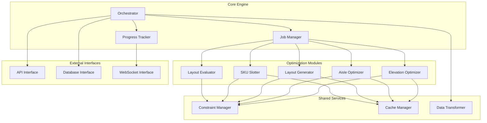

# RackOptix Optimization Engine Design

## 1. Executive Summary

The RackOptix optimization engine will be the core computational component responsible for generating efficient warehouse layouts, optimizing rack configurations, and determining optimal SKU placements. The engine will be designed to handle up to 100,000 SKUs, complete full optimization runs within 5-10 minutes on standard hardware (8-core CPU, 16GB RAM), and provide initial results for interactive optimizations in under 30 seconds. It will use a WebSocket-based approach to stream progressive updates to the frontend, allowing users to see optimization progress in real-time.

## 2. System Architecture Overview

```mermaid
flowchart TB
    subgraph "Optimization Engine"
        direction TB
        CoreEngine[Core Engine Orchestrator]
        
        subgraph "Optimization Components"
            ElevationOpt[Elevation Profile Optimizer]
            AisleOpt[Aisle Width Optimizer]
            LayoutGen[Layout Generator]
            SKUSlot[SKU Slotting Optimizer]
            LayoutEval[Layout Evaluator]
        end
        
        subgraph "Shared Services"
            ConstraintManager[Constraint Manager]
            ProgressTracker[Progress Tracker]
            CacheManager[Cache Manager]
            DataTransformer[Data Transformer]
        end
        
        subgraph "Algorithm Libraries"
            CPSolver[Constraint Programming Solver]
            MILPSolver[Mixed Integer Linear Programming]
            Heuristics[Heuristic Algorithms]
            SimulationEngine[Simulation Engine]
        end
        
        CoreEngine --> ElevationOpt
        CoreEngine --> AisleOpt
        CoreEngine --> LayoutGen
        CoreEngine --> SKUSlot
        CoreEngine --> LayoutEval
        
        ElevationOpt --> CPSolver
        AisleOpt --> MILPSolver
        LayoutGen --> Heuristics
        SKUSlot --> CPSolver
        LayoutEval --> SimulationEngine
        
        CoreEngine --> ConstraintManager
        CoreEngine --> ProgressTracker
        CoreEngine --> CacheManager
        CoreEngine --> DataTransformer
    end
    
    subgraph "External Interfaces"
        APIInterface[API Interface]
        DBInterface[Database Interface]
        WSInterface[WebSocket Interface]
## 3. Optimization Algorithms and Mathematical Models

### 3.1 Algorithm Selection Strategy

Each optimization component requires different algorithmic approaches based on the problem characteristics:

| Optimization Component | Primary Algorithm | Secondary/Fallback | Justification |
|------------------------|-------------------|-------------------|---------------|
| Elevation Profile | Constraint Programming (CP) | Dynamic Programming | CP handles complex spatial constraints well; DP for simpler cases |
| Aisle Width | Mixed Integer Linear Programming (MILP) | Heuristic Search | MILP optimal for width trade-offs; heuristics for quick solutions |
| Layout Generation | Genetic Algorithm + Simulated Annealing | Greedy Placement | Metaheuristics explore diverse layouts; greedy for initial solutions |
| SKU Slotting | Constraint Programming + Local Search | ABC Analysis + Greedy | CP for optimal placement; simpler heuristics for quick results |
| Layout Evaluation | Discrete Event Simulation | Analytical Models | Simulation captures dynamic behavior; analytical models for quick estimates |

### 3.2 Mathematical Models

#### 3.2.1 Elevation Profile Optimization

The elevation profile optimization will be modeled as a constraint satisfaction problem (CSP):

```
Variables:
- E[i,j] = Elevation of beam j in rack i
- S[i,j,k] = 1 if SKU k is stored in position (i,j), 0 otherwise

Constraints:
- Minimum clearance: E[i,j+1] - E[i,j] ≥ max(H[k] + clearance) for all k where S[i,j,k] = 1
- Maximum height: E[i,j] ≤ facility_clear_height - safety_margin
- Equipment reach: E[i,j] ≤ equipment_reach_height
- Beam spacing: E[i,j+1] - E[i,j] ≥ min_beam_spacing

Objective:
- Maximize storage positions while maintaining accessibility
```

#### 3.2.2 Aisle Width Optimization

Aisle width optimization will use a mixed integer linear programming (MILP) model:

```
Variables:
- W[i] = Width of aisle i
- T[i,e] = 1 if equipment e uses aisle i, 0 otherwise
- F[i,v] = Flow of products with velocity class v through aisle i

Constraints:
- Minimum width: W[i] ≥ min_width[e] for all e where T[i,e] = 1
- Total width: sum(W[i]) + sum(rack_depth[j]) ≤ facility_width
- Flow capacity: F[i,v] ≤ capacity(W[i], v)

Objective:
- Minimize sum(W[i]) while maximizing throughput efficiency
```

#### 3.2.3 Layout Generation

Layout generation will use a hybrid genetic algorithm with the following representation:

```
Chromosome representation:
- Grid-based encoding of rack positions and orientations
- Variable-length encoding for different layout configurations

Fitness function:
- Weighted combination of:
  * Storage density (pallet positions per sq ft)
  * Travel distance for common operations
  * Compliance with constraints
  * Utilization of vertical space

Genetic operators:
- Crossover: Sectional exchange of layout portions
- Mutation: Small adjustments to rack positions/orientations
- Selection: Tournament selection with elitism
```

#### 3.2.4 SKU Slotting Optimization

SKU slotting will use a constraint-based approach with the following model:

```
Variables:
- A[i,j,k] = 1 if SKU k is assigned to location (i,j), 0 otherwise
- D[k,l] = Distance between locations of SKUs k and l

Constraints:
- Capacity: sum(A[i,j,k]) ≤ 1 for all i,j (one SKU per location)
- Assignment: sum(A[i,j,k]) = 1 for all k (each SKU must be assigned)
## 4. Data Structures for Warehouse Elements

### 4.1 Core Data Structures

#### 4.1.1 Facility Representation

```python
class Facility:
    """Represents the warehouse facility with boundaries and constraints."""
    
    def __init__(self, boundary_polygon, clear_height, column_grid=None):
        self.boundary = boundary_polygon  # PostGIS polygon
        self.clear_height = clear_height  # in feet/meters
        self.column_grid = column_grid    # 2D array of column positions
        self.obstructions = []            # list of Obstruction objects
        self.zones = []                   # list of Zone objects
        
    def add_obstruction(self, obstruction):
        """Add an obstruction to the facility."""
        self.obstructions.append(obstruction)
        
    def create_zone(self, boundary, name, purpose):
        """Create a new zone within the facility."""
        zone = Zone(boundary, name, purpose)
        self.zones.append(zone)
        return zone
        
    def validate_layout(self, layout):
        """Check if a layout fits within facility constraints."""
        # Implementation details
```

#### 4.1.2 Rack Representation

```python
class Rack:
    """Represents a storage rack with configurable parameters."""
    
    def __init__(self, rack_type, position, orientation, length, depth, height):
        self.rack_type = rack_type        # e.g., "selective", "drive-in"
        self.position = position          # (x, y) coordinates
        self.orientation = orientation    # in degrees
        self.length = length              # in feet/meters
        self.depth = depth                # in feet/meters
        self.height = height              # in feet/meters
        self.bays = []                    # list of Bay objects
        
    def add_bay(self, width, beam_elevations):
        """Add a bay to the rack with specified beam elevations."""
        bay = Bay(width, beam_elevations)
        self.bays.append(bay)
        return bay
        
    def calculate_capacity(self):
        """Calculate the storage capacity of the rack."""
        # Implementation details
```

#### 4.1.3 Product (SKU) Representation

```python
class Product:
    """Represents a stock keeping unit (SKU) with its characteristics."""
    
    def __init__(self, sku_id, dimensions, weight, velocity_class):
        self.sku_id = sku_id              # unique identifier
        self.dimensions = dimensions      # (length, width, height)
        self.weight = weight              # in kg/lbs
        self.velocity_class = velocity_class  # e.g., "A", "B", "C"
        self.storage_method = None        # e.g., "pallet", "case", "each"
        self.stackable = False            # whether it can be stacked
        self.handling_limitations = {}    # special handling requirements
        self.environmental_reqs = {}      # temperature, humidity, etc.
        
    def is_compatible_with(self, location):
        """Check if the SKU is compatible with a given location."""
        # Implementation details
```

#### 4.1.4 Layout Representation

```python
class Layout:
    """Represents a complete warehouse layout configuration."""
    
    def __init__(self, facility, name):
        self.facility = facility          # reference to Facility object
        self.name = name                  # layout identifier
        self.racks = []                   # list of Rack objects
        self.aisles = []                  # list of Aisle objects
        self.metrics = {}                 # performance metrics
        
    def add_rack(self, rack):
        """Add a rack to the layout."""
        self.racks.append(rack)
        
    def add_aisle(self, start_point, end_point, width):
        """Add an aisle to the layout."""
        aisle = Aisle(start_point, end_point, width)
        self.aisles.append(aisle)
        return aisle
        
    def evaluate(self, criteria=None):
        """Evaluate the layout based on specified criteria."""
        # Implementation details
```

### 4.2 Specialized Data Structures

#### 4.2.1 Spatial Grid

For efficient spatial operations and collision detection:

```python
class SpatialGrid:
    """Grid-based spatial index for efficient collision detection."""
    
    def __init__(self, boundary, cell_size):
        self.boundary = boundary
        self.cell_size = cell_size
        self.grid = {}  # Dictionary mapping (x,y) cell coordinates to objects
        
    def insert(self, obj, bbox):
        """Insert an object into the grid cells it overlaps with."""
        # Implementation details
        
    def query(self, bbox):
        """Return all objects that might intersect with the given bounding box."""
        # Implementation details
        
    def remove(self, obj, bbox):
        """Remove an object from the grid."""
## 5. Constraint Modeling Approach

### 5.1 Constraint Hierarchy

Constraints will be organized in a hierarchical structure:

```mermaid
flowchart TB
    RootConstraints[Root Constraints]
    
    RootConstraints --> HardConstraints[Hard Constraints]
    RootConstraints --> SoftConstraints[Soft Constraints]
    
    HardConstraints --> PhysicalConstraints[Physical Constraints]
    HardConstraints --> SafetyConstraints[Safety Constraints]
    HardConstraints --> OperationalConstraints[Operational Constraints]
    
    PhysicalConstraints --> BoundaryConstraint[Boundary Constraint]
    PhysicalConstraints --> ObstructionConstraint[Obstruction Constraint]
    PhysicalConstraints --> HeightConstraint[Height Constraint]
    
    SafetyConstraints --> FireCodeConstraint[Fire Code Constraint]
    SafetyConstraints --> EgressConstraint[Egress Constraint]
    SafetyConstraints --> SpacingConstraint[Spacing Constraint]
    
    OperationalConstraints --> EquipmentConstraint[Equipment Constraint]
    OperationalConstraints --> WorkflowConstraint[Workflow Constraint]
    
    SoftConstraints --> EfficiencyConstraints[Efficiency Constraints]
    SoftConstraints --> PreferenceConstraints[Preference Constraints]
    
    EfficiencyConstraints --> TravelDistanceConstraint[Travel Distance Constraint]
    EfficiencyConstraints --> UtilizationConstraint[Utilization Constraint]
    
    PreferenceConstraints --> ZoningPreferenceConstraint[Zoning Preference]
    PreferenceConstraints --> ProductGroupingConstraint[Product Grouping]
```



### 5.2 Constraint Implementation

Constraints will be implemented using a flexible, composable approach:

```python
class Constraint:
    """Base class for all constraints."""
    
    def __init__(self, name, weight=1.0):
        self.name = name
        self.weight = weight  # For soft constraints
        
    def is_satisfied(self, solution):
        """Check if the constraint is satisfied by the solution."""
        raise NotImplementedError
        
    def violation_degree(self, solution):
        """Calculate how much the constraint is violated (for soft constraints)."""
        raise NotImplementedError
        
    def suggest_repair(self, solution):
        """Suggest how to repair the solution to satisfy the constraint."""
        raise NotImplementedError
```

Example implementation of a specific constraint:

```python
class BoundaryConstraint(Constraint):
    """Ensures all elements are within the facility boundary."""
    
    def __init__(self, facility_boundary, margin=0):
        super().__init__("Boundary Constraint")
        self.boundary = facility_boundary
        self.margin = margin
        
    def is_satisfied(self, layout):
        """Check if all racks are within the facility boundary."""
        for rack in layout.racks:
            rack_polygon = rack.get_footprint_polygon()
            if not self.boundary.contains(rack_polygon.buffer(-self.margin)):
                return False
        return True
        
    def violation_degree(self, layout):
        """Calculate the area of racks outside the boundary."""
        total_violation = 0
        for rack in layout.racks:
            rack_polygon = rack.get_footprint_polygon()
            if not self.boundary.contains(rack_polygon):
                violation = rack_polygon.difference(self.boundary).area
                total_violation += violation
        return total_violation
        
    def suggest_repair(self, layout):
        """Suggest moving racks to be within the boundary."""
        repairs = []
        for i, rack in enumerate(layout.racks):
            rack_polygon = rack.get_footprint_polygon()
            if not self.boundary.contains(rack_polygon):
                # Calculate vector to move rack inside boundary
                # Implementation details
                repairs.append(("move_rack", i, new_position))
        return repairs
```

### 5.3 Constraint Manager

A central constraint manager will handle constraint registration, validation, and conflict resolution:

```python
class ConstraintManager:
    """Manages and evaluates constraints for optimization problems."""
    
## 6. Performance Optimization Strategies

### 6.1 Progressive Optimization

To meet the requirement of providing initial results within 30 seconds while allowing for longer optimization runs:

```python
class ProgressiveOptimizer:
    """Implements progressive optimization with incremental improvements."""
    
    def __init__(self, problem, initial_solution_generator, improvers):
        self.problem = problem
        self.initial_solution_generator = initial_solution_generator
        self.improvers = improvers  # List of improvement algorithms
        self.best_solution = None
        self.best_score = float('inf')
        self.progress_callback = None
        
    def set_progress_callback(self, callback):
        """Set callback function for reporting progress."""
        self.progress_callback = callback
        
    def optimize(self, time_budget=300):
        """Run optimization with the given time budget (in seconds)."""
        start_time = time.time()
        
        # Generate initial solution quickly (< 5 seconds)
        self.best_solution = self.initial_solution_generator.generate()
        self.best_score = self.problem.evaluate(self.best_solution)
        
        if self.progress_callback:
            self.progress_callback(self.best_solution, self.best_score, 0.1)
        
        # Apply improvers in sequence with time allocation
        remaining_time = time_budget - (time.time() - start_time)
        progress = 0.1
        
        for i, improver in enumerate(self.improvers):
            # Allocate time proportionally to improvers
            improver_time = remaining_time * (1 / (len(self.improvers) - i))
            
            improved_solution = improver.improve(
                self.best_solution, 
                time_budget=improver_time,
                progress_callback=lambda sol, score, p: self._report_progress(sol, score, progress + p * (0.9 / len(self.improvers)))
            )
            
            improved_score = self.problem.evaluate(improved_solution)
            
            if improved_score < self.best_score:
                self.best_solution = improved_solution
                self.best_score = improved_score
            
            progress += 0.9 / len(self.improvers)
            remaining_time = time_budget - (time.time() - start_time)
            
            if remaining_time <= 0:
                break
                
        return self.best_solution, self.best_score
        
    def _report_progress(self, solution, score, progress):
        """Report progress through callback if set."""
        if self.progress_callback and score < self.best_score:
            self.best_solution = solution
            self.best_score = score
            self.progress_callback(solution, score, progress)
```

### 6.2 Parallel Processing

To leverage multi-core CPUs effectively:

```python
class ParallelProcessor:
    """Handles parallel execution of independent optimization tasks."""
    
    def __init__(self, max_workers=None):
        """Initialize with optional worker limit (defaults to CPU count)."""
        self.max_workers = max_workers or multiprocessing.cpu_count()
        
    def map(self, function, items, chunksize=1):
        """Apply function to each item in parallel."""
        with concurrent.futures.ProcessPoolExecutor(max_workers=self.max_workers) as executor:
            return list(executor.map(function, items, chunksize=chunksize))
            
    def submit_all(self, functions_with_args):
        """Submit multiple different functions with their arguments."""
        results = []
        with concurrent.futures.ProcessPoolExecutor(max_workers=self.max_workers) as executor:
            futures = []
            for func, args, kwargs in functions_with_args:
                future = executor.submit(func, *args, **kwargs)
                futures.append(future)
            
            for future in concurrent.futures.as_completed(futures):
                results.append(future.result())
                
        return results
```

### 6.3 Caching Strategy

For efficient reuse of computation results:

```python
class ComputationCache:
    """Multi-level cache for optimization computations."""
    
    def __init__(self, db_connection=None):
        # In-memory LRU cache for fastest access
        self.memory_cache = LRUCache(max_size=1000)
        
        # Disk-based cache for persistence between runs
        self.disk_cache = DiskCache(directory="./cache")
        
        # Database cache for sharing between instances
        self.db_cache = db_connection
        
    def get(self, key, compute_func=None):
        """Get cached value or compute if not available."""
        # Try memory cache first
        value = self.memory_cache.get(key)
        if value is not None:
            return value
            
        # Try disk cache next
        value = self.disk_cache.get(key)
        if value is not None:
            self.memory_cache.put(key, value)
            return value
            
        # Try database cache if available
        if self.db_cache:
            value = self.db_cache.get_cache_entry(key)
            if value is not None:
                self.memory_cache.put(key, value)
                self.disk_cache.put(key, value)
                return value
                
        # Compute if function provided
        if compute_func:
            value = compute_func()
            self.put(key, value)
            return value
            
        return None
        
    def put(self, key, value):
        """Store value in all cache levels."""
        self.memory_cache.put(key, value)
        self.disk_cache.put(key, value)
        if self.db_cache:
            self.db_cache.store_cache_entry(key, value)
```

### 6.4 Incremental Computation

For efficiently updating results when inputs change slightly:

```python
class IncrementalOptimizer:
## 7. Key Optimization Components

### 7.1 Elevation Profile Optimizer

```python
class ElevationProfileOptimizer:
    """Optimizes beam elevations for rack bays based on SKU dimensions."""
    
    def __init__(self, constraint_manager):
        self.constraint_manager = constraint_manager
        self.solver = cp_model.CpSolver()  # Google OR-Tools CP-SAT solver
        
    def optimize(self, rack, skus, equipment, time_limit_seconds=30):
        """Optimize beam elevations for a rack given SKUs and equipment."""
        model = cp_model.CpModel()
        
        # Define variables
        max_beams = 10  # Maximum number of beam levels
        max_height = int(equipment.reach_height * 100)  # Convert to cm for integer CP
        
        # Beam elevation variables (in cm)
        elevations = [model.NewIntVar(0, max_height, f'elevation_{i}') for i in range(max_beams)]
        
        # Add constraints
        
        # 1. Increasing elevations
        for i in range(max_beams - 1):
            model.Add(elevations[i+1] > elevations[i])
        
        # 2. Minimum spacing between beams based on SKU heights
        sku_heights = [int(sku.dimensions[2] * 100) for sku in skus]  # Convert to cm
        min_clearance = 10  # 10 cm clearance
        
        for i in range(max_beams - 1):
            model.Add(elevations[i+1] - elevations[i] >= max(sku_heights) + min_clearance)
        
        # 3. Equipment reach constraint
        model.Add(elevations[max_beams-1] <= max_height)
        
        # Objective: Maximize storage positions while ensuring accessibility
        # We want to fit as many levels as possible within the height constraint
        model.Maximize(elevations[max_beams-1])
        
        # Set time limit
        self.solver.parameters.max_time_in_seconds = time_limit_seconds
        
        # Solve the model
        status = self.solver.Solve(model)
        
        if status == cp_model.OPTIMAL or status == cp_model.FEASIBLE:
            # Extract solution
            optimal_elevations = [self.solver.Value(elevations[i]) / 100.0 for i in range(max_beams)]
            return optimal_elevations
        else:
            # Fallback to heuristic if CP fails
            return self._heuristic_elevations(rack, skus, equipment)
    
    def _heuristic_elevations(self, rack, skus, equipment):
        """Fallback heuristic method for beam elevation calculation."""
        # Simple heuristic: evenly distribute beams within reach height
        max_sku_height = max(sku.dimensions[2] for sku in skus)
        clearance = 0.1  # 10 cm clearance
        level_height = max_sku_height + clearance
        num_levels = int(equipment.reach_height / level_height)
        
        # Create evenly spaced elevations
        elevations = [i * level_height for i in range(1, num_levels + 1)]
        return elevations
```

### 7.2 Aisle Width Optimizer

```python
class AisleWidthOptimizer:
    """Optimizes aisle widths based on equipment specifications and product velocity."""
    
    def __init__(self, constraint_manager):
        self.constraint_manager = constraint_manager
        
    def optimize(self, layout, equipment_list, product_velocities, time_limit_seconds=30):
        """Optimize aisle widths for a layout given equipment and product velocities."""
        # Create a MILP model
        model = mip.Model()
        
        # Variables: aisle widths (in cm)
        aisle_widths = [model.add_var(name=f'width_{i}', 
                                      lb=min(e.min_aisle_width for e in equipment_list),
                                      ub=max(e.max_aisle_width for e in equipment_list),
                                      var_type=mip.INTEGER) 
                        for i in range(len(layout.aisles))]
        
        # Equipment assignment variables
        equipment_assigned = [[model.add_var(name=f'equip_{i}_{j}', var_type=mip.BINARY) 
                              for j in range(len(equipment_list))] 
                             for i in range(len(layout.aisles))]
        
        # Constraints
        
        # 1. Each aisle must have at least one equipment type assigned
        for i in range(len(layout.aisles)):
            model += mip.xsum(equipment_assigned[i][j] for j in range(len(equipment_list))) == 1
        
        # 2. Aisle width must be sufficient for assigned equipment
        for i in range(len(layout.aisles)):
            for j in range(len(equipment_list)):
                model += aisle_widths[i] >= equipment_list[j].min_aisle_width * equipment_assigned[i][j]
        
        # 3. Total width constraint (facility width limit)
        total_rack_depth = sum(rack.depth for rack in layout.racks)
        model += mip.xsum(aisle_widths[i] for i in range(len(layout.aisles))) + total_rack_depth <= layout.facility.boundary.width
        
        # Objective: Minimize aisle width while prioritizing velocity
        # Higher velocity aisles get more weight to ensure they're wider for throughput
        velocity_weights = self._calculate_aisle_velocity_weights(layout, product_velocities)
        
        objective = mip.xsum(aisle_widths[i] * (1 - velocity_weights[i]) for i in range(len(layout.aisles)))
        model.objective = mip.minimize(objective)
        
        # Set time limit
        model.max_mip_gap = 0.05  # 5% optimality gap
        model.max_seconds = time_limit_seconds
        
        # Solve
        status = model.optimize()
        
        if status == mip.OptimizationStatus.OPTIMAL or status == mip.OptimizationStatus.FEASIBLE:
            # Extract solution
            optimal_widths = [aisle_widths[i].x for i in range(len(layout.aisles))]
            equipment_choices = [[equipment_assigned[i][j].x > 0.5 for j in range(len(equipment_list))] 
                                for i in range(len(layout.aisles))]
            return optimal_widths, equipment_choices
        else:
            # Fallback to heuristic if MILP fails
            return self._heuristic_aisle_widths(layout, equipment_list, product_velocities)
    
    def _calculate_aisle_velocity_weights(self, layout, product_velocities):
        """Calculate weights for aisles based on product velocity."""
        # Implementation details
        
    def _heuristic_aisle_widths(self, layout, equipment_list, product_velocities):
        """Fallback heuristic method for aisle width calculation."""
        # Implementation details
```

### 7.3 Layout Generator

```python
class LayoutGenerator:
    """Generates rack layout configurations using genetic algorithms."""
    
    def __init__(self, constraint_manager, parallel_processor=None):
        self.constraint_manager = constraint_manager
        self.parallel_processor = parallel_processor or ParallelProcessor()
        
    def generate(self, facility, rack_types, equipment, time_limit_seconds=300):
        """Generate optimal rack layout for a facility."""
        # Initialize genetic algorithm parameters
        population_size = 50
        num_generations = 100
        mutation_rate = 0.1
        crossover_rate = 0.8
        
        # Create initial population
        population = self._create_initial_population(facility, rack_types, population_size)
        
        # Evaluate initial population
        fitness_scores = self.parallel_processor.map(
            lambda layout: self._evaluate_fitness(layout, equipment),
            population
        )
        
        # Track best solution
        best_layout = population[np.argmax(fitness_scores)]
        best_fitness = max(fitness_scores)
        
        # Main GA loop
        start_time = time.time()
        generation = 0
        
        while generation < num_generations and time.time() - start_time < time_limit_seconds:
            # Selection
            parents = self._selection(population, fitness_scores)
            
            # Crossover
            offspring = []
            for i in range(0, len(parents), 2):
                if i + 1 < len(parents):
                    if random.random() < crossover_rate:
                        child1, child2 = self._crossover(parents[i], parents[i+1])
                        offspring.extend([child1, child2])
                    else:
                        offspring.extend([parents[i], parents[i+1]])
            
            # Mutation
            for i in range(len(offspring)):
                if random.random() < mutation_rate:
                    offspring[i] = self._mutate(offspring[i], facility)
            
            # Evaluate offspring
            offspring_fitness = self.parallel_processor.map(
                lambda layout: self._evaluate_fitness(layout, equipment),
                offspring
            )
            
            # Combine populations (elitism)
            combined_population = population + offspring
            combined_fitness = fitness_scores + offspring_fitness
            
            # Select next generation
            indices = np.argsort(combined_fitness)[-population_size:]
            population = [combined_population[i] for i in indices]
            fitness_scores = [combined_fitness[i] for i in indices]
            
            # Update best solution
            current_best = max(fitness_scores)
            if current_best > best_fitness:
                best_fitness = current_best
                best_layout = population[fitness_scores.index(best_fitness)]
            
            generation += 1
        
        return best_layout
    
    def _create_initial_population(self, facility, rack_types, population_size):
        """Create initial population of layouts."""
        # Implementation details
        
    def _evaluate_fitness(self, layout, equipment):
        """Evaluate fitness of a layout."""
        # Implementation details
        
    def _selection(self, population, fitness_scores):
        """Select parents for reproduction using tournament selection."""
        # Implementation details
        
    def _crossover(self, parent1, parent2):
        """Perform crossover between two parent layouts."""
        # Implementation details
        
    def _mutate(self, layout, facility):
        """Mutate a layout by making small changes."""
        # Implementation details
```

### 7.4 SKU Slotting Optimizer

```python
class SKUSlottingOptimizer:
    """Optimizes SKU assignments to storage locations."""
    
    def __init__(self, constraint_manager):
        self.constraint_manager = constraint_manager
        
    def optimize(self, layout, products, time_limit_seconds=300):
        """Optimize SKU assignments to locations in a layout."""
        # For large problems (>10,000 SKUs), use a hierarchical approach
        if len(products) > 10000:
            return self._hierarchical_optimization(layout, products, time_limit_seconds)
        
        # For smaller problems, use constraint programming
        model = cp_model.CpModel()
        
        # Get all locations from the layout
        locations = self._extract_locations(layout)
        
        # Variables: assignment of products to locations
        assignments = {}
        for p_idx, product in enumerate(products):
            for l_idx, location in enumerate(locations):
                assignments[(p_idx, l_idx)] = model.NewBoolVar(f'assign_{p_idx}_{l_idx}')
        
        # Constraints
        
        # 1. Each product must be assigned to exactly one location
        for p_idx in range(len(products)):
            model.Add(sum(assignments[(p_idx, l_idx)] for l_idx in range(len(locations))) == 1)
        
        # 2. Each location can have at most one product
        for l_idx in range(len(locations)):
            model.Add(sum(assignments[(p_idx, l_idx)] for p_idx in range(len(products))) <= 1)
        
        # 3. Product must fit in the location
        for p_idx, product in enumerate(products):
            for l_idx, location in enumerate(locations):
                if not self._product_fits_location(product, location):
                    model.Add(assignments[(p_idx, l_idx)] == 0)
        
        # Objective: Minimize travel distance weighted by velocity
        objective_terms = []
        for p_idx, product in enumerate(products):
            for l_idx, location in enumerate(locations):
                distance = self._calculate_distance(location, layout.output_point)
                velocity_weight = self._get_velocity_weight(product.velocity_class)
                objective_terms.append(assignments[(p_idx, l_idx)] * distance * velocity_weight)
        
        model.Minimize(sum(objective_terms))
        
        # Set time limit
        solver = cp_model.CpSolver()
        solver.parameters.max_time_in_seconds = time_limit_seconds
        
        # Solve
        status = solver.Solve(model)
        
        if status == cp_model.OPTIMAL or status == cp_model.FEASIBLE:
            # Extract solution
            solution = {}
            for p_idx in range(len(products)):
                for l_idx in range(len(locations)):
                    if solver.Value(assignments[(p_idx, l_idx)]) == 1:
                        solution[products[p_idx].sku_id] = locations[l_idx].id
            return solution
        else:
            # Fallback to heuristic if CP fails
            return self._heuristic_slotting(layout, products)
    
    def _hierarchical_optimization(self, layout, products, time_limit_seconds):
        """Use a hierarchical approach for large SKU catalogs."""
        # Implementation details
        
    def _extract_locations(self, layout):
        """Extract all storage locations from a layout."""
        # Implementation details
        
    def _product_fits_location(self, product, location):
        """Check if a product fits in a location."""
        # Implementation details
        
    def _calculate_distance(self, location, output_point):
        """Calculate distance from a location to the output point."""
        # Implementation details
        
    def _get_velocity_weight(self, velocity_class):
        """Get weight factor based on velocity class."""
        # Implementation details
        
    def _heuristic_slotting(self, layout, products):
        """Fallback heuristic method for SKU slotting."""
        # Implementation details
```

### 7.5 Layout Evaluator

```python
class LayoutEvaluator:
    """Evaluates layout performance using simulation and analytical models."""
    
    def __init__(self):
        self.simulation_engine = None  # Will be initialized on first use
        
    def evaluate(self, layout, products, equipment, operations, metrics=None, simulation_time=60):
        """Evaluate a layout based on specified metrics."""
        # Default metrics if none specified
        if metrics is None:
            metrics = ['storage_density', 'travel_distance', 'throughput']
        
        results = {}
        
        # Calculate basic metrics analytically
        if 'storage_density' in metrics:
            results['storage_density'] = self._calculate_storage_density(layout)
        
        if 'travel_distance' in metrics:
            results['travel_distance'] = self._calculate_average_travel_distance(layout, products)
        
        if 'space_utilization' in metrics:
            results['space_utilization'] = self._calculate_space_utilization(layout)
        
        # Run simulation for dynamic metrics
        if any(m in metrics for m in ['throughput', 'congestion', 'cycle_time']):
## 8. Integration Points

### 8.1 Input Data Requirements and Formats

The optimization engine will accept input data in the following formats:

#### 8.1.1 JSON Input Schema

```json
{
  "facility": {
    "boundary": {
      "type": "Polygon",
      "coordinates": [[[x1, y1], [x2, y2], ...]]
    },
    "clear_height": 32.5,
    "obstructions": [
      {
        "type": "Column",
        "shape": {
          "type": "Polygon",
          "coordinates": [[[x1, y1], [x2, y2], ...]]
        },
        "height": 32.5
      }
    ]
  },
  "products": [
    {
      "sku_id": "SKU123",
      "dimensions": [40, 48, 60],
      "weight": 1200,
      "velocity_class": "A",
      "storage_method": "pallet",
      "stackable": false,
      "handling_limitations": {
        "hazardous": false,
        "fragile": false
      },
      "environmental_reqs": {
        "temperature_controlled": false
      }
    }
  ],
  "equipment": [
    {
      "name": "Reach Truck",
      "type": "reach",
      "reach_height": 30.0,
      "min_aisle_width": 96,
      "max_aisle_width": 120,
      "turning_radius": 72
    }
  ],
  "optimization_parameters": {
    "objectives": {
      "storage_density": 0.7,
      "accessibility": 0.3
    },
    "constraints": {
      "max_aisle_count": 10,
      "min_clearance": 6
    },
    "time_limit": 300
  }
}
```

#### 8.1.2 Database Input

The engine will also support direct database access for retrieving input data, using the database schema defined in the architecture document. This approach is preferred for large datasets, especially when dealing with 100,000+ SKUs.

#### 8.1.3 File Import Support

For integration with external systems, the engine will support importing data from:

- CSV files for product data
- DXF/DWG files for facility boundaries and obstructions
- Excel spreadsheets for equipment specifications

### 8.2 Output Data Structures and Formats

#### 8.2.1 JSON Output Schema

```json
{
  "layout": {
    "id": "layout-123",
    "racks": [
      {
        "id": "rack-1",
        "type": "selective",
        "position": [10, 20],
        "orientation": 0,
        "length": 96,
        "depth": 42,
        "height": 240,
        "bays": [
          {
            "width": 96,
            "beam_elevations": [48, 96, 144, 192]
          }
        ]
      }
    ],
    "aisles": [
      {
        "id": "aisle-1",
        "start_point": [10, 0],
        "end_point": [10, 100],
        "width": 120
      }
    ]
  },
  "sku_assignments": {
    "SKU123": "location-456"
  },
  "metrics": {
    "storage_density": 0.85,
    "pallet_positions": 1200,
    "avg_travel_distance": 45.6,
    "throughput_capacity": 120,
    "space_utilization": 0.78
  },
  "visualization_data": {
    "2d": {
      "elements": [
        {
          "type": "rack",
          "geometry": {...}
        }
      ]
    },
    "3d": {
      "elements": [
        {
          "type": "rack",
          "geometry": {...}
        }
      ]
    }
  }
}
```

#### 8.2.2 Database Output

Results will be stored in the database for persistence and retrieval by the API layer, following the schema defined in the architecture document.

#### 8.2.3 File Export Support

The engine will support exporting results to:

- DXF/DWG files for CAD integration
- PDF reports with layout metrics and visualizations
- Excel spreadsheets for detailed SKU assignments

### 8.3 API Endpoints for Frontend Communication

The optimization engine will expose the following API endpoints for communication with the frontend:

#### 8.3.1 REST API Endpoints

- `POST /api/optimization/layout` - Start a new layout optimization job
- `GET /api/optimization/layout/{job_id}` - Get layout optimization results
- `POST /api/optimization/elevation` - Optimize rack elevation profiles
- `POST /api/optimization/aisle-width` - Optimize aisle widths
- `POST /api/optimization/sku-slotting` - Optimize SKU assignments
- `GET /api/optimization/status/{job_id}` - Check optimization job status

#### 8.3.2 WebSocket Endpoints

- `ws://server/api/optimization/progress/{job_id}` - Stream optimization progress updates
- `ws://server/api/optimization/partial-results/{job_id}` - Stream partial optimization results

### 8.4 Batch Processing Capabilities

For complex optimizations involving large datasets, the engine will support batch processing:

```python
class BatchProcessor:
    """Handles batch processing of optimization jobs."""
    
    def __init__(self, db_connection, max_concurrent_jobs=4):
        self.db_connection = db_connection
        self.max_concurrent_jobs = max_concurrent_jobs
        self.job_queue = Queue()
        self.active_jobs = {}
        self.worker_threads = []
        
    def start(self):
        """Start the batch processor."""
        for i in range(self.max_concurrent_jobs):
            thread = Thread(target=self._worker)
            thread.daemon = True
            thread.start()
            self.worker_threads.append(thread)
            
    def submit_job(self, job_type, parameters, callback=None):
        """Submit a new optimization job."""
        job_id = str(uuid.uuid4())
        job = {
            'id': job_id,
            'type': job_type,
            'parameters': parameters,
            'status': 'queued',
            'callback': callback,
            'submitted_at': datetime.now()
        }
        
        # Store job in database
        self._store_job(job)
        
        # Add to queue
        self.job_queue.put(job)
        
        return job_id
        
    def get_job_status(self, job_id):
        """Get the status of a job."""
        if job_id in self.active_jobs:
            return self.active_jobs[job_id]['status']
        else:
            # Retrieve from database
            return self._get_job_from_db(job_id)['status']
            
    def get_job_results(self, job_id):
        """Get the results of a completed job."""
        job = self._get_job_from_db(job_id)
        if job['status'] == 'completed':
            return job['results']
        else:
            return None
            
    def _worker(self):
        """Worker thread that processes jobs from the queue."""
        while True:
            job = self.job_queue.get()
            
            try:
                # Update status
                job['status'] = 'running'
                self.active_jobs[job['id']] = job
                self._update_job_status(job['id'], 'running')
                
                # Process job
                if job['type'] == 'layout':
                    results = self._process_layout_job(job)
                elif job['type'] == 'elevation':
                    results = self._process_elevation_job(job)
                elif job['type'] == 'aisle-width':
                    results = self._process_aisle_width_job(job)
                elif job['type'] == 'sku-slotting':
                    results = self._process_sku_slotting_job(job)
                else:
                    raise ValueError(f"Unknown job type: {job['type']}")
                
                # Update job with results
                job['status'] = 'completed'
                job['results'] = results
                job['completed_at'] = datetime.now()
                
                # Store results in database
                self._store_job_results(job['id'], results)
                self._update_job_status(job['id'], 'completed')
                
                # Call callback if provided
                if job['callback']:
                    job['callback'](job['id'], results)
                    
            except Exception as e:
                # Handle errors
                job['status'] = 'failed'
                job['error'] = str(e)
                self._update_job_status(job['id'], 'failed', error=str(e))
                
            finally:
                # Remove from active jobs
                if job['id'] in self.active_jobs:
                    del self.active_jobs[job['id']]
                
                # Mark as done in queue
                self.job_queue.task_done()
                
    def _process_layout_job(self, job):
        """Process a layout optimization job."""
        # Implementation details
        
    def _process_elevation_job(self, job):
        """Process an elevation profile optimization job."""
        # Implementation details
        
    def _process_aisle_width_job(self, job):
        """Process an aisle width optimization job."""
        # Implementation details
        
    def _process_sku_slotting_job(self, job):
        """Process a SKU slotting optimization job."""
        # Implementation details
        
    def _store_job(self, job):
        """Store job in database."""
        # Implementation details
        
    def _update_job_status(self, job_id, status, error=None):
        """Update job status in database."""
        # Implementation details
        
    def _store_job_results(self, job_id, results):
        """Store job results in database."""
        # Implementation details
        
    def _get_job_from_db(self, job_id):
        """Retrieve job from database."""
        # Implementation details
```

## 9. Implementation Approach

### 9.1 Core Algorithms and Libraries

The optimization engine will leverage the following core libraries:

| Library | Purpose | Justification |
|---------|---------|---------------|
| Google OR-Tools | Constraint programming, MILP | Industry-standard optimization toolkit with high performance |
| NumPy | Numerical computations | Efficient array operations for mathematical calculations |
| Pandas | Data manipulation | Handling large datasets and data transformations |
| SciPy | Scientific computing | Specialized algorithms for optimization and spatial operations |
| Shapely | Geometric operations | Efficient handling of 2D geometric objects and operations |
| SimPy | Discrete event simulation | Lightweight simulation framework for evaluating layouts |
| PyTorch (optional) | Machine learning | For potential ML-based optimization approaches |

### 9.2 Modular Architecture

The optimization engine will follow a modular architecture with clear separation of concerns:



This modular architecture provides several benefits:

1. **Maintainability**: Each component has a single responsibility
2. **Testability**: Components can be tested in isolation
3. **Extensibility**: New algorithms can be added without modifying existing code
4. **Flexibility**: Different algorithms can be swapped based on problem characteristics

### 9.3 Testing and Validation Methodology

The optimization engine will be tested using a comprehensive approach:

#### 9.3.1 Unit Testing

Each component will have unit tests covering:

- Core algorithms
- Data structures
- Constraint handling
- Edge cases

#### 9.3.2 Integration Testing

Integration tests will verify:

- Component interactions
- Data flow between modules
- API contract adherence
- Database interactions

#### 9.3.3 Performance Testing

Performance tests will measure:

- Optimization speed for different problem sizes
- Memory usage patterns
- Scalability with increasing SKU counts
- Parallel processing efficiency

#### 9.3.4 Validation Testing

Validation tests will ensure:

- Solutions meet all hard constraints
- Optimization quality meets expectations
- Results are consistent and reproducible
- Edge cases are handled gracefully

#### 9.3.5 Test Data Generation

A test data generator will create synthetic datasets of varying sizes and characteristics for testing:

```python
class TestDataGenerator:
    """Generates synthetic test data for optimization testing."""
    
    def generate_facility(self, complexity='medium'):
        """Generate a synthetic facility with specified complexity."""
        # Implementation details
        
    def generate_products(self, count, distribution='realistic'):
        """Generate synthetic product data with specified distribution."""
        # Implementation details
        
    def generate_equipment(self, variety='standard'):
        """Generate equipment specifications."""
        # Implementation details
        
    def generate_complete_dataset(self, facility_complexity='medium', 
                                 product_count=1000, 
                                 product_distribution='realistic',
                                 equipment_variety='standard'):
        """Generate a complete dataset for testing."""
        facility = self.generate_facility(complexity=facility_complexity)
        products = self.generate_products(count=product_count, distribution=product_distribution)
        equipment = self.generate_equipment(variety=equipment_variety)
        
        return {
            'facility': facility,
            'products': products,
            'equipment': equipment
        }
```

### 9.4 Performance Benchmarking Approach

Performance benchmarking will be conducted using:

#### 9.4.1 Benchmark Suite

A suite of benchmark problems with varying characteristics:

- Small problems (100-1,000 SKUs)
- Medium problems (1,000-10,000 SKUs)
- Large problems (10,000-100,000 SKUs)
- Simple facilities (rectangular, few obstructions)
- Complex facilities (irregular shape, many obstructions)

#### 9.4.2 Metrics Collection

Key metrics to be collected:

- Time to first solution
- Time to optimal solution
- Solution quality (% of theoretical optimum)
- Memory usage
- CPU utilization
- I/O operations

#### 9.4.3 Comparison Framework

Benchmarks will be run against:

- Different algorithm configurations
- Different hardware configurations
- Previous versions (regression testing)

## 10. Scalability and Performance

### 10.1 Handling Large SKU Catalogs

To efficiently handle 100,000+ SKUs, the optimization engine will employ:

#### 10.1.1 Hierarchical Optimization

Breaking down large problems into manageable subproblems:

1. **Clustering**: Group similar SKUs based on characteristics
2. **Zone-Based Optimization**: Optimize each zone independently
3. **Global Refinement**: Fine-tune boundaries between zones

#### 10.1.2 Progressive Loading

Loading and processing SKUs in batches:

1. **Prioritization**: Process high-velocity SKUs first
2. **Incremental Refinement**: Add more SKUs in subsequent passes
3. **Adaptive Detail**: Use simplified models for less important SKUs
## 12. Frontend Visualization Integration

To address the specific requirements for integration with frontend visualization components, this section details how the optimization engine will provide data for 2D and 3D visualizations.

### 12.1 Visualization Data Model

The optimization engine will generate structured visualization data that can be consumed by the frontend's visualization components:

```typescript
// TypeScript interface for visualization data
interface VisualizationData {
  // 2D visualization data
  twoDimensional: {
    // Facility boundary
    boundary: GeoJSON.Polygon;
    
    // Obstructions (columns, walls, etc.)
    obstructions: {
      id: string;
      type: string;
      geometry: GeoJSON.Polygon;
      height: number;
      properties: Record<string, any>;
    }[];
    
    // Racks
    racks: {
      id: string;
      type: string;
      position: [number, number];
      orientation: number;
      length: number;
      depth: number;
      height: number;
      bays: {
        width: number;
        beamElevations: number[];
      }[];
      properties: Record<string, any>;
    }[];
    
    // Aisles
    aisles: {
      id: string;
      startPoint: [number, number];
      endPoint: [number, number];
      width: number;
      properties: Record<string, any>;
    }[];
    
    // Zones
    zones: {
      id: string;
      name: string;
      geometry: GeoJSON.Polygon;
      properties: Record<string, any>;
    }[];
  };
  
  // 3D visualization data
  threeDimensional: {
    // 3D models for racks
    rackModels: {
      id: string;
      type: string;
      position: [number, number, number];
      rotation: [number, number, number];
      scale: [number, number, number];
      geometry: {
        vertices: number[][];
        faces: number[][];
        uvs?: number[][];
        normals?: number[][];
      };
      materials: {
        name: string;
        color: string;
        opacity: number;
        texture?: string;
      }[];
      children: {
        // Beams, uprights, etc.
        type: string;
        position: [number, number, number];
        rotation: [number, number, number];
        scale: [number, number, number];
        geometry: {
          vertices: number[][];
          faces: number[][];
        };
        materialIndex: number;
      }[];
    }[];
    
    // 3D models for products/SKUs
    productModels: {
      id: string;
      skuId: string;
      position: [number, number, number];
      rotation: [number, number, number];
      scale: [number, number, number];
      geometry: {
        // Simplified box geometry for most SKUs
        type: "box";
        dimensions: [number, number, number];
      };
      material: {
        color: string;
        opacity: number;
        texture?: string;
      };
    }[];
    
    // Lighting information
    lighting: {
      ambient: {
        color: string;
        intensity: number;
      };
      directional: {
        position: [number, number, number];
        color: string;
        intensity: number;
        castShadow: boolean;
      }[];
    };
    
    // Camera presets
    cameraPresets: {
      name: string;
      position: [number, number, number];
      target: [number, number, number];
      fov: number;
    }[];
  };
  
  // Animation data for transitions
  animations: {
    id: string;
    type: "camera" | "object";
    targetId?: string;
    keyframes: {
      time: number;
      position?: [number, number, number];
      rotation?: [number, number, number];
      scale?: [number, number, number];
    }[];
  }[];
  
  // Heatmap data for analytics visualization
  heatmaps: {
    id: string;
    type: "velocity" | "density" | "accessibility";
    data: {
      position: [number, number];
      value: number;
    }[];
    min: number;
    max: number;
    colorScale: string[];
  }[];
}
```

### 12.2 3D Model Generation

The optimization engine will generate 3D models for visualization using the following approach:

#### 12.2.1 Parametric Model Generation

```python
class RackModelGenerator:
    """Generates 3D models for racks based on parametric definitions."""
    
    def __init__(self, model_templates):
        self.model_templates = model_templates  # Dictionary of rack type -> template model
        
    def generate_rack_model(self, rack):
        """Generate a 3D model for a rack based on its parameters."""
        # Get the appropriate template
        template = self.model_templates.get(rack.rack_type)
        if not template:
            # Use default template if specific one not found
            template = self.model_templates.get('default')
            
        # Create base model from template
        model = copy.deepcopy(template)
        
        # Apply rack-specific parameters
        model['position'] = [rack.position[0], rack.position[1], 0]
        model['rotation'] = [0, 0, rack.orientation]
        model['scale'] = [1, 1, 1]  # Will be adjusted based on dimensions
        
        # Generate beam geometry
        beams = []
        for i, bay in enumerate(rack.bays):
            bay_offset = i * bay.width
            
            for elevation in bay.beam_elevations:
                beam = {
                    'type': 'beam',
                    'position': [bay_offset, 0, elevation],
                    'rotation': [0, 0, 0],
                    'scale': [bay.width, rack.depth, 0.1],  # Beam thickness
                    'geometry': template['beam_geometry'],
                    'materialIndex': 0  # Use first material
                }
                beams.append(beam)
                
        # Generate upright geometry
        uprights = []
        total_width = sum(bay.width for bay in rack.bays)
        
        for i in range(len(rack.bays) + 1):
            upright_offset = i * (total_width / len(rack.bays))
            
            upright = {
                'type': 'upright',
                'position': [upright_offset, 0, 0],
                'rotation': [0, 0, 0],
                'scale': [0.1, rack.depth, rack.height],  # Upright thickness
                'geometry': template['upright_geometry'],
                'materialIndex': 1  # Use second material
            }
            uprights.append(upright)
            
        # Combine all components
        model['children'] = beams + uprights
        
        return model
        
    def generate_product_model(self, product, position):
        """Generate a 3D model for a product based on its dimensions."""
        model = {
            'id': f"product-{product.sku_id}",
            'skuId': product.sku_id,
            'position': position,
            'rotation': [0, 0, 0],
            'scale': [1, 1, 1],
            'geometry': {
                'type': 'box',
                'dimensions': product.dimensions
            },
            'material': {
                'color': self._get_color_for_velocity(product.velocity_class),
                'opacity': 1.0
            }
        }
        
        return model
        
    def _get_color_for_velocity(self, velocity_class):
        """Get color based on velocity class."""
        colors = {
            'A': '#ff0000',  # Red for fast movers
            'B': '#ffaa00',  # Orange for medium movers
            'C': '#00ff00'   # Green for slow movers
        }
        return colors.get(velocity_class, '#aaaaaa')  # Gray for unknown
```

#### 12.2.2 Level of Detail (LOD) Generation

To support efficient rendering of complex layouts, the engine will generate multiple levels of detail:

```python
class LODGenerator:
    """Generates multiple levels of detail for 3D models."""
    
    def generate_lods(self, model, lod_levels=3):
        """Generate multiple LOD versions of a model."""
        lods = [model]  # LOD0 is the original model
        
        for level in range(1, lod_levels):
            # Create simplified version
            simplified = self._simplify_model(model, level)
            lods.append(simplified)
            
        return lods
        
    def _simplify_model(self, model, level):
        """Simplify a model based on LOD level."""
        simplified = copy.deepcopy(model)
        
        # Simplification factor increases with level
        factor = level * 0.5
        
        # Simplify geometry
        if 'geometry' in simplified:
            simplified['geometry'] = self._simplify_geometry(simplified['geometry'], factor)
            
        # Simplify children recursively
        if 'children' in simplified:
            # For higher LOD levels, remove some children entirely
            if level > 1:
                # Keep only every Nth child
                simplified['children'] = simplified['children'][::level]
            
            # Simplify remaining children
            for child in simplified['children']:
                if 'geometry' in child:
                    child['geometry'] = self._simplify_geometry(child['geometry'], factor)
                    
        return simplified
        
    def _simplify_geometry(self, geometry, factor):
        """Simplify geometry by reducing vertex count."""
        # Implementation depends on geometry representation
        # For mesh geometry, could use decimation algorithms
        # For parametric geometry, could reduce parameter resolution
        
        # Simplified implementation for box geometry
        if geometry.get('type') == 'box':
            return geometry  # Box geometry is already simple
            
        # For mesh geometry
        if 'vertices' in geometry and 'faces' in geometry:
            # Decimate mesh (simplified example)
            vertex_count = len(geometry['vertices'])
            target_count = max(8, int(vertex_count * (1 - factor)))
            
            # In a real implementation, would use proper mesh decimation
            # This is just a placeholder
            decimated = self._decimate_mesh(geometry, target_count)
            return decimated
            
        return geometry
        
    def _decimate_mesh(self, geometry, target_vertex_count):
        """Decimate a mesh to have approximately target_vertex_count vertices."""
        # In a real implementation, would use a proper decimation algorithm
        # This is just a placeholder
        return geometry
```

### 12.3 Progressive Transmission

To support efficient loading of large layouts, the optimization engine will implement progressive transmission of visualization data:

```python
class ProgressiveTransmitter:
    """Handles progressive transmission of visualization data."""
    
    def __init__(self, websocket_manager):
        self.websocket_manager = websocket_manager
        
    def transmit_layout(self, layout, client_id, max_chunks=10):
        """Transmit layout data progressively in chunks."""
        # Convert layout to visualization data
        vis_data = self._convert_to_visualization_data(layout)
        
        # Split into chunks
        chunks = self._split_into_chunks(vis_data, max_chunks)
        
        # Transmit chunks with increasing detail
        for i, chunk in enumerate(chunks):
            # Add metadata
            chunk_data = {
                'type': 'visualization_chunk',
                'chunkIndex': i,
                'totalChunks': len(chunks),
                'data': chunk
            }
            
            # Send through WebSocket
            self.websocket_manager.send_to_client(client_id, chunk_data)
            
            # Small delay between chunks to allow processing
            time.sleep(0.1)
            
    def _convert_to_visualization_data(self, layout):
        """Convert layout to visualization data structure."""
        # Implementation details
        
    def _split_into_chunks(self, vis_data, max_chunks):
        """Split visualization data into progressive chunks."""
        chunks = []
        
        # Chunk 1: Facility boundary and basic structure
        chunks.append({
            'twoDimensional': {
                'boundary': vis_data['twoDimensional']['boundary'],
                'obstructions': vis_data['twoDimensional']['obstructions'],
                'zones': vis_data['twoDimensional']['zones']
            },
            'threeDimensional': {
                'lighting': vis_data['threeDimensional']['lighting'],
                'cameraPresets': vis_data['threeDimensional']['cameraPresets']
            }
        })
        
        # Chunk 2: Rack outlines (2D)
        chunks.append({
            'twoDimensional': {
                'racks': vis_data['twoDimensional']['racks'],
                'aisles': vis_data['twoDimensional']['aisles']
            }
        })
        
        # Remaining chunks: 3D models with increasing detail
        rack_models = vis_data['threeDimensional']['rackModels']
        product_models = vis_data['threeDimensional']['productModels']
        
        # Calculate models per chunk
        racks_per_chunk = max(1, len(rack_models) // (max_chunks - 2))
        
        # Split rack models into chunks
        for i in range(0, len(rack_models), racks_per_chunk):
            chunk_racks = rack_models[i:i+racks_per_chunk]
            
            # Find products associated with these racks
            chunk_products = [p for p in product_models if any(
                self._is_product_in_rack(p, r) for r in chunk_racks
            )]
            
            chunks.append({
                'threeDimensional': {
                    'rackModels': chunk_racks,
                    'productModels': chunk_products
                }
            })
            
            if len(chunks) >= max_chunks:
                break
                
        return chunks
        
    def _is_product_in_rack(self, product, rack):
        """Check if a product is located in a rack."""
        # Implementation details
```

### 12.4 Real-time Visualization Updates

During optimization, the engine will provide real-time updates to the visualization:

```python
class VisualizationUpdater:
    """Provides real-time updates to visualization during optimization."""
    
    def __init__(self, websocket_manager):
        self.websocket_manager = websocket_manager
        
    def register_optimization_callbacks(self, optimizer, client_id):
        """Register callbacks for optimization progress updates."""
        # Register callback for initial solution
        optimizer.set_initial_solution_callback(
            lambda solution: self._send_initial_solution(solution, client_id)
        )
        
        # Register callback for incremental improvements
        optimizer.set_improvement_callback(
            lambda solution, improvement, progress: self._send_improvement(solution, improvement, progress, client_id)
        )
        
        # Register callback for final solution
        optimizer.set_final_solution_callback(
            lambda solution: self._send_final_solution(solution, client_id)
        )
        
    def _send_initial_solution(self, solution, client_id):
        """Send initial solution visualization."""
        vis_data = self._convert_to_visualization_data(solution)
        
        update = {
            'type': 'initial_solution',
            'progress': 0.1,
            'visualization': vis_data
        }
        
        self.websocket_manager.send_to_client(client_id, update)
        
    def _send_improvement(self, solution, improvement, progress, client_id):
        """Send visualization update for an improved solution."""
        # Only send significant improvements to avoid overwhelming the client
        if improvement > 0.01:  # 1% improvement threshold
            # Convert to visualization data
            vis_data = self._convert_to_visualization_data(solution)
            
            # Create delta update if possible
            delta = self._create_delta_update(solution)
            
            update = {
                'type': 'solution_improvement',
                'progress': progress,
                'improvement': improvement,
                'visualization': vis_data if delta is None else delta
            }
            
            self.websocket_manager.send_to_client(client_id, update)
        
    def _send_final_solution(self, solution, client_id):
        """Send final solution visualization."""
        vis_data = self._convert_to_visualization_data(solution)
        
        update = {
            'type': 'final_solution',
            'progress': 1.0,
            'visualization': vis_data
        }
### 12.7 Specialized Rack Type Visualization

To address the specific requirements for visualizing different rack types, this section details how the optimization engine will handle the 3D representation of various rack configurations.

#### 12.7.1 Rack Type Catalog

The system will support a comprehensive catalog of rack types, each with its own specialized 3D representation:

```python
class RackTypeCatalog:
    """Manages 3D representations for different rack types."""
    
    def __init__(self):
        self.rack_types = {
            # Selective Pallet Rack (standard)
            'selective': {
                'template': self._create_selective_rack_template(),
                'parameters': ['height', 'depth', 'bay_width', 'beam_elevations'],
                'components': ['uprights', 'beams', 'bracing', 'base_plates'],
                'variants': ['single_deep', 'double_deep']
            },
            
            # Drive-In/Drive-Through Rack
            'drive_in': {
                'template': self._create_drive_in_rack_template(),
                'parameters': ['height', 'depth', 'bay_width', 'rail_elevations', 'entry_type'],
                'components': ['uprights', 'rails', 'bracing', 'entry_guides'],
                'variants': ['drive_in', 'drive_through']
            },
            
            # Push-Back Rack
            'push_back': {
                'template': self._create_push_back_rack_template(),
                'parameters': ['height', 'depth', 'bay_width', 'beam_elevations', 'lanes_per_bay', 'depth_positions'],
                'components': ['uprights', 'beams', 'rails', 'carts', 'bracing'],
                'variants': ['2_deep', '3_deep', '4_deep', '5_deep']
            },
            
            # Pallet Flow Rack
            'pallet_flow': {
                'template': self._create_pallet_flow_rack_template(),
                'parameters': ['height', 'depth', 'bay_width', 'beam_elevations', 'lanes_per_bay', 'slope_angle'],
                'components': ['uprights', 'beams', 'rollers', 'braking_system', 'entry_guides', 'exit_stops'],
                'variants': ['standard', 'high_density']
            },
            
            # Cantilever Rack
            'cantilever': {
                'template': self._create_cantilever_rack_template(),
                'parameters': ['height', 'arm_length', 'column_spacing', 'arm_elevations', 'arm_capacity'],
                'components': ['columns', 'arms', 'bracing', 'base'],
                'variants': ['single_sided', 'double_sided']
            },
            
            # Carton Flow Rack
            'carton_flow': {
                'template': self._create_carton_flow_rack_template(),
                'parameters': ['height', 'depth', 'bay_width', 'shelf_elevations', 'lanes_per_shelf', 'slope_angle'],
                'components': ['uprights', 'shelves', 'tracks', 'dividers', 'bracing'],
                'variants': ['standard', 'high_density']
            },
            
            # Mobile Rack
            'mobile': {
                'template': self._create_mobile_rack_template(),
                'parameters': ['height', 'depth', 'bay_width', 'beam_elevations', 'track_length', 'aisle_width'],
                'components': ['base', 'wheels', 'tracks', 'uprights', 'beams', 'bracing', 'motor'],
                'variants': ['manual', 'powered']
            },
            
            # Mezzanine
            'mezzanine': {
                'template': self._create_mezzanine_template(),
                'parameters': ['height', 'length', 'width', 'column_spacing', 'deck_type'],
                'components': ['columns', 'beams', 'joists', 'decking', 'stairs', 'railings'],
                'variants': ['rack_supported', 'free_standing']
            },
            
            # Multi-Tier Shelving
            'multi_tier_shelving': {
                'template': self._create_multi_tier_shelving_template(),
                'parameters': ['height', 'depth', 'bay_width', 'tier_count', 'shelf_elevations_per_tier'],
                'components': ['uprights', 'shelves', 'walkways', 'stairs', 'railings'],
                'variants': ['2_tier', '3_tier', '4_tier']
            }
        }
        
    def get_rack_template(self, rack_type, variant=None):
        """Get the template for a specific rack type and variant."""
        if rack_type not in self.rack_types:
            return self.rack_types['selective']['template']  # Default to selective rack
            
        rack_info = self.rack_types[rack_type]
        
        if variant and variant in rack_info['variants']:
            # Modify template based on variant
            template = copy.deepcopy(rack_info['template'])
            self._apply_variant_modifications(template, rack_type, variant)
            return template
        
        return rack_info['template']
        
    def _create_selective_rack_template(self):
        """Create template for selective pallet rack."""
        return {
            'type': 'selective',
            'components': {
                'uprights': {
                    'geometry': self._create_upright_geometry(),
                    'material': {
                        'color': '#2b5797',
                        'opacity': 1.0
                    }
                },
                'beams': {
                    'geometry': self._create_beam_geometry(),
                    'material': {
                        'color': '#f28f1c',
                        'opacity': 1.0
                    }
                },
                'bracing': {
                    'geometry': self._create_bracing_geometry(),
                    'material': {
                        'color': '#2b5797',
                        'opacity': 1.0
                    }
                },
                'base_plates': {
                    'geometry': self._create_base_plate_geometry(),
                    'material': {
                        'color': '#2b5797',
                        'opacity': 1.0
                    }
                }
            },
            'assembly_logic': self._selective_rack_assembly_logic
        }
        
    def _create_drive_in_rack_template(self):
        """Create template for drive-in rack."""
        # Similar structure to selective rack but with different components
        # Implementation details
        
    def _create_push_back_rack_template(self):
        """Create template for push-back rack."""
        # Implementation details
        
    def _create_pallet_flow_rack_template(self):
        """Create template for pallet flow rack."""
        # Implementation details
        
    def _create_cantilever_rack_template(self):
        """Create template for cantilever rack."""
        # Implementation details
        
    def _create_carton_flow_rack_template(self):
        """Create template for carton flow rack."""
        # Implementation details
        
    def _create_mobile_rack_template(self):
        """Create template for mobile rack."""
        # Implementation details
        
    def _create_mezzanine_template(self):
        """Create template for mezzanine."""
        # Implementation details
        
    def _create_multi_tier_shelving_template(self):
        """Create template for multi-tier shelving."""
        # Implementation details
        
    def _apply_variant_modifications(self, template, rack_type, variant):
        """Apply modifications to template based on variant."""
        if rack_type == 'selective':
            if variant == 'double_deep':
                # Modify template for double deep selective rack
                template['depth'] *= 2
                # Add connecting beams between front and back racks
                # Implementation details
                
        elif rack_type == 'drive_in':
            if variant == 'drive_through':
                # Modify template for drive-through (vs drive-in)
                template['entry_type'] = 'both_ends'
                # Implementation details
                
        # Handle other rack type variants
        # Implementation details
        
    def _selective_rack_assembly_logic(self, parameters):
        """Assembly logic for selective rack."""
        # Implementation details
        
    def _create_upright_geometry(self):
        """Create geometry for rack uprights."""
        # Implementation details
        
    def _create_beam_geometry(self):
        """Create geometry for rack beams."""
        # Implementation details
        
    def _create_bracing_geometry(self):
        """Create geometry for rack bracing."""
        # Implementation details
        
    def _create_base_plate_geometry(self):
        """Create geometry for base plates."""
        # Implementation details
```

#### 12.7.2 Parametric Rack Generation

Each rack type will be generated using a parametric approach that allows for flexible configuration while maintaining accurate representation:

```python
class ParametricRackGenerator:
    """Generates 3D models for racks using parametric definitions."""
    
    def __init__(self, rack_type_catalog):
        self.catalog = rack_type_catalog
        
    def generate_rack_model(self, rack):
        """Generate a 3D model for a rack based on its parameters."""
        # Get template for rack type
        template = self.catalog.get_rack_template(rack.rack_type, rack.variant)
        
        # Create parameter dictionary
        parameters = {
            'height': rack.height,
            'depth': rack.depth,
            'bay_width': rack.bay_width if hasattr(rack, 'bay_width') else None,
            'beam_elevations': rack.beam_elevations if hasattr(rack, 'beam_elevations') else None,
            # Add other parameters based on rack type
        }
        
        # Generate 3D model using template and parameters
        model = self._generate_from_template(template, parameters)
        
        # Position and orient the model
        model['position'] = [rack.position[0], rack.position[1], 0]
        model['rotation'] = [0, 0, rack.orientation]
        
        return model
        
    def _generate_from_template(self, template, parameters):
        """Generate a 3D model from template and parameters."""
        # Create base model
        model = {
            'type': template['type'],
            'position': [0, 0, 0],
            'rotation': [0, 0, 0],
            'scale': [1, 1, 1],
            'children': []
        }
        
        # Use template's assembly logic to create components
        if 'assembly_logic' in template and callable(template['assembly_logic']):
            components = template['assembly_logic'](parameters)
        else:
            components = self._default_assembly_logic(template, parameters)
            
        # Add components to model
        model['children'] = components
        
        return model
        
    def _default_assembly_logic(self, template, parameters):
        """Default assembly logic for rack components."""
        components = []
        
        # Extract parameters
        height = parameters.get('height', 0)
        depth = parameters.get('depth', 0)
        bay_width = parameters.get('bay_width', 0)
        beam_elevations = parameters.get('beam_elevations', [])
        
        # Create uprights
        if 'uprights' in template['components']:
            upright_geometry = template['components']['uprights']['geometry']
            upright_material = template['components']['uprights']['material']
            
            # Calculate number of uprights based on bay width
            num_uprights = max(2, int(bay_width / 100) + 1)
            
            for i in range(num_uprights):
                x_pos = i * (bay_width / (num_uprights - 1)) if num_uprights > 1 else 0
                
                upright = {
                    'type': 'upright',
                    'position': [x_pos, 0, 0],
                    'rotation': [0, 0, 0],
                    'scale': [1, 1, height],
                    'geometry': upright_geometry,
                    'material': upright_material
                }
                
                components.append(upright)
                
        # Create beams
        if 'beams' in template['components'] and beam_elevations:
            beam_geometry = template['components']['beams']['geometry']
            beam_material = template['components']['beams']['material']
            
            for elevation in beam_elevations:
                beam = {
                    'type': 'beam',
                    'position': [0, 0, elevation],
                    'rotation': [0, 0, 0],
                    'scale': [bay_width, depth * 0.1, 1],
                    'geometry': beam_geometry,
                    'material': beam_material
                }
                
                components.append(beam)
                
        # Add other components based on rack type
        # Implementation details
        
        return components
```

#### 12.7.3 Specialized Rack Type Implementations

Each rack type requires specialized implementation to accurately represent its unique characteristics:

##### 12.7.3.1 Drive-In Rack

```python
def _drive_in_rack_assembly_logic(self, parameters):
    """Assembly logic for drive-in rack."""
    components = []
    
    # Extract parameters
    height = parameters.get('height', 0)
    depth = parameters.get('depth', 0)
    bay_width = parameters.get('bay_width', 0)
    rail_elevations = parameters.get('rail_elevations', [])
    entry_type = parameters.get('entry_type', 'single_end')
    
    # Create uprights
    upright_geometry = self.template['components']['uprights']['geometry']
    upright_material = self.template['components']['uprights']['material']
    
    # Drive-in racks have uprights along the sides
    for side in [0, 1]:
        y_pos = 0 if side == 0 else depth
        
        # Multiple uprights along depth
        num_depth_uprights = max(2, int(depth / 120) + 1)
        
        for i in range(num_depth_uprights):
            z_pos = i * (depth / (num_depth_uprights - 1)) if num_depth_uprights > 1 else 0
            
            # Skip front uprights if entry is from this side
            if (entry_type == 'single_end' and side == 0 and i == 0) or \
               (entry_type == 'both_ends' and ((side == 0 and i == 0) or (side == 1 and i == num_depth_uprights - 1))):
                continue
                
            upright = {
                'type': 'upright',
                'position': [0, y_pos, z_pos],
                'rotation': [0, 0, 0],
                'scale': [1, 1, height],
                'geometry': upright_geometry,
                'material': upright_material
            }
            
            components.append(upright)
            
    # Create rails
    rail_geometry = self.template['components']['rails']['geometry']
    rail_material = self.template['components']['rails']['material']
    
    for elevation in rail_elevations:
        # Rails run along the depth on both sides
        for side in [0, 1]:
            x_pos = 0 if side == 0 else bay_width
            
            rail = {
                'type': 'rail',
                'position': [x_pos, 0, elevation],
                'rotation': [0, 90, 0],  # Rotated to run along depth
                'scale': [depth, 1, 1],
                'geometry': rail_geometry,
                'material': rail_material
            }
            
            components.append(rail)
            
    # Add bracing
    # Implementation details
    
    # Add entry guides if needed
    if entry_type in ['single_end', 'both_ends']:
        entry_guide_geometry = self.template['components']['entry_guides']['geometry']
        entry_guide_material = self.template['components']['entry_guides']['material']
        
        # Add entry guides at front
        left_guide = {
            'type': 'entry_guide',
            'position': [0, 0, 0],
            'rotation': [0, 0, 0],
            'scale': [1, 1, 1],
            'geometry': entry_guide_geometry,
            'material': entry_guide_material
        }
        
        right_guide = {
            'type': 'entry_guide',
            'position': [bay_width, 0, 0],
            'rotation': [0, 0, 0],
            'scale': [1, 1, 1],
            'geometry': entry_guide_geometry,
            'material': entry_guide_material
        }
        
        components.append(left_guide)
        components.append(right_guide)
        
        # Add entry guides at back if needed
        if entry_type == 'both_ends':
            back_left_guide = {
                'type': 'entry_guide',
                'position': [0, depth, 0],
                'rotation': [0, 180, 0],
                'scale': [1, 1, 1],
                'geometry': entry_guide_geometry,
                'material': entry_guide_material
            }
            
            back_right_guide = {
                'type': 'entry_guide',
                'position': [bay_width, depth, 0],
                'rotation': [0, 180, 0],
                'scale': [1, 1, 1],
                'geometry': entry_guide_geometry,
                'material': entry_guide_material
            }
            
            components.append(back_left_guide)
            components.append(back_right_guide)
            
    return components
```

##### 12.7.3.2 Push-Back Rack

```python
def _push_back_rack_assembly_logic(self, parameters):
    """Assembly logic for push-back rack."""
    components = []
    
    # Extract parameters
    height = parameters.get('height', 0)
    depth = parameters.get('depth', 0)
    bay_width = parameters.get('bay_width', 0)
    beam_elevations = parameters.get('beam_elevations', [])
    lanes_per_bay = parameters.get('lanes_per_bay', 1)
    depth_positions = parameters.get('depth_positions', 2)  # How many pallets deep
    
    # Create uprights (similar to selective rack)
    # Implementation details
    
    # Create beams
    beam_geometry = self.template['components']['beams']['geometry']
    beam_material = self.template['components']['beams']['material']
    
    for elevation in beam_elevations:
        # Front beam
        front_beam = {
            'type': 'beam',
            'position': [0, 0, elevation],
            'rotation': [0, 0, 0],
            'scale': [bay_width, 1, 1],
            'geometry': beam_geometry,
            'material': beam_material
        }
        
        # Back beam
        back_beam = {
            'type': 'beam',
            'position': [0, depth, elevation],
            'rotation': [0, 0, 0],
            'scale': [bay_width, 1, 1],
            'geometry': beam_geometry,
            'material': beam_material
        }
        
        components.append(front_beam)
        components.append(back_beam)
        
    # Create rails and carts
    rail_geometry = self.template['components']['rails']['geometry']
    rail_material = self.template['components']['rails']['material']
    cart_geometry = self.template['components']['carts']['geometry']
    cart_material = self.template['components']['carts']['material']
    
    lane_width = bay_width / lanes_per_bay
    
    for lane in range(lanes_per_bay):
        x_pos = lane * lane_width
        
        for elevation in beam_elevations:
            # Rails for this lane at this elevation
            rail = {
                'type': 'rail',
                'position': [x_pos + lane_width/2, 0, elevation],
                'rotation': [0, 90, 0],  # Rotated to run along depth
                'scale': [depth, 1, 1],
                'geometry': rail_geometry,
                'material': rail_material
            }
            
            components.append(rail)
            
            # Carts for this lane at this elevation
            for pos in range(depth_positions):
                cart_depth_pos = pos * (depth / depth_positions)
                
                cart = {
                    'type': 'cart',
                    'position': [x_pos + lane_width/2, cart_depth_pos, elevation + 5],  # Slightly above rail
                    'rotation': [0, 0, 0],
                    'scale': [lane_width * 0.9, depth / depth_positions * 0.9, 1],
                    'geometry': cart_geometry,
                    'material': cart_material
                }
                
                components.append(cart)
                
    # Add bracing
    # Implementation details
    
    return components
```

##### 12.7.3.3 Cantilever Rack

```python
def _cantilever_rack_assembly_logic(self, parameters):
    """Assembly logic for cantilever rack."""
    components = []
    
    # Extract parameters
    height = parameters.get('height', 0)
    arm_length = parameters.get('arm_length', 0)
    column_spacing = parameters.get('column_spacing', 0)
    arm_elevations = parameters.get('arm_elevations', [])
    variant = parameters.get('variant', 'single_sided')
    
    # Create columns
    column_geometry = self.template['components']['columns']['geometry']
    column_material = self.template['components']['columns']['material']
    
    num_columns = max(2, int(parameters.get('length', 0) / column_spacing) + 1)
    
    for i in range(num_columns):
        x_pos = i * column_spacing
        
        column = {
            'type': 'column',
            'position': [x_pos, 0, 0],
            'rotation': [0, 0, 0],
            'scale': [1, 1, height],
            'geometry': column_geometry,
            'material': column_material
        }
        
        components.append(column)
        
    # Create arms
    arm_geometry = self.template['components']['arms']['geometry']
    arm_material = self.template['components']['arms']['material']
    
    for i in range(num_columns):
        x_pos = i * column_spacing
        
        for elevation in arm_elevations:
            # Front arm
            front_arm = {
                'type': 'arm',
                'position': [x_pos, 0, elevation],
                'rotation': [0, 0, 0],
                'scale': [1, arm_length, 1],
                'geometry': arm_geometry,
                'material': arm_material
            }
            
            components.append(front_arm)
            
            # Back arm if double-sided
            if variant == 'double_sided':
                back_arm = {
                    'type': 'arm',
                    'position': [x_pos, 0, elevation],
                    'rotation': [0, 180, 0],
                    'scale': [1, arm_length, 1],
                    'geometry': arm_geometry,
                    'material': arm_material
                }
                
                components.append(back_arm)
                
    # Add base
    base_geometry = self.template['components']['base']['geometry']
    base_material = self.template['components']['base']['material']
    
    for i in range(num_columns):
        x_pos = i * column_spacing
        
        base = {
            'type': 'base',
            'position': [x_pos, 0, 0],
            'rotation': [0, 0, 0],
            'scale': [1, arm_length * 2 if variant == 'double_sided' else arm_length, 1],
            'geometry': base_geometry,
            'material': base_material
        }
        
        components.append(base)
        
    # Add bracing
    # Implementation details
    
    return components
```

#### 12.7.4 Rack Type Visualization API

The optimization engine will expose specialized API endpoints for rack type visualization:

```python
class RackTypeVisualizationAPI:
    """API endpoints for rack type visualization."""
    
    def __init__(self, app, rack_type_catalog):
        self.app = app
        self.catalog = rack_type_catalog
        self.register_routes()
        
    def register_routes(self):
        """Register API routes."""
        # Get available rack types
        self.app.route('/api/visualization/rack-types', methods=['GET'])(self.get_rack_types)
        
        # Get rack type template
        self.app.route('/api/visualization/rack-type/<rack_type>', methods=['GET'])(self.get_rack_type_template)
        
        # Get rack type variants
        self.app.route('/api/visualization/rack-type/<rack_type>/variants', methods=['GET'])(self.get_rack_type_variants)
        
        # Get rack type preview
        self.app.route('/api/visualization/rack-type/<rack_type>/preview', methods=['GET'])(self.get_rack_type_preview)
        
        # Get rack type parameters
        self.app.route('/api/visualization/rack-type/<rack_type>/parameters', methods=['GET'])(self.get_rack_type_parameters)
        
    def get_rack_types(self):
        """Get list of available rack types."""
        rack_types = list(self.catalog.rack_types.keys())
        
        return {
            'rack_types': rack_types
        }
        
    def get_rack_type_template(self, rack_type):
        """Get template for a specific rack type."""
        if rack_type not in self.catalog.rack_types:
            return {'error': 'Rack type not found'}, 404
            
        template = self.catalog.rack_types[rack_type]
        
        # Remove implementation details not needed by frontend
        simplified_template = {
            'type': rack_type,
            'parameters': template['parameters'],
            'components': list(template['components'].keys()),
            'variants': template['variants']
        }
        
        return simplified_template
        
    def get_rack_type_variants(self, rack_type):
        """Get variants for a specific rack type."""
        if rack_type not in self.catalog.rack_types:
            return {'error': 'Rack type not found'}, 404
            
        variants = self.catalog.rack_types[rack_type]['variants']
        
        return {
            'rack_type': rack_type,
            'variants': variants
        }
        
    def get_rack_type_preview(self, rack_type):
        """Get preview visualization for a rack type."""
        if rack_type not in self.catalog.rack_types:
            return {'error': 'Rack type not found'}, 404
            
        # Generate a sample rack of this type with default parameters
        default_params = self._get_default_parameters(rack_type)
        
        # Create a sample rack
        sample_rack = {
            'rack_type': rack_type,
            'position': [0, 0],
            'orientation': 0,
            'height': default_params.get('height', 120),
            'depth': default_params.get('depth', 42),
            'bay_width': default_params.get('bay_width', 96),
            'beam_elevations': default_params.get('beam_elevations', [36, 72, 108]),
            # Add other parameters based on rack type
        }
        
        # Generate 3D model
        generator = ParametricRackGenerator(self.catalog)
        model = generator.generate_rack_model(sample_rack)
        
        return {
            'rack_type': rack_type,
            'preview_model': model
        }
        
    def get_rack_type_parameters(self, rack_type):
        """Get parameters for a specific rack type."""
        if rack_type not in self.catalog.rack_types:
            return {'error': 'Rack type not found'}, 404
            
        parameters = self.catalog.rack_types[rack_type]['parameters']
        default_values = self._get_default_parameters(rack_type)
        
        parameter_info = {}
        for param in parameters:
            parameter_info[param] = {
                'default': default_values.get(param),
                'type': self._get_parameter_type(param),
                'unit': self._get_parameter_unit(param),
                'constraints': self._get_parameter_constraints(rack_type, param)
            }
            
        return {
            'rack_type': rack_type,
            'parameters': parameter_info
        }
        
    def _get_default_parameters(self, rack_type):
        """Get default parameters for a rack type."""
        # Default parameters for different rack types
        defaults = {
            'selective': {
                'height': 240,
                'depth': 42,
                'bay_width': 96,
                'beam_elevations': [48, 96, 144, 192]
            },
            'drive_in': {
                'height': 240,
                'depth': 120,
                'bay_width': 96,
                'rail_elevations': [48, 96, 144, 192],
                'entry_type': 'single_end'
            },
            # Defaults for other rack types
            # Implementation details
        }
        
        return defaults.get(rack_type, {})
        
    def _get_parameter_type(self, param):
        """Get data type for a parameter."""
        # Map parameters to their data types
        param_types = {
            'height': 'number',
            'depth': 'number',
            'bay_width': 'number',
            'beam_elevations': 'array',
            'rail_elevations': 'array',
            'entry_type': 'string',
            'lanes_per_bay': 'number',
            'depth_positions': 'number',
            'arm_length': 'number',
            'column_spacing': 'number',
            'arm_elevations': 'array',
            'shelf_elevations': 'array',
            'lanes_per_shelf': 'number',
            'slope_angle': 'number',
            'track_length': 'number',
            'aisle_width': 'number',
            'tier_count': 'number',
            'deck_type': 'string'
        }
        
        return param_types.get(param, 'string')
        
    def _get_parameter_unit(self, param):
        """Get unit for a parameter."""
        # Map parameters to their units
        param_units = {
            'height': 'inches',
            'depth': 'inches',
            'bay_width': 'inches',
            'arm_length': 'inches',
            'column_spacing': 'inches',
            'track_length': 'inches',
            'aisle_width': 'inches',
            'slope_angle': 'degrees'
        }
        
        return param_units.get(param, '')
        
    def _get_parameter_constraints(self, rack_type, param):
        """Get constraints for a parameter based on rack type."""
        # Implementation details
```

This detailed design for specialized rack type visualization ensures that the optimization engine can accurately represent and visualize a wide variety of rack types, providing a rich and informative user experience.
        
        self.websocket_manager.send_to_client(client_id, update)
        
    def _convert_to_visualization_data(self, solution):
        """Convert optimization solution to visualization data."""
        # Implementation details
        
    def _create_delta_update(self, solution):
        """Create a delta update with only changed elements."""
        # Implementation details
```

### 12.5 Interactive Visualization Features

The optimization engine will support interactive visualization features through specialized data structures:

#### 12.5.1 Spatial Queries

```python
class SpatialQueryHandler:
    """Handles spatial queries for interactive visualization."""
    
    def __init__(self, layout):
        self.layout = layout
        self.spatial_index = self._build_spatial_index(layout)
        
    def query_point(self, point, tolerance=1.0):
        """Query objects at or near a specific point."""
        results = []
        
        # Query spatial index
        nearby = self.spatial_index.query_point(point, tolerance)
        
        for obj in nearby:
            # Calculate exact distance
            distance = self._calculate_distance(point, obj)
            
            if distance <= tolerance:
                results.append({
                    'object': obj,
                    'distance': distance,
                    'type': self._get_object_type(obj)
                })
                
        # Sort by distance
        results.sort(key=lambda x: x['distance'])
        return results
        
    def query_box(self, min_point, max_point):
        """Query objects within a bounding box."""
        return self.spatial_index.query_box(min_point, max_point)
        
    def query_ray(self, origin, direction, max_distance=float('inf')):
        """Query objects intersecting a ray (for picking)."""
        results = []
        
        # Get potential intersections from spatial index
        potential = self.spatial_index.query_ray(origin, direction, max_distance)
        
        for obj in potential:
            # Calculate exact intersection
            intersection = self._calculate_ray_intersection(origin, direction, obj)
            
            if intersection:
                results.append({
                    'object': obj,
                    'distance': intersection['distance'],
                    'point': intersection['point'],
                    'type': self._get_object_type(obj)
                })
                
        # Sort by distance
        results.sort(key=lambda x: x['distance'])
        return results
        
    def _build_spatial_index(self, layout):
        """Build a spatial index for the layout objects."""
        # Implementation details
        
    def _calculate_distance(self, point, obj):
        """Calculate distance from point to object."""
        # Implementation details
        
    def _calculate_ray_intersection(self, origin, direction, obj):
        """Calculate intersection between ray and object."""
        # Implementation details
        
    def _get_object_type(self, obj):
        """Get the type of an object."""
        # Implementation details
```

#### 12.5.2 Metrics Visualization

```python
class MetricsVisualizer:
    """Generates visualization data for layout metrics."""
    
    def generate_heatmap(self, layout, metric_type, resolution=100):
        """Generate a heatmap for a specific metric."""
        # Get facility boundary
        boundary = layout.facility.boundary
        
        # Calculate grid size
        min_x, min_y, max_x, max_y = boundary.bounds
        cell_size_x = (max_x - min_x) / resolution
        cell_size_y = (max_y - min_y) / resolution
        
        # Initialize grid
        grid = [[0 for _ in range(resolution)] for _ in range(resolution)]
        
        # Calculate metric values
        if metric_type == 'velocity':
            grid = self._calculate_velocity_heatmap(layout, grid, min_x, min_y, cell_size_x, cell_size_y)
        elif metric_type == 'density':
            grid = self._calculate_density_heatmap(layout, grid, min_x, min_y, cell_size_x, cell_size_y)
        elif metric_type == 'accessibility':
            grid = self._calculate_accessibility_heatmap(layout, grid, min_x, min_y, cell_size_x, cell_size_y)
        
        # Convert grid to heatmap data
        heatmap_data = []
        min_value = float('inf')
        max_value = float('-inf')
        
        for i in range(resolution):
            for j in range(resolution):
                value = grid[i][j]
                
                if value > 0:  # Only include non-zero values
                    x = min_x + (j + 0.5) * cell_size_x
                    y = min_y + (i + 0.5) * cell_size_y
                    
                    heatmap_data.append({
                        'position': [x, y],
                        'value': value
                    })
                    
                    min_value = min(min_value, value)
                    max_value = max(max_value, value)
        
        # Create heatmap object
        heatmap = {
            'id': f"{metric_type}-heatmap",
            'type': metric_type,
            'data': heatmap_data,
            'min': min_value if min_value != float('inf') else 0,
            'max': max_value if max_value != float('-inf') else 1,
            'colorScale': self._get_color_scale(metric_type)
        }
        
        return heatmap
        
    def _calculate_velocity_heatmap(self, layout, grid, min_x, min_y, cell_size_x, cell_size_y):
        """Calculate velocity heatmap values."""
        # Implementation details
        
    def _calculate_density_heatmap(self, layout, grid, min_x, min_y, cell_size_x, cell_size_y):
        """Calculate density heatmap values."""
        # Implementation details
        
    def _calculate_accessibility_heatmap(self, layout, grid, min_x, min_y, cell_size_x, cell_size_y):
        """Calculate accessibility heatmap values."""
        # Implementation details
        
    def _get_color_scale(self, metric_type):
        """Get color scale for a specific metric type."""
        color_scales = {
            'velocity': ['#00ff00', '#ffff00', '#ff0000'],  # Green to yellow to red
            'density': ['#0000ff', '#00ffff', '#ffffff'],   # Blue to cyan to white
            'accessibility': ['#ff0000', '#ffff00', '#00ff00']  # Red to yellow to green
        }
        return color_scales.get(metric_type, ['#000000', '#ffffff'])  # Default: black to white
```

### 12.6 Frontend Integration API

The optimization engine will expose the following API endpoints specifically for visualization integration:

```python
class VisualizationAPI:
    """API endpoints for visualization integration."""
    
    def __init__(self, app, optimization_engine):
        self.app = app
        self.engine = optimization_engine
        self.register_routes()
        
    def register_routes(self):
        """Register API routes."""
        # Get visualization data for a layout
        self.app.route('/api/visualization/layout/<layout_id>', methods=['GET'])(self.get_layout_visualization)
        
        # Get visualization data for a specific rack
        self.app.route('/api/visualization/rack/<rack_id>', methods=['GET'])(self.get_rack_visualization)
        
        # Get visualization data for SKU assignments
        self.app.route('/api/visualization/sku-assignments/<layout_id>', methods=['GET'])(self.get_sku_assignments_visualization)
        
        # Get heatmap visualization
        self.app.route('/api/visualization/heatmap/<layout_id>/<metric_type>', methods=['GET'])(self.get_heatmap)
        
        # Get animation data
        self.app.route('/api/visualization/animation/<animation_type>/<layout_id>', methods=['GET'])(self.get_animation)
        
        # WebSocket endpoint for real-time updates
        self.app.websocket('/ws/visualization/<client_id>')(self.visualization_websocket)
        
    def get_layout_visualization(self, layout_id):
        """Get visualization data for a layout."""
        # Implementation details
        
    def get_rack_visualization(self, rack_id):
        """Get visualization data for a specific rack."""
        # Implementation details
        
    def get_sku_assignments_visualization(self, layout_id):
        """Get visualization data for SKU assignments."""
        # Implementation details
        
    def get_heatmap(self, layout_id, metric_type):
        """Get heatmap visualization for a specific metric."""
        # Implementation details
        
    def get_animation(self, animation_type, layout_id):
        """Get animation data for a specific animation type."""
        # Implementation details
        
    def visualization_websocket(self, client_id):
        """WebSocket handler for real-time visualization updates."""
        # Implementation details
```

This detailed design for frontend visualization integration ensures that the optimization engine will provide rich, interactive visualization capabilities that enhance the user experience and provide valuable insights into the optimization results.

#### 10.1.3 Database Optimizations

Efficient database access patterns:

1. **Indexing Strategy**: Optimize indexes for common query patterns
2. **Materialized Views**: Pre-compute common aggregations
3. **Partitioning**: Partition large tables by velocity class or other attributes

### 10.2 Complex Facility Optimization

For optimizing complex facilities with multiple zones:

#### 10.2.1 Divide and Conquer

Breaking down the facility into manageable sections:

1. **Zone Identification**: Automatically identify logical zones
2. **Independent Optimization**: Optimize each zone separately
3. **Boundary Coordination**: Ensure compatibility at zone boundaries

#### 10.2.2 Multi-Resolution Approach

Using different levels of detail for different optimization stages:

1. **Coarse Layout**: Generate initial layout at low resolution
2. **Refinement**: Progressively increase resolution in promising areas
3. **Detail Pass**: Apply fine-grained optimization to final layout

### 10.3 Parallel Processing and Computation Distribution

To leverage available computational resources:

#### 10.3.1 Task Parallelism

Identifying and parallelizing independent tasks:

1. **Independent Evaluations**: Evaluate multiple layouts in parallel
2. **Parallel Simulations**: Run multiple simulations concurrently
3. **Algorithm Parallelism**: Parallelize within algorithms where possible

#### 10.3.2 Data Parallelism

Processing different portions of data in parallel:

1. **SKU Partitioning**: Process different SKU groups in parallel
2. **Spatial Partitioning**: Process different facility areas in parallel
3. **Scenario Partitioning**: Evaluate different scenarios in parallel

### 10.4 Caching and Incremental Optimization

For efficient handling of iterative optimizations:

#### 10.4.1 Multi-Level Caching

Implementing a comprehensive caching strategy:

1. **In-Memory Cache**: For frequently accessed results
2. **Disk Cache**: For persistence between runs
3. **Database Cache**: For sharing between instances

#### 10.4.2 Incremental Updates

Efficiently updating results when inputs change slightly:

1. **Change Detection**: Identify what has changed
2. **Impact Analysis**: Determine affected parts of the solution
3. **Partial Recomputation**: Only recompute affected components

## 11. Conclusion and Next Steps

The RackOptix optimization engine design provides a comprehensive blueprint for implementing a high-performance warehouse layout optimization system. The design balances solution quality with computational efficiency, providing interactive feedback while still generating high-quality warehouse layouts.

### 11.1 Implementation Roadmap

1. **Phase 1 (Weeks 1-4)**: Core engine infrastructure and data structures
2. **Phase 2 (Weeks 5-8)**: Basic optimization algorithms and constraint handling
3. **Phase 3 (Weeks 9-12)**: Advanced optimization components and integration
4. **Phase 4 (Weeks 13-16)**: Performance optimization and scaling

### 11.2 Key Success Metrics

The optimization engine will be considered successful if it achieves:

1. **Performance Targets**:
   - Initial results within 30 seconds
   - Complete optimization within 5-10 minutes for 100,000 SKUs
   - Linear scaling with problem size

2. **Quality Targets**:
   - 15-25% improvement in storage density over manual designs
   - 100% compliance with all hard constraints
   - 90%+ satisfaction of soft constraints

3. **Usability Targets**:
   - Real-time feedback during optimization
   - Clear explanation of optimization decisions
   - Intuitive visualization of results
            sim_results = self._run_simulation(layout, products, equipment, operations, simulation_time)
            results.update(sim_results)
        
        return results
    
    def _calculate_storage_density(self, layout):
        """Calculate storage density (pallet positions per sq ft)."""
        # Implementation details
        
    def _calculate_average_travel_distance(self, layout, products):
        """Calculate average travel distance weighted by product velocity."""
        # Implementation details
        
    def _calculate_space_utilization(self, layout):
        """Calculate percentage of facility space utilized by racks."""
        # Implementation details
        
    def _run_simulation(self, layout, products, equipment, operations, simulation_time):
        """Run discrete event simulation to evaluate dynamic metrics."""
        # Lazy initialization of simulation engine
        if self.simulation_engine is None:
            self.simulation_engine = self._initialize_simulation_engine()
        
        # Set up simulation model
        model = self.simulation_engine.create_model(layout, products, equipment, operations)
        
        # Run simulation
        results = self.simulation_engine.run(model, simulation_time)
        
        return {
            'throughput': results.get('throughput', 0),
            'congestion': results.get('congestion', 0),
            'cycle_time': results.get('cycle_time', 0)
        }
    
    def _initialize_simulation_engine(self):
        """Initialize the discrete event simulation engine."""
        # Implementation details
```
    """Supports incremental updates to optimization results."""
    
    def __init__(self, full_optimizer):
        self.full_optimizer = full_optimizer
        self.last_solution = None
        self.last_inputs = None
        self.dependency_graph = {}  # Tracks which outputs depend on which inputs
        
    def optimize(self, inputs):
        """Optimize with potential reuse of previous results."""
        if self.last_solution is None or self._inputs_significantly_different(inputs):
            # Full recomputation needed
            solution = self.full_optimizer.optimize(inputs)
            self.last_solution = solution
            self.last_inputs = copy.deepcopy(inputs)
            return solution
            
        # Identify changed components
        changed_components = self._identify_changed_components(inputs)
        
        # Determine affected parts of the solution
        affected_parts = self._get_affected_parts(changed_components)
        
        # Partial recomputation
        updated_solution = copy.deepcopy(self.last_solution)
        for part in affected_parts:
            self._recompute_part(updated_solution, part, inputs)
            
        self.last_solution = updated_solution
        self.last_inputs = copy.deepcopy(inputs)
        
        return updated_solution
        
    def _inputs_significantly_different(self, inputs):
        """Check if inputs are too different for incremental update."""
        # Implementation details
        
    def _identify_changed_components(self, inputs):
        """Identify which input components have changed."""
        # Implementation details
        
    def _get_affected_parts(self, changed_components):
        """Determine which parts of the solution are affected by changes."""
        # Implementation details
        
    def _recompute_part(self, solution, part, inputs):
        """Recompute a specific part of the solution."""
        # Implementation details
```
    def __init__(self):
        self.hard_constraints = []
        self.soft_constraints = []
        
    def add_hard_constraint(self, constraint):
        """Add a hard constraint that must be satisfied."""
        self.hard_constraints.append(constraint)
        
    def add_soft_constraint(self, constraint, weight=1.0):
        """Add a soft constraint with a specified weight."""
        constraint.weight = weight
        self.soft_constraints.append(constraint)
        
    def is_feasible(self, solution):
        """Check if all hard constraints are satisfied."""
        return all(c.is_satisfied(solution) for c in self.hard_constraints)
        
    def evaluate_soft_constraints(self, solution):
        """Calculate the weighted sum of soft constraint violations."""
        return sum(c.weight * c.violation_degree(solution) for c in self.soft_constraints)
        
    def suggest_repairs(self, solution):
        """Suggest repairs to make the solution feasible."""
        repairs = []
        for constraint in self.hard_constraints:
            if not constraint.is_satisfied(solution):
                repairs.extend(constraint.suggest_repair(solution))
        return repairs
```
        # Implementation details
```

#### 4.2.2 Optimization Result Cache

For storing and retrieving intermediate optimization results:

```python
class OptimizationCache:
    """Cache for storing and retrieving optimization results."""
    
    def __init__(self, max_size=1000):
        self.max_size = max_size
        self.cache = {}  # Dictionary mapping parameter hashes to results
        self.access_times = {}  # Track when each entry was last accessed
        
    def get(self, params_hash):
        """Get cached result for the given parameters hash."""
        # Implementation details
        
    def put(self, params_hash, result):
        """Store a result in the cache."""
        # Implementation details
        
    def invalidate(self, params_hash=None):
        """Invalidate specific or all cache entries."""
        # Implementation details
```
- Compatibility: A[i,j,k] = 0 if SKU k is incompatible with location (i,j)
- Grouping: A[i,j,k] = A[i',j',l] = 1 → D[k,l] ≤ threshold for related SKUs

Objective:
- Minimize sum(velocity[k] * distance_to_output[i,j] * A[i,j,k]) for all i,j,k
```
    end
    
    CoreEngine <--> APIInterface
    CoreEngine <--> DBInterface
    ProgressTracker <--> WSInterface