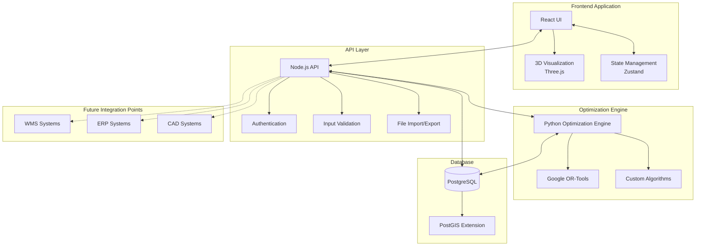
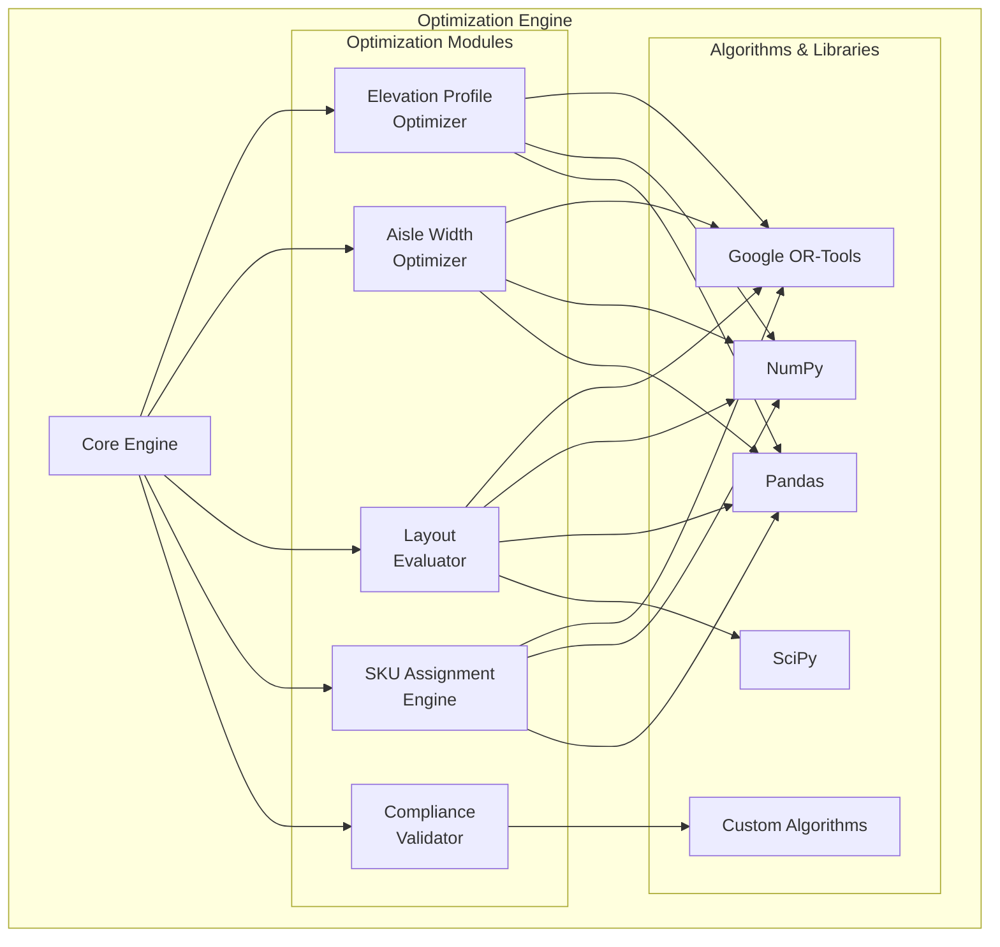
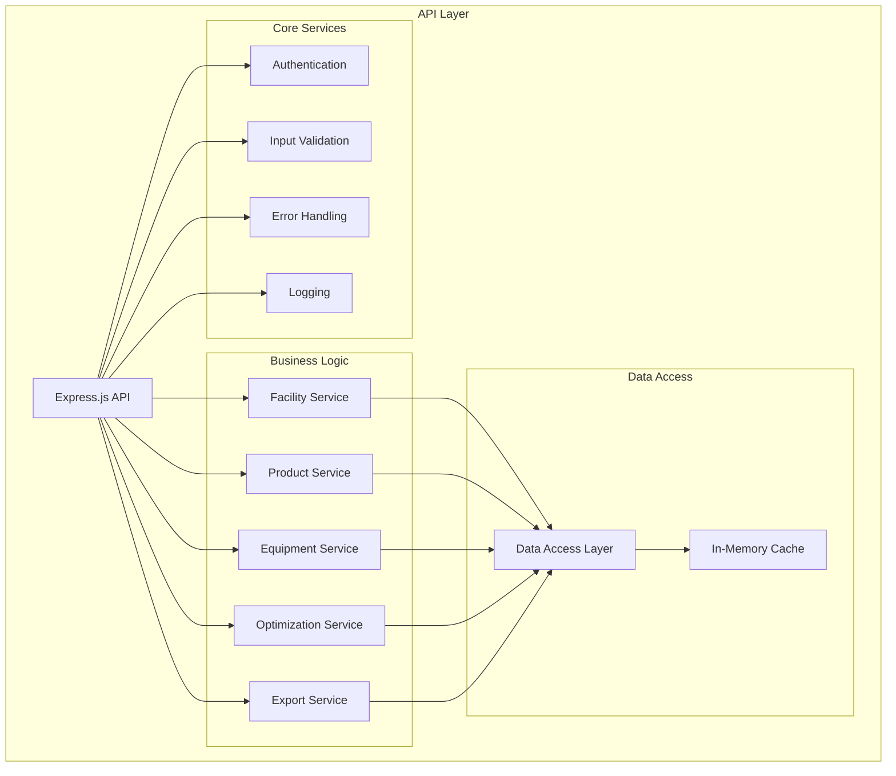
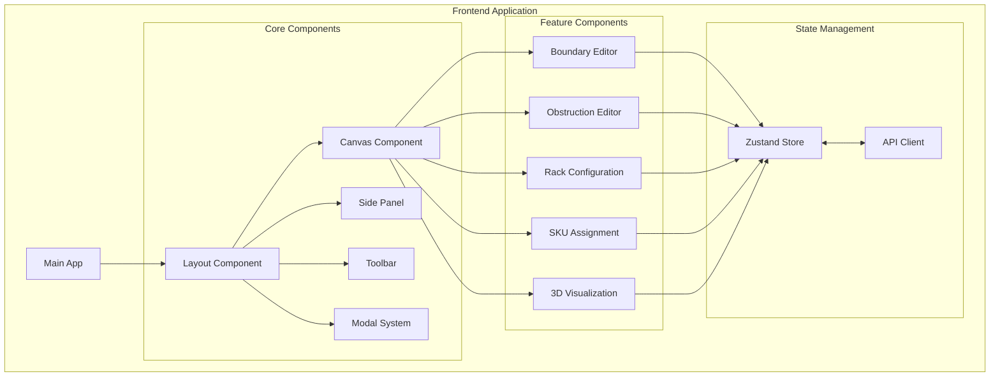
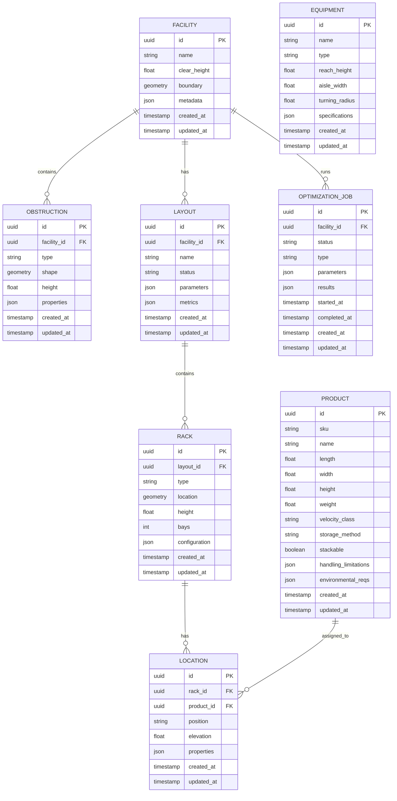
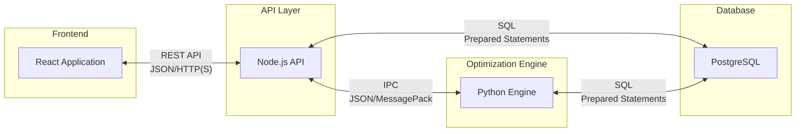

# RackOptix Technical Architecture Design

## Table of Contents
1. [System Architecture Overview](#1-system-architecture-overview)
2. [Detailed Component Specifications](#2-detailed-component-specifications)
   - [2.1 Backend Optimization Engine](#21-backend-optimization-engine-python-with-or-tools)
   - [2.2 API Layer](#22-api-layer-nodejs)
   - [2.3 Frontend Application](#23-frontend-application-react-with-typescript)
   - [2.4 Database Design](#24-database-design-postgresql-with-postgis)
3. [Data Exchange Formats and Protocols](#3-data-exchange-formats-and-protocols)
4. [Scalability Approach](#4-scalability-approach)
5. [Security Considerations](#5-security-considerations)
6. [Deployment Architecture](#6-deployment-architecture)
7. [Implementation Roadmap](#7-implementation-roadmap)
8. [Technical Considerations and Tradeoffs](#8-technical-considerations-and-tradeoffs)

## 1. System Architecture Overview

The RackOptix system architecture consists of four major components: the frontend application, API layer, backend optimization engine, and database. The architecture is designed for on-premises deployment in warehouse environments with limited internet connectivity.

### High-Level System Architecture Diagram



### Component Interactions and Data Flow

1. **User Interaction Flow**:
   - User interacts with the React UI
   - UI updates state via Zustand
   - API requests are made to the Node.js backend
   - Backend processes requests, interacts with the database and optimization engine
   - Results are returned to the UI for visualization

2. **Optimization Flow**:
   - Input data is collected from the UI and validated
   - Data is passed to the optimization engine
   - Engine runs algorithms using OR-Tools
   - Results are stored in the database
   - Visualization data is returned to the frontend

3. **Future Integration Points**:
   - Well-defined API endpoints for WMS/ERP integration
   - Export capabilities for CAD systems
   - Import capabilities for existing warehouse data

## 2. Detailed Component Specifications

### 2.1 Backend Optimization Engine (Python with OR-Tools)



#### Key Components

1. **Core Engine**:
   - Orchestrates optimization processes
   - Manages computational resources
   - Handles input/output data formatting

2. **Optimization Modules**:
   - **Elevation Profile Optimizer**: Calculates optimal beam elevations based on SKU dimensions and equipment reach
   - **Aisle Width Optimizer**: Determines optimal aisle widths based on equipment and velocity
   - **Layout Evaluator**: Simulates and evaluates different layout scenarios
   - **SKU Assignment Engine**: Assigns SKUs to optimal locations
   - **Compliance Validator**: Ensures layouts meet safety and regulatory requirements

3. **Technical Specifications**:
   - **Language**: Python 3.9+
   - **Core Libraries**: 
     - Google OR-Tools for constraint programming and optimization
     - NumPy and Pandas for data manipulation
     - SciPy for scientific computing
   - **Performance Optimizations**:
     - Parallel processing for independent calculations
     - Caching of intermediate results
     - Progressive optimization (quick results first, then refinement)

4. **Interfaces**:
   - REST API for communication with the API layer
   - Direct database access for storing/retrieving optimization results
   - File-based interface for importing/exporting data

### 2.2 API Layer (Node.js)



#### Key Components

1. **Express.js API**:
   - RESTful API endpoints
   - WebSocket support for real-time updates
   - API versioning

2. **Core Services**:
   - **Authentication**: Simple authentication for single-user mode (expandable for Phase 2)
   - **Input Validation**: Schema-based validation using Joi or similar
   - **Error Handling**: Standardized error responses
   - **Logging**: Comprehensive logging for debugging and auditing

3. **Business Logic Services**:
   - **Facility Service**: Manages facility data (boundaries, obstructions)
   - **Product Service**: Handles SKU data and classifications
   - **Equipment Service**: Manages material handling equipment specifications
   - **Optimization Service**: Interfaces with the Python optimization engine
   - **Export Service**: Handles file exports (JSON, DXF, etc.)

4. **Technical Specifications**:
   - **Language**: Node.js 18+ with TypeScript
   - **Framework**: Express.js
   - **Key Libraries**:
     - Joi for validation
     - Winston for logging
     - Passport.js for authentication (future expansion)
     - node-cache for in-memory caching

5. **Interfaces**:
   - REST API for frontend communication
   - Inter-process communication with Python optimization engine
   - Database access via ORM (Sequelize or TypeORM)

### 2.3 Frontend Application (React with TypeScript)



#### Key Components

1. **Core Components**:
   - **Layout Component**: Main application layout
   - **Canvas Component**: Primary drawing and visualization area
   - **Side Panel**: Context-sensitive controls and inputs
   - **Toolbar**: Common actions and tools
   - **Modal System**: For dialogs and overlays

2. **Feature Components**:
   - **Boundary Editor**: For defining facility boundaries
   - **Obstruction Editor**: For adding columns, docks, etc.
   - **Rack Configuration**: For configuring rack types and parameters
   - **SKU Assignment**: For assigning SKUs to locations
   - **3D Visualization**: Three.js-based 3D view of the layout

3. **Technical Specifications**:
   - **Language**: TypeScript 4.5+
   - **Framework**: React 18+
   - **State Management**: Zustand
   - **UI Components**: Custom components with Material-UI base
   - **Visualization**:
     - Konva.js for 2D canvas manipulation
     - Three.js for 3D visualization
   - **Build Tools**: Vite for fast development and building

4. **Key Features**:
   - Responsive design for different screen sizes
   - Offline-first approach with local storage backup
   - Progressive loading of large datasets
   - Canvas-based interactive editing
   - 3D visualization with zoom, pan, and rotate

### 2.4 Database Design (PostgreSQL with PostGIS)



#### Key Components

1. **Core Tables**:
   - **FACILITY**: Stores facility information including boundaries
   - **OBSTRUCTION**: Columns, docks, and other obstructions
   - **PRODUCT**: SKU information and characteristics
   - **EQUIPMENT**: Material handling equipment specifications
   - **LAYOUT**: Layout scenarios and configurations
   - **RACK**: Rack definitions and locations
   - **LOCATION**: Individual storage locations within racks
   - **OPTIMIZATION_JOB**: Tracks optimization jobs and results

2. **Technical Specifications**:
   - **Database**: PostgreSQL 14+
   - **Extensions**:
     - PostGIS for spatial data and queries
     - pgvector (optional) for vector-based similarity searches
   - **Performance Optimizations**:
     - Appropriate indexing on frequently queried columns
     - Partitioning for large tables (products, locations)
     - Materialized views for complex aggregations

3. **Data Management**:
   - Versioning of layouts and configurations
   - Soft deletion for data recovery
   - Audit logging for changes
   - Regular backups

## 3. Data Exchange Formats and Protocols

### 3.1 Internal Data Exchange



1. **Frontend to API**:
   - **Protocol**: REST API over HTTP/HTTPS
   - **Format**: JSON
   - **Authentication**: JWT tokens
   - **Endpoints**:
     - `/api/facilities` - Facility management
     - `/api/products` - Product management
     - `/api/equipment` - Equipment management
     - `/api/layouts` - Layout management
     - `/api/optimization` - Optimization jobs

2. **API to Optimization Engine**:
   - **Protocol**: Inter-Process Communication (IPC)
   - **Format**: JSON or MessagePack for efficiency
   - **Communication Methods**:
     - REST API for stateless operations
     - File-based exchange for large datasets
     - Shared memory for performance-critical operations

3. **Database Access**:
   - **Protocol**: SQL with prepared statements
   - **ORM**: Sequelize (Node.js) and SQLAlchemy (Python)
   - **Connection Pooling**: For efficient resource utilization

### 3.2 External Data Exchange

1. **File Imports**:
   - **CAD Imports**: DXF/DWG for existing layouts
   - **Product Data**: CSV/Excel for SKU information
   - **Equipment Specs**: JSON/XML for equipment parameters

2. **File Exports**:
   - **Layout Exports**: DXF/DWG for CAD integration
   - **Reports**: PDF/Excel for documentation
   - **Data Exports**: JSON/CSV for external analysis

3. **Future WMS/ERP Integration**:
   - **Protocol**: REST API or message queue
   - **Format**: JSON or XML
   - **Authentication**: API keys or OAuth
   - **Operations**:
     - Product data synchronization
     - Inventory level updates
     - Location assignment updates

## 4. Scalability Approach

### 4.1 Handling Large SKU Catalogs

1. **Database Optimizations**:
   - Table partitioning for products and locations
   - Efficient indexing strategies
   - Query optimization for common access patterns

2. **Data Loading Strategies**:
   - Progressive loading of SKU data
   - Caching frequently accessed SKUs
   - Batch processing for bulk operations

3. **UI Considerations**:
   - Virtualized lists for displaying large catalogs
   - Filtering and search capabilities
   - Grouping SKUs by categories for easier management

### 4.2 Complex Facility Configurations

1. **Spatial Indexing**:
   - Using PostGIS spatial indexes for efficient geometric queries
   - R-tree indexing for fast spatial lookups

2. **Hierarchical Representation**:
   - Breaking down complex facilities into zones
   - Modular processing of different areas
   - Composite pattern for nested structures

3. **Visualization Optimizations**:
   - Level-of-detail rendering
   - Frustum culling for 3D visualization
   - Incremental rendering of complex layouts

### 4.3 Intensive Optimization Calculations

1. **Algorithmic Optimizations**:
   - Progressive optimization (quick results first, then refinement)
   - Heuristic-based approaches for initial solutions
   - Constraint relaxation techniques

2. **Computational Strategies**:
   - Parallel processing for independent calculations
   - Task queuing for long-running optimizations
   - Caching intermediate results

3. **Resource Management**:
   - Monitoring CPU and memory usage
   - Graceful degradation under heavy load
   - Background processing for non-interactive operations

## 5. Security Considerations

### 5.1 Data Protection

1. **At Rest**:
   - Database encryption for sensitive data
   - Secure file storage for imported/exported files
   - Regular backups with encryption

2. **In Transit**:
   - HTTPS for all API communications
   - Secure IPC between components
   - Encrypted file transfers

3. **Access Control**:
   - Single user authentication initially
   - Preparation for role-based access in Phase 2
   - Audit logging of all operations

### 5.2 Application Security

1. **Input Validation**:
   - Strict schema validation for all inputs
   - Sanitization of user-provided data
   - Prevention of common vulnerabilities (XSS, CSRF, etc.)

2. **Dependency Management**:
   - Regular updates of dependencies
   - Vulnerability scanning
   - Minimal dependency footprint

3. **Code Security**:
   - Secure coding practices
   - Code reviews
   - Static analysis tools

### 5.3 On-Premises Deployment Security

1. **Installation Security**:
   - Signed installation packages
   - Verification of integrity
   - Minimal required permissions

2. **Network Security**:
   - Local network operation only
   - No external dependencies for core functionality
   - Optional secure updates mechanism

3. **Data Isolation**:
   - Keeping proprietary warehouse data local
   - No cloud dependencies or data sharing
   - User control over all data

## 6. Deployment Architecture

### 6.1 On-Premises Deployment

```mermaid
flowchart TB
    subgraph "RackOptix Application"
        FE[Frontend\nElectron App]
        API[API Layer\nNode.js]
        OE[Optimization Engine\nPython]
        DB[(Local Database\nPostgreSQL)]
        
        FE <--> API
        API <--> OE
        API <--> DB
        OE <--> DB
    end
    
    subgraph "Local Environment"
        FS[File System]
        Backup[Backup System]
    end
    
    RackOptix Application <--> FS
    RackOptix Application <--> Backup
```

1. **Deployment Options**:
   - **Standalone Application**: Electron-based desktop application
   - **Local Server**: Deployable on warehouse server with web access

2. **Installation Process**:
   - Single installer package
   - Minimal dependencies
   - Automated database setup
   - Configuration wizard

3. **Updates**:
   - Offline update packages
   - Versioned updates with rollback capability
   - Database migration scripts

### 6.2 Development, Testing, and Production Environments

1. **Development Environment**:
   - Local development setup
   - Docker containers for consistent environments
   - Mock data generation

2. **Testing Environment**:
   - Automated testing suite
   - Performance testing tools
   - Validation against real-world scenarios

3. **Production Environment**:
   - Optimized builds
   - Minimal debugging information
   - Performance monitoring

### 6.3 Continuous Integration/Deployment

1. **CI/CD Pipeline**:
   - Automated builds
   - Unit and integration testing
   - Static code analysis
   - Package generation

2. **Release Management**:
   - Semantic versioning
   - Release notes generation
   - Deployment verification

3. **Quality Assurance**:
   - Automated testing
   - Manual validation
   - Performance benchmarking

### 6.4 Performance Monitoring

1. **Application Monitoring**:
   - Performance metrics collection
   - Error tracking
   - Usage statistics (optional, privacy-preserving)

2. **Diagnostic Tools**:
   - Logging framework
   - Troubleshooting utilities
   - Performance profiling

3. **Reporting**:
   - System health reports
   - Optimization performance metrics
   - Resource utilization tracking

## 7. Implementation Roadmap

### 7.1 Phase 1: MVP Implementation

1. **Foundation (Weeks 1-2)**:
   - Database schema setup
   - Core API structure
   - Basic UI framework

2. **Core Features (Weeks 3-6)**:
   - Facility boundary definition
   - Obstruction placement
   - Basic optimization algorithms
   - 2D visualization

3. **Enhanced Features (Weeks 7-10)**:
   - Complete optimization engine
   - 3D visualization
   - Export capabilities
   - Performance optimization

4. **Testing and Refinement (Weeks 11-12)**:
   - User acceptance testing
   - Performance testing
   - Bug fixes and refinements

### 7.2 Phase 2: Advanced Features

1. **WMS/ERP Integration**:
   - API development for integration
   - Data synchronization
   - Real-time updates

2. **Multi-User Support**:
   - User management
   - Role-based access control
   - Collaboration features

3. **Advanced Analytics**:
   - Cost vs. density analysis
   - Throughput simulation
   - What-if scenario modeling

## 8. Technical Considerations and Tradeoffs

### 8.1 Performance vs. Usability

1. **Optimization Speed**:
   - Progressive optimization to show quick results
   - Background processing for detailed analysis
   - User feedback during long calculations

2. **Visualization Performance**:
   - Level-of-detail rendering
   - Simplified models for interaction
   - Detailed models for final visualization

3. **Data Management**:
   - Efficient storage formats
   - Caching strategies
   - Lazy loading of large datasets

### 8.2 Flexibility vs. Complexity

1. **Configuration Options**:
   - Balancing customization with usability
   - Sensible defaults with expert options
   - Template-based approach for common scenarios

2. **Algorithm Design**:
   - Modular algorithms for extensibility
   - Clear interfaces between components
   - Pluggable optimization strategies

3. **User Interface**:
   - Progressive disclosure of complex features
   - Context-sensitive help
   - Guided workflows for common tasks

### 8.3 On-Premises vs. Future Cloud Options

1. **Current Design**:
   - Fully self-contained for on-premises deployment
   - No external dependencies for core functionality
   - Local data storage and processing

2. **Future Expansion**:
   - Architecture designed for potential cloud migration
   - Clear separation of concerns
   - Containerization-friendly design

3. **Hybrid Options**:
   - Optional cloud backup
   - Distributed processing capabilities
   - Secure data sharing mechanisms