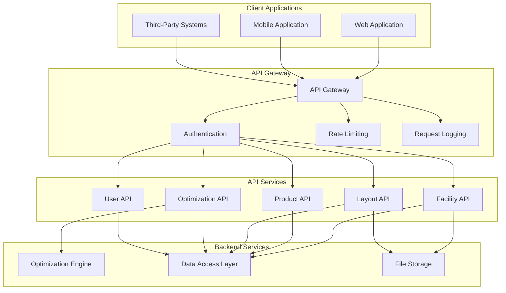

# RackOptix Data Model and Integration Strategy

## Table of Contents
1. [Data Model Design](#1-data-model-design)
   - [Entity-Relationship Diagrams](#11-entity-relationship-diagrams)
   - [Database Schema Design](#12-database-schema-design)
   - [Entity Definitions](#13-entity-definitions)
2. [Core Data Entities](#2-core-data-entities)
   - [Facility and Building Structures](#21-facility-and-building-structures)
   - [Rack Types and Configurations](#22-rack-types-and-configurations)
   - [Product/SKU Data Model](#23-productsku-data-model)
   - [Material Handling Equipment](#24-material-handling-equipment)
   - [Layout Scenarios and Optimization Results](#25-layout-scenarios-and-optimization-results)
   - [User and Project Management](#26-user-and-project-management)
3. [Data Integration Strategy](#3-data-integration-strategy)
   - [API Strategy Overview](#31-api-strategy-overview)
   - [API Contract Definitions](#32-api-contract-definitions)
   - [Data Exchange Formats](#33-data-exchange-formats)
   - [Batch Import/Export Capabilities](#34-batch-importexport-capabilities)
   - [Future Integration Points](#35-future-integration-points)
4. [Data Persistence Approach](#4-data-persistence-approach)
   - [Database Indexing Strategy](#41-database-indexing-strategy)
   - [Query Optimization](#42-query-optimization)
   - [Data Partitioning](#43-data-partitioning)
   - [Backup and Recovery](#44-backup-and-recovery)
5. [Data Security and Compliance](#5-data-security-and-compliance)
   - [General Best Practices](#51-general-best-practices)
6. [Data Migration and Versioning Strategy](#6-data-migration-and-versioning-strategy)
   - [Schema Versioning Approach](#61-schema-versioning-approach)
   - [Data Migration Procedures](#62-data-migration-procedures)
   - [Backward Compatibility](#63-backward-compatibility)
   - [Test Data Generation](#64-test-data-generation)

## 1. Data Model Design

### 1.1 Entity-Relationship Diagrams

The following entity-relationship diagram represents the complete data model for the RackOptix system:

```mermaid
erDiagram
    %% Core Entities
    USER {
        uuid id PK
        string username
        string email
        timestamp created_at
        timestamp updated_at
        boolean is_active
    }
    
    PROJECT {
        uuid id PK
        string name
        string description
        uuid created_by_user_id FK
        timestamp created_at
        timestamp updated_at
    }
    
    FACILITY {
        uuid id PK
        uuid project_id FK
        string name
        string description
        float clear_height
        geometry boundary
        json metadata
        timestamp created_at
        timestamp updated_at
    }
    
    ZONE {
        uuid id PK
        uuid facility_id FK
        string name
        string purpose
        geometry boundary
        json properties
        timestamp created_at
        timestamp updated_at
    }
    
    OBSTRUCTION {
        uuid id PK
        uuid facility_id FK
        string type
        geometry shape
        float height
        json properties
        timestamp created_at
        timestamp updated_at
    }
    
    PRODUCT_CATEGORY {
        uuid id PK
        string name
        string description
        timestamp created_at
        timestamp updated_at
    }
    
    PRODUCT {
        uuid id PK
        uuid category_id FK
        string sku
        string name
        string description
        float length
        float width
        float height
        float weight
        string velocity_class
        string storage_method
        boolean stackable
        json handling_limitations
        json environmental_reqs
        int monthly_throughput
        timestamp created_at
        timestamp updated_at
    }
    
    EQUIPMENT_TYPE {
        uuid id PK
        string name
        string description
        timestamp created_at
        timestamp updated_at
    }
    
    EQUIPMENT {
        uuid id PK
        uuid type_id FK
        string name
        float reach_height
        float min_aisle_width
        float max_aisle_width
        float turning_radius
        float lift_capacity
        json specifications
        timestamp created_at
        timestamp updated_at
    }
    
    RACK_TYPE {
        uuid id PK
        string name
        string description
        json specifications
        timestamp created_at
        timestamp updated_at
    }
    
    LAYOUT {
        uuid id PK
        uuid facility_id FK
        string name
        string description
        string status
        json parameters
        json metrics
        timestamp created_at
        timestamp updated_at
    }
    
    RACK {
        uuid id PK
        uuid layout_id FK
        uuid rack_type_id FK
        geometry location
        float orientation
        float height
        float length
        float depth
        int bays
        json configuration
        timestamp created_at
        timestamp updated_at
    }
    
    BAY {
        uuid id PK
        uuid rack_id FK
        int position
        float width
        json beam_elevations
        timestamp created_at
        timestamp updated_at
    }
    
    AISLE {
        uuid id PK
        uuid layout_id FK
        uuid equipment_id FK
        geometry path
        float width
        json properties
        timestamp created_at
        timestamp updated_at
    }
    
    LOCATION {
        uuid id PK
        uuid rack_id FK
        uuid bay_id FK
        int level
        int position
        float elevation
        json dimensions
        json properties
        timestamp created_at
        timestamp updated_at
    }
    
    PRODUCT_ASSIGNMENT {
        uuid id PK
        uuid layout_id FK
        uuid product_id FK
        uuid location_id FK
        int quantity
        timestamp created_at
        timestamp updated_at
    }
    
    OPTIMIZATION_JOB {
        uuid id PK
        uuid facility_id FK
        uuid layout_id FK
        string job_type
        string status
        json parameters
        json results
        timestamp started_at
        timestamp completed_at
        timestamp created_at
        timestamp updated_at
    }
    
    OPTIMIZATION_CONSTRAINT {
        uuid id PK
        uuid optimization_job_id FK
        string constraint_type
        string name
        boolean is_hard_constraint
        float weight
        json parameters
        timestamp created_at
        timestamp updated_at
    }
    
    %% Relationships
    USER ||--o{ PROJECT : "creates"
    PROJECT ||--o{ FACILITY : "contains"
    FACILITY ||--o{ ZONE : "divided into"
    FACILITY ||--o{ OBSTRUCTION : "contains"
    FACILITY ||--o{ LAYOUT : "has"
    PRODUCT_CATEGORY ||--o{ PRODUCT : "categorizes"
    EQUIPMENT_TYPE ||--o{ EQUIPMENT : "categorizes"
    LAYOUT ||--o{ RACK : "contains"
    LAYOUT ||--o{ AISLE : "contains"
    RACK ||--o{ BAY : "contains"
    RACK_TYPE ||--o{ RACK : "defines"
    BAY ||--o{ LOCATION : "contains"
    LOCATION ||--o{ PRODUCT_ASSIGNMENT : "stores"
    PRODUCT ||--o{ PRODUCT_ASSIGNMENT : "assigned to"
    EQUIPMENT ||--o{ AISLE : "operates in"
    FACILITY ||--o{ OPTIMIZATION_JOB : "runs"
    OPTIMIZATION_JOB ||--o{ OPTIMIZATION_CONSTRAINT : "applies"
    LAYOUT }|--|| OPTIMIZATION_JOB : "results from"
### 1.2 Database Schema Design

The database schema is designed for PostgreSQL with PostGIS extension to handle spatial data. The schema is organized into logical groups of related tables.

#### 1.2.1 User and Project Management Tables

```sql
-- Users table
CREATE TABLE users (
    id UUID PRIMARY KEY DEFAULT gen_random_uuid(),
    username VARCHAR(50) NOT NULL UNIQUE,
    email VARCHAR(100) NOT NULL UNIQUE,
    created_at TIMESTAMP WITH TIME ZONE NOT NULL DEFAULT CURRENT_TIMESTAMP,
    updated_at TIMESTAMP WITH TIME ZONE NOT NULL DEFAULT CURRENT_TIMESTAMP,
    is_active BOOLEAN NOT NULL DEFAULT TRUE
);

-- Projects table
CREATE TABLE projects (
    id UUID PRIMARY KEY DEFAULT gen_random_uuid(),
    name VARCHAR(100) NOT NULL,
    description TEXT,
    created_by_user_id UUID NOT NULL REFERENCES users(id),
    created_at TIMESTAMP WITH TIME ZONE NOT NULL DEFAULT CURRENT_TIMESTAMP,
    updated_at TIMESTAMP WITH TIME ZONE NOT NULL DEFAULT CURRENT_TIMESTAMP
);
CREATE INDEX idx_projects_created_by ON projects(created_by_user_id);
```

#### 1.2.2 Facility and Building Structure Tables

```sql
-- Facilities table
CREATE TABLE facilities (
    id UUID PRIMARY KEY DEFAULT gen_random_uuid(),
    project_id UUID NOT NULL REFERENCES projects(id) ON DELETE CASCADE,
    name VARCHAR(100) NOT NULL,
    description TEXT,
    clear_height FLOAT NOT NULL,
    boundary GEOMETRY(POLYGON, 4326) NOT NULL,
    metadata JSONB,
    created_at TIMESTAMP WITH TIME ZONE NOT NULL DEFAULT CURRENT_TIMESTAMP,
    updated_at TIMESTAMP WITH TIME ZONE NOT NULL DEFAULT CURRENT_TIMESTAMP
);
CREATE INDEX idx_facilities_project_id ON facilities(project_id);
CREATE INDEX idx_facilities_boundary ON facilities USING GIST(boundary);

-- Zones table
CREATE TABLE zones (
    id UUID PRIMARY KEY DEFAULT gen_random_uuid(),
    facility_id UUID NOT NULL REFERENCES facilities(id) ON DELETE CASCADE,
    name VARCHAR(100) NOT NULL,
    purpose VARCHAR(50),
    boundary GEOMETRY(POLYGON, 4326) NOT NULL,
    properties JSONB,
    created_at TIMESTAMP WITH TIME ZONE NOT NULL DEFAULT CURRENT_TIMESTAMP,
    updated_at TIMESTAMP WITH TIME ZONE NOT NULL DEFAULT CURRENT_TIMESTAMP
);
CREATE INDEX idx_zones_facility_id ON zones(facility_id);
CREATE INDEX idx_zones_boundary ON zones USING GIST(boundary);

-- Obstructions table
CREATE TABLE obstructions (
    id UUID PRIMARY KEY DEFAULT gen_random_uuid(),
    facility_id UUID NOT NULL REFERENCES facilities(id) ON DELETE CASCADE,
    type VARCHAR(50) NOT NULL,
    shape GEOMETRY(POLYGON, 4326) NOT NULL,
    height FLOAT NOT NULL,
    properties JSONB,
    created_at TIMESTAMP WITH TIME ZONE NOT NULL DEFAULT CURRENT_TIMESTAMP,
    updated_at TIMESTAMP WITH TIME ZONE NOT NULL DEFAULT CURRENT_TIMESTAMP
);
CREATE INDEX idx_obstructions_facility_id ON obstructions(facility_id);
CREATE INDEX idx_obstructions_shape ON obstructions USING GIST(shape);
CREATE INDEX idx_obstructions_type ON obstructions(type);
```

#### 1.2.3 Product and SKU Tables

```sql
-- Product Categories table
CREATE TABLE product_categories (
    id UUID PRIMARY KEY DEFAULT gen_random_uuid(),
    name VARCHAR(100) NOT NULL,
    description TEXT,
    created_at TIMESTAMP WITH TIME ZONE NOT NULL DEFAULT CURRENT_TIMESTAMP,
    updated_at TIMESTAMP WITH TIME ZONE NOT NULL DEFAULT CURRENT_TIMESTAMP
);

-- Products table
CREATE TABLE products (
    id UUID PRIMARY KEY DEFAULT gen_random_uuid(),
    category_id UUID REFERENCES product_categories(id),
    sku VARCHAR(50) NOT NULL UNIQUE,
    name VARCHAR(100) NOT NULL,
    description TEXT,
    length FLOAT NOT NULL,
    width FLOAT NOT NULL,
    height FLOAT NOT NULL,
    weight FLOAT NOT NULL,
    velocity_class VARCHAR(10) NOT NULL,
    storage_method VARCHAR(50) NOT NULL,
    stackable BOOLEAN NOT NULL DEFAULT FALSE,
    handling_limitations JSONB,
    environmental_reqs JSONB,
    monthly_throughput INTEGER,
    created_at TIMESTAMP WITH TIME ZONE NOT NULL DEFAULT CURRENT_TIMESTAMP,
    updated_at TIMESTAMP WITH TIME ZONE NOT NULL DEFAULT CURRENT_TIMESTAMP,
    CONSTRAINT valid_dimensions CHECK (length > 0 AND width > 0 AND height > 0),
    CONSTRAINT valid_weight CHECK (weight > 0)
);
CREATE INDEX idx_products_category_id ON products(category_id);
CREATE INDEX idx_products_sku ON products(sku);
CREATE INDEX idx_products_velocity_class ON products(velocity_class);
CREATE INDEX idx_products_storage_method ON products(storage_method);
```

#### 1.2.4 Material Handling Equipment Tables

```sql
-- Equipment Types table
CREATE TABLE equipment_types (
    id UUID PRIMARY KEY DEFAULT gen_random_uuid(),
    name VARCHAR(100) NOT NULL,
    description TEXT,
    created_at TIMESTAMP WITH TIME ZONE NOT NULL DEFAULT CURRENT_TIMESTAMP,
    updated_at TIMESTAMP WITH TIME ZONE NOT NULL DEFAULT CURRENT_TIMESTAMP
);

-- Equipment table
CREATE TABLE equipment (
    id UUID PRIMARY KEY DEFAULT gen_random_uuid(),
    type_id UUID NOT NULL REFERENCES equipment_types(id),
    name VARCHAR(100) NOT NULL,
    reach_height FLOAT NOT NULL,
    min_aisle_width FLOAT NOT NULL,
    max_aisle_width FLOAT NOT NULL,
    turning_radius FLOAT NOT NULL,
    lift_capacity FLOAT NOT NULL,
    specifications JSONB,
    created_at TIMESTAMP WITH TIME ZONE NOT NULL DEFAULT CURRENT_TIMESTAMP,
    updated_at TIMESTAMP WITH TIME ZONE NOT NULL DEFAULT CURRENT_TIMESTAMP,
    CONSTRAINT valid_reach_height CHECK (reach_height > 0),
    CONSTRAINT valid_aisle_width CHECK (min_aisle_width > 0 AND max_aisle_width >= min_aisle_width),
    CONSTRAINT valid_turning_radius CHECK (turning_radius > 0),
    CONSTRAINT valid_lift_capacity CHECK (lift_capacity > 0)
);
CREATE INDEX idx_equipment_type_id ON equipment(type_id);
```
#### 1.2.5 Rack and Layout Tables

```sql
-- Rack Types table
CREATE TABLE rack_types (
    id UUID PRIMARY KEY DEFAULT gen_random_uuid(),
    name VARCHAR(100) NOT NULL,
    description TEXT,
    specifications JSONB NOT NULL,
    created_at TIMESTAMP WITH TIME ZONE NOT NULL DEFAULT CURRENT_TIMESTAMP,
    updated_at TIMESTAMP WITH TIME ZONE NOT NULL DEFAULT CURRENT_TIMESTAMP
);

-- Layouts table
CREATE TABLE layouts (
    id UUID PRIMARY KEY DEFAULT gen_random_uuid(),
    facility_id UUID NOT NULL REFERENCES facilities(id) ON DELETE CASCADE,
    name VARCHAR(100) NOT NULL,
    description TEXT,
    status VARCHAR(20) NOT NULL DEFAULT 'draft',
    parameters JSONB,
    metrics JSONB,
    created_at TIMESTAMP WITH TIME ZONE NOT NULL DEFAULT CURRENT_TIMESTAMP,
    updated_at TIMESTAMP WITH TIME ZONE NOT NULL DEFAULT CURRENT_TIMESTAMP,
    CONSTRAINT valid_status CHECK (status IN ('draft', 'in_progress', 'completed', 'archived'))
);
CREATE INDEX idx_layouts_facility_id ON layouts(facility_id);
CREATE INDEX idx_layouts_status ON layouts(status);

-- Racks table
CREATE TABLE racks (
    id UUID PRIMARY KEY DEFAULT gen_random_uuid(),
    layout_id UUID NOT NULL REFERENCES layouts(id) ON DELETE CASCADE,
    rack_type_id UUID NOT NULL REFERENCES rack_types(id),
    location GEOMETRY(POLYGON, 4326) NOT NULL,
    orientation FLOAT NOT NULL DEFAULT 0,
    height FLOAT NOT NULL,
    length FLOAT NOT NULL,
    depth FLOAT NOT NULL,
    bays INTEGER NOT NULL,
    configuration JSONB,
    created_at TIMESTAMP WITH TIME ZONE NOT NULL DEFAULT CURRENT_TIMESTAMP,
    updated_at TIMESTAMP WITH TIME ZONE NOT NULL DEFAULT CURRENT_TIMESTAMP,
    CONSTRAINT valid_dimensions CHECK (height > 0 AND length > 0 AND depth > 0),
    CONSTRAINT valid_bays CHECK (bays > 0)
);
CREATE INDEX idx_racks_layout_id ON racks(layout_id);
CREATE INDEX idx_racks_rack_type_id ON racks(rack_type_id);
CREATE INDEX idx_racks_location ON racks USING GIST(location);

-- Bays table
CREATE TABLE bays (
    id UUID PRIMARY KEY DEFAULT gen_random_uuid(),
    rack_id UUID NOT NULL REFERENCES racks(id) ON DELETE CASCADE,
    position INTEGER NOT NULL,
    width FLOAT NOT NULL,
    beam_elevations JSONB NOT NULL,
    created_at TIMESTAMP WITH TIME ZONE NOT NULL DEFAULT CURRENT_TIMESTAMP,
    updated_at TIMESTAMP WITH TIME ZONE NOT NULL DEFAULT CURRENT_TIMESTAMP,
    CONSTRAINT valid_width CHECK (width > 0),
    UNIQUE (rack_id, position)
);
CREATE INDEX idx_bays_rack_id ON bays(rack_id);

-- Aisles table
CREATE TABLE aisles (
    id UUID PRIMARY KEY DEFAULT gen_random_uuid(),
    layout_id UUID NOT NULL REFERENCES layouts(id) ON DELETE CASCADE,
    equipment_id UUID REFERENCES equipment(id),
    path GEOMETRY(LINESTRING, 4326) NOT NULL,
    width FLOAT NOT NULL,
    properties JSONB,
    created_at TIMESTAMP WITH TIME ZONE NOT NULL DEFAULT CURRENT_TIMESTAMP,
    updated_at TIMESTAMP WITH TIME ZONE NOT NULL DEFAULT CURRENT_TIMESTAMP,
    CONSTRAINT valid_width CHECK (width > 0)
);
CREATE INDEX idx_aisles_layout_id ON aisles(layout_id);
CREATE INDEX idx_aisles_equipment_id ON aisles(equipment_id);
CREATE INDEX idx_aisles_path ON aisles USING GIST(path);

-- Locations table
CREATE TABLE locations (
    id UUID PRIMARY KEY DEFAULT gen_random_uuid(),
    rack_id UUID NOT NULL REFERENCES racks(id) ON DELETE CASCADE,
    bay_id UUID NOT NULL REFERENCES bays(id) ON DELETE CASCADE,
    level INTEGER NOT NULL,
    position INTEGER NOT NULL,
    elevation FLOAT NOT NULL,
    dimensions JSONB NOT NULL,
    properties JSONB,
    created_at TIMESTAMP WITH TIME ZONE NOT NULL DEFAULT CURRENT_TIMESTAMP,
    updated_at TIMESTAMP WITH TIME ZONE NOT NULL DEFAULT CURRENT_TIMESTAMP,
    CONSTRAINT valid_elevation CHECK (elevation >= 0),
    UNIQUE (rack_id, bay_id, level, position)
);
CREATE INDEX idx_locations_rack_id ON locations(rack_id);
CREATE INDEX idx_locations_bay_id ON locations(bay_id);

-- Product Assignments table
CREATE TABLE product_assignments (
    id UUID PRIMARY KEY DEFAULT gen_random_uuid(),
    layout_id UUID NOT NULL REFERENCES layouts(id) ON DELETE CASCADE,
    product_id UUID NOT NULL REFERENCES products(id),
    location_id UUID NOT NULL REFERENCES locations(id),
    quantity INTEGER NOT NULL DEFAULT 1,
    created_at TIMESTAMP WITH TIME ZONE NOT NULL DEFAULT CURRENT_TIMESTAMP,
    updated_at TIMESTAMP WITH TIME ZONE NOT NULL DEFAULT CURRENT_TIMESTAMP,
    CONSTRAINT valid_quantity CHECK (quantity > 0),
    UNIQUE (layout_id, location_id)
);
CREATE INDEX idx_product_assignments_layout_id ON product_assignments(layout_id);
CREATE INDEX idx_product_assignments_product_id ON product_assignments(product_id);
CREATE INDEX idx_product_assignments_location_id ON product_assignments(location_id);
```

#### 1.2.6 Optimization Tables

```sql
-- Optimization Jobs table
CREATE TABLE optimization_jobs (
    id UUID PRIMARY KEY DEFAULT gen_random_uuid(),
    facility_id UUID NOT NULL REFERENCES facilities(id) ON DELETE CASCADE,
    layout_id UUID REFERENCES layouts(id) ON DELETE SET NULL,
    job_type VARCHAR(50) NOT NULL,
    status VARCHAR(20) NOT NULL DEFAULT 'pending',
    parameters JSONB NOT NULL,
    results JSONB,
    started_at TIMESTAMP WITH TIME ZONE,
    completed_at TIMESTAMP WITH TIME ZONE,
    created_at TIMESTAMP WITH TIME ZONE NOT NULL DEFAULT CURRENT_TIMESTAMP,
    updated_at TIMESTAMP WITH TIME ZONE NOT NULL DEFAULT CURRENT_TIMESTAMP,
    CONSTRAINT valid_status CHECK (status IN ('pending', 'running', 'completed', 'failed', 'cancelled')),
    CONSTRAINT valid_job_type CHECK (job_type IN ('layout_generation', 'elevation_optimization', 'aisle_optimization', 'sku_slotting', 'full_optimization'))
);
CREATE INDEX idx_optimization_jobs_facility_id ON optimization_jobs(facility_id);
CREATE INDEX idx_optimization_jobs_layout_id ON optimization_jobs(layout_id);
CREATE INDEX idx_optimization_jobs_status ON optimization_jobs(status);
CREATE INDEX idx_optimization_jobs_job_type ON optimization_jobs(job_type);

-- Optimization Constraints table
CREATE TABLE optimization_constraints (
    id UUID PRIMARY KEY DEFAULT gen_random_uuid(),
    optimization_job_id UUID NOT NULL REFERENCES optimization_jobs(id) ON DELETE CASCADE,
    constraint_type VARCHAR(50) NOT NULL,
    name VARCHAR(100) NOT NULL,
    is_hard_constraint BOOLEAN NOT NULL DEFAULT TRUE,
    weight FLOAT,
    parameters JSONB NOT NULL,
    created_at TIMESTAMP WITH TIME ZONE NOT NULL DEFAULT CURRENT_TIMESTAMP,
    updated_at TIMESTAMP WITH TIME ZONE NOT NULL DEFAULT CURRENT_TIMESTAMP,
    CONSTRAINT valid_weight CHECK (is_hard_constraint OR (weight IS NOT NULL AND weight > 0))
);
CREATE INDEX idx_optimization_constraints_job_id ON optimization_constraints(optimization_job_id);
CREATE INDEX idx_optimization_constraints_type ON optimization_constraints(constraint_type);
```

### 1.3 Entity Definitions

#### 1.3.1 User and Project Entities

| Entity | Description |
|--------|-------------|
| USER | Represents system users who create and manage projects |
| PROJECT | Represents a collection of facilities and layouts for a specific client or purpose |

#### 1.3.2 Facility and Building Structure Entities

| Entity | Description |
|--------|-------------|
| FACILITY | Represents a warehouse or distribution center with physical boundaries and properties |
| ZONE | Represents a designated area within a facility with a specific purpose (e.g., receiving, shipping, storage) |
| OBSTRUCTION | Represents physical obstructions within a facility (columns, walls, docks, etc.) |

#### 1.3.3 Product and SKU Entities

| Entity | Description |
|--------|-------------|
| PRODUCT_CATEGORY | Represents a grouping of similar products |
| PRODUCT | Represents a stock keeping unit (SKU) with physical dimensions and handling requirements |

#### 1.3.4 Material Handling Equipment Entities

| Entity | Description |
|--------|-------------|
| EQUIPMENT_TYPE | Represents a category of material handling equipment (e.g., reach truck, forklift) |
| EQUIPMENT | Represents a specific equipment model with operational parameters |

#### 1.3.5 Rack and Layout Entities

| Entity | Description |
|--------|-------------|
| RACK_TYPE | Represents a type of storage rack (e.g., selective, drive-in, push-back) |
| LAYOUT | Represents a specific warehouse layout configuration |
| RACK | Represents a storage rack within a layout |
| BAY | Represents a section of a rack |
| AISLE | Represents a pathway between racks |
| LOCATION | Represents a specific storage location within a rack |
| PRODUCT_ASSIGNMENT | Represents the assignment of a product to a specific location |

#### 1.3.6 Optimization Entities

| Entity | Description |
|--------|-------------|
| OPTIMIZATION_JOB | Represents an optimization task with parameters and results |
| OPTIMIZATION_CONSTRAINT | Represents a constraint applied to an optimization job |
## 2. Core Data Entities

### 2.1 Facility and Building Structures

#### 2.1.1 Facility Entity

The Facility entity is the core container for all warehouse-related data. It represents a physical warehouse or distribution center.

**Key Attributes:**
- `id`: Unique identifier (UUID)
- `project_id`: Reference to the parent project
- `name`: Facility name
- `description`: Detailed description
- `clear_height`: Maximum usable height in feet/meters
- `boundary`: PostGIS polygon representing the facility outline
- `metadata`: JSON field for flexible additional properties

**Relationships:**
- Belongs to one Project
- Contains many Zones
- Contains many Obstructions
- Has many Layouts
- Runs many Optimization Jobs

**Sample Data:**
```json
{
  "id": "f47ac10b-58cc-4372-a567-0e02b2c3d479",
  "project_id": "3fa85f64-5717-4562-b3fc-2c963f66afa6",
  "name": "Chicago Distribution Center",
  "description": "Main distribution facility for Midwest region",
  "clear_height": 32.5,
  "boundary": {
    "type": "Polygon",
    "coordinates": [
      [
        [0, 0],
        [0, 500],
        [800, 500],
        [800, 0],
        [0, 0]
      ]
    ]
  },
  "metadata": {
    "address": "123 Warehouse Blvd, Chicago, IL",
    "square_footage": 400000,
    "year_built": 2010,
    "sprinkler_type": "ESFR"
  }
}
```

#### 2.1.2 Zone Entity

Zones represent designated areas within a facility with specific purposes.

**Key Attributes:**
- `id`: Unique identifier (UUID)
- `facility_id`: Reference to the parent facility
- `name`: Zone name
- `purpose`: Zone purpose (e.g., "receiving", "shipping", "storage")
- `boundary`: PostGIS polygon representing the zone outline
- `properties`: JSON field for flexible additional properties

**Relationships:**
- Belongs to one Facility

**Sample Data:**
```json
{
  "id": "d290f1ee-6c54-4b01-90e6-d701748f0851",
  "facility_id": "f47ac10b-58cc-4372-a567-0e02b2c3d479",
  "name": "Zone A - Fast Movers",
  "purpose": "storage",
  "boundary": {
    "type": "Polygon",
    "coordinates": [
      [
        [100, 100],
        [100, 300],
        [300, 300],
        [300, 100],
        [100, 100]
      ]
    ]
  },
  "properties": {
    "velocity_class": "A",
    "temperature_controlled": false,
    "security_level": "standard"
  }
}
```

#### 2.1.3 Obstruction Entity

Obstructions represent physical elements within a facility that cannot be used for storage.

**Key Attributes:**
- `id`: Unique identifier (UUID)
- `facility_id`: Reference to the parent facility
- `type`: Obstruction type (e.g., "column", "wall", "dock", "office")
- `shape`: PostGIS polygon representing the obstruction outline
- `height`: Height of the obstruction in feet/meters
- `properties`: JSON field for flexible additional properties

**Relationships:**
- Belongs to one Facility

**Sample Data:**
```json
{
  "id": "0e8dd095-1b9f-4c8b-8e9a-f5f9d3c17c4f",
  "facility_id": "f47ac10b-58cc-4372-a567-0e02b2c3d479",
  "type": "column",
  "shape": {
    "type": "Polygon",
    "coordinates": [
      [
        [150, 150],
        [150, 152],
        [152, 152],
        [152, 150],
        [150, 150]
      ]
    ]
  },
  "height": 32.5,
  "properties": {
    "material": "concrete",
    "cross_section": "square"
  }
}
```

### 2.2 Rack Types and Configurations

#### 2.2.1 Rack Type Entity

Rack Types define the various storage rack configurations available in the system.

**Key Attributes:**
- `id`: Unique identifier (UUID)
- `name`: Rack type name
- `description`: Detailed description
- `specifications`: JSON field containing rack type specifications

**Relationships:**
- Has many Racks

**Sample Data:**
```json
{
  "id": "7c9e6679-7425-40de-944b-e07fc1f90ae7",
  "name": "Selective Pallet Rack",
  "description": "Standard selective pallet racking system",
  "specifications": {
    "max_height": 480,
    "max_bay_width": 144,
    "max_depth": 48,
    "beam_types": [
      {"name": "Standard", "capacity": 5000},
      {"name": "Heavy Duty", "capacity": 8000}
    ],
    "upright_types": [
      {"name": "Standard", "capacity": 25000},
      {"name": "Heavy Duty", "capacity": 40000}
    ],
    "accessories": ["wire_decking", "pallet_supports", "row_spacers"]
  }
}
#### 2.2.2 Rack Entity

Racks represent storage structures within a layout.

**Key Attributes:**
- `id`: Unique identifier (UUID)
- `layout_id`: Reference to the parent layout
- `rack_type_id`: Reference to the rack type
- `location`: PostGIS polygon representing the rack footprint
- `orientation`: Rotation angle in degrees
- `height`: Height in feet/meters
- `length`: Length in feet/meters
- `depth`: Depth in feet/meters
- `bays`: Number of bays
- `configuration`: JSON field containing rack-specific configuration

**Relationships:**
- Belongs to one Layout
- Belongs to one Rack Type
- Contains many Bays
- Contains many Locations (through Bays)

**Sample Data:**
```json
{
  "id": "8f0d333f-8a24-43f0-9e22-6295a1f80c64",
  "layout_id": "e7c527ce-45cc-4b58-8d52-9e4c7b737bfa",
  "rack_type_id": "7c9e6679-7425-40de-944b-e07fc1f90ae7",
  "location": {
    "type": "Polygon",
    "coordinates": [
      [
        [200, 200],
        [200, 242],
        [584, 242],
        [584, 200],
        [200, 200]
      ]
    ]
  },
  "orientation": 0,
  "height": 240,
  "length": 384,
  "depth": 42,
  "bays": 4,
  "configuration": {
    "beam_type": "Standard",
    "upright_type": "Standard",
    "accessories": ["wire_decking"]
  }
}
```

### 2.3 Product/SKU Data Model

#### 2.3.1 Product Category Entity

Product Categories group similar products.

**Key Attributes:**
- `id`: Unique identifier (UUID)
- `name`: Category name
- `description`: Detailed description

**Relationships:**
- Has many Products

**Sample Data:**
```json
{
  "id": "9d8c7b6a-5f4e-3d2c-1b0a-9e8d7f6a5b4c",
  "name": "Electronics",
  "description": "Consumer electronic products"
}
```

#### 2.3.2 Product Entity

Products represent individual SKUs with physical and operational characteristics.

**Key Attributes:**
- `id`: Unique identifier (UUID)
- `category_id`: Reference to the product category
- `sku`: Stock keeping unit code
- `name`: Product name
- `description`: Detailed description
- `length`, `width`, `height`: Dimensions in feet/meters
- `weight`: Weight in pounds/kilograms
- `velocity_class`: Product velocity classification (e.g., "A", "B", "C")
- `storage_method`: Preferred storage method (e.g., "pallet", "case", "tote", "each")
- `stackable`: Whether the product can be stacked
- `handling_limitations`: JSON field for special handling requirements
- `environmental_reqs`: JSON field for environmental requirements
- `monthly_throughput`: Average monthly throughput

**Relationships:**
- Belongs to one Product Category
- Has many Product Assignments

**Sample Data:**
```json
{
  "id": "1a2b3c4d-5e6f-7g8h-9i0j-1k2l3m4n5o6p",
  "category_id": "9d8c7b6a-5f4e-3d2c-1b0a-9e8d7f6a5b4c",
  "sku": "ELEC-001",
  "name": "Smartphone X1",
  "description": "Latest model smartphone with 6.5-inch display",
  "length": 6.5,
  "width": 3.0,
  "height": 0.35,
  "weight": 0.45,
  "velocity_class": "A",
  "storage_method": "case",
  "stackable": true,
  "handling_limitations": {
    "fragile": true,
    "high_value": true
  },
  "environmental_reqs": {
    "temperature_controlled": true,
    "humidity_range": [20, 60]
  },
  "monthly_throughput": 5000
}
```

### 2.4 Material Handling Equipment

#### 2.4.1 Equipment Type Entity

Equipment Types categorize material handling equipment.

**Key Attributes:**
- `id`: Unique identifier (UUID)
- `name`: Equipment type name
- `description`: Detailed description

**Relationships:**
- Has many Equipment

**Sample Data:**
```json
{
  "id": "5a4b3c2d-1e2f-3g4h-5i6j-7k8l9m0n1o2p",
  "name": "Reach Truck",
  "description": "Electric reach truck for narrow aisle operations"
}
```

#### 2.4.2 Equipment Entity

Equipment represents specific material handling equipment models.

**Key Attributes:**
- `id`: Unique identifier (UUID)
- `type_id`: Reference to the equipment type
- `name`: Equipment name
- `reach_height`: Maximum reach height in feet/meters
- `min_aisle_width`: Minimum aisle width required in feet/meters
- `max_aisle_width`: Maximum recommended aisle width in feet/meters
- `turning_radius`: Turning radius in feet/meters
- `lift_capacity`: Maximum lift capacity in pounds/kilograms
- `specifications`: JSON field for additional specifications

**Relationships:**
- Belongs to one Equipment Type
- Used in many Aisles

**Sample Data:**
```json
{
  "id": "6b7c8d9e-0f1g-2h3i-4j5k-6l7m8n9o0p1q",
  "type_id": "5a4b3c2d-1e2f-3g4h-5i6j-7k8l9m0n1o2p",
  "name": "RT-5000",
  "reach_height": 30.0,
  "min_aisle_width": 8.0,
  "max_aisle_width": 10.0,
  "turning_radius": 6.5,
  "lift_capacity": 3500,
  "specifications": {
    "power_source": "electric",
    "battery_life": "8 hours",
    "max_speed": 7.5,
    "width": 4.0,
    "length": 8.5,
    "height": 7.5
  }
}
```

### 2.5 Layout Scenarios and Optimization Results

#### 2.5.1 Layout Entity

Layouts represent warehouse layout configurations.

**Key Attributes:**
- `id`: Unique identifier (UUID)
- `facility_id`: Reference to the parent facility
- `name`: Layout name
- `description`: Detailed description
- `status`: Layout status (e.g., "draft", "in_progress", "completed", "archived")
- `parameters`: JSON field for layout parameters
- `metrics`: JSON field for layout performance metrics

**Relationships:**
- Belongs to one Facility
- Contains many Racks
- Contains many Aisles
- Has many Product Assignments
- Results from one Optimization Job

**Sample Data:**
```json
{
  "id": "e7c527ce-45cc-4b58-8d52-9e4c7b737bfa",
  "facility_id": "f47ac10b-58cc-4372-a567-0e02b2c3d479",
  "name": "High Density Layout - Version 3",
  "description": "Optimized for maximum storage density with VNA equipment",
  "status": "completed",
  "parameters": {
    "optimization_priority": "storage_density",
    "equipment_types": ["reach_truck", "vna_truck"],
    "max_rack_height": 32.0
  },
  "metrics": {
    "pallet_positions": 12500,
    "storage_density": 0.85,
    "avg_travel_distance": 120.5,
    "throughput_capacity": 450,
    "space_utilization": 0.78
  }
}
```

#### 2.5.2 Optimization Job Entity

Optimization Jobs represent optimization tasks with parameters and results.

**Key Attributes:**
- `id`: Unique identifier (UUID)
- `facility_id`: Reference to the parent facility
- `layout_id`: Reference to the resulting layout
- `job_type`: Type of optimization job
- `status`: Job status
- `parameters`: JSON field for optimization parameters
- `results`: JSON field for optimization results
- `started_at`, `completed_at`: Timestamps for job execution

**Relationships:**
- Belongs to one Facility
- Results in one Layout
- Has many Optimization Constraints

**Sample Data:**
```json
{
  "id": "a1b2c3d4-e5f6-g7h8-i9j0-k1l2m3n4o5p6",
  "facility_id": "f47ac10b-58cc-4372-a567-0e02b2c3d479",
  "layout_id": "e7c527ce-45cc-4b58-8d52-9e4c7b737bfa",
  "job_type": "full_optimization",
  "status": "completed",
  "parameters": {
    "objectives": {
      "storage_density": 0.7,
      "travel_distance": 0.3
    },
    "equipment_types": ["reach_truck", "vna_truck"],
    "rack_types": ["selective", "drive_in"],
    "time_limit": 300
  },
  "results": {
    "objective_value": 0.85,
    "iterations": 1250,
    "time_taken": 287.5,
    "improvement": 0.23
  },
  "started_at": "2025-04-15T10:30:00Z",
  "completed_at": "2025-04-15T10:35:00Z"
}
```

### 2.6 User and Project Management

#### 2.6.1 User Entity

Users represent system users who create and manage projects.

**Key Attributes:**
- `id`: Unique identifier (UUID)
- `username`: User's username
- `email`: User's email address
- `is_active`: Whether the user is active

**Relationships:**
- Creates many Projects

**Sample Data:**
```json
{
  "id": "c1d2e3f4-g5h6-i7j8-k9l0-m1n2o3p4q5r6",
  "username": "jsmith",
  "email": "john.smith@example.com",
  "is_active": true
}
```

#### 2.6.2 Project Entity

Projects represent collections of facilities and layouts for a specific client or purpose.

**Key Attributes:**
- `id`: Unique identifier (UUID)
- `name`: Project name
- `description`: Detailed description
- `created_by_user_id`: Reference to the user who created the project

**Relationships:**
- Created by one User
- Contains many Facilities

**Sample Data:**
```json
{
  "id": "3fa85f64-5717-4562-b3fc-2c963f66afa6",
  "name": "Midwest Distribution Network Optimization",
  "description": "Optimization project for all distribution centers in the Midwest region",
  "created_by_user_id": "c1d2e3f4-g5h6-i7j8-k9l0-m1n2o3p4q5r6"
}
```

## 3. Data Integration Strategy

### 3.1 API Strategy Overview

The RackOptix system will implement a comprehensive API strategy to enable seamless integration between components and with external systems. The API architecture follows REST principles with JSON as the primary data exchange format.

#### 3.1.1 API Architecture



#### 3.1.2 API Design Principles

1. **Resource-Oriented**: APIs are organized around resources (Facilities, Products, Layouts, etc.)
2. **Stateless**: Each request contains all information needed to process it
3. **Cacheable**: Responses explicitly indicate cacheability
4. **Layered**: Client interacts with a single API endpoint, unaware of backend complexity
5. **Uniform Interface**: Consistent resource identifiers and methods
6. **HATEOAS**: Hypermedia as the Engine of Application State for discoverability

#### 3.1.3 API Versioning Strategy

### 3.3 Data Exchange Formats

#### 3.3.1 JSON Schema Definitions

All API requests and responses will use JSON as the primary data exchange format. JSON Schema will be used to define and validate data structures.

**Example JSON Schema for Facility**:
```json
{
  "$schema": "http://json-schema.org/draft-07/schema#",
  "title": "Facility",
  "type": "object",
  "required": ["name", "clear_height", "boundary"],
  "properties": {
    "id": {
      "type": "string",
      "format": "uuid",
      "description": "Unique identifier"
    },
    "project_id": {
      "type": "string",
      "format": "uuid",
      "description": "Reference to parent project"
    },
    "name": {
      "type": "string",
      "maxLength": 100,
      "description": "Facility name"
    },
    "description": {
      "type": "string",
      "description": "Detailed description"
    },
    "clear_height": {
      "type": "number",
      "minimum": 0,
      "description": "Maximum usable height in feet/meters"
    },
    "boundary": {
      "type": "object",
      "required": ["type", "coordinates"],
      "properties": {
        "type": {
          "type": "string",
          "enum": ["Polygon"]
        },
        "coordinates": {
          "type": "array",
          "items": {
            "type": "array",
            "items": {
              "type": "array",
              "minItems": 2,
              "maxItems": 2,
              "items": {
                "type": "number"
              }
            }
          }
        }
      }
    },
    "metadata": {
      "type": "object",
      "description": "Additional properties"
    },
    "created_at": {
      "type": "string",
      "format": "date-time",
      "description": "Creation timestamp"
    },
    "updated_at": {
      "type": "string",
      "format": "date-time",
      "description": "Last update timestamp"
    }
  }
}
```

#### 3.3.2 GeoJSON for Spatial Data

Spatial data will be exchanged using GeoJSON format, which is a standard for representing geographical features with JSON.

**Example GeoJSON for Facility Boundary**:
```json
{
  "type": "Polygon",
  "coordinates": [
    [
      [0, 0],
      [0, 500],
      [800, 500],
      [800, 0],
      [0, 0]
    ]
  ]
}
```

#### 3.3.3 Error Response Format

All API error responses will follow a consistent format:

```json
{
  "error": {
    "code": "VALIDATION_ERROR",
    "message": "Invalid facility data",
    "details": [
      {
        "field": "clear_height",
        "message": "Must be greater than 0"
      }
    ]
  }
}
```

### 3.4 Batch Import/Export Capabilities

#### 3.4.1 Product Data Import

The system will support batch import of product data from various formats:

**CSV Import**:
```
sku,name,length,width,height,weight,velocity_class,storage_method,stackable
ELEC-001,Smartphone X1,6.5,3.0,0.35,0.45,A,case,true
ELEC-002,Tablet Y2,9.7,7.5,0.5,1.2,B,case,true
ELEC-003,Laptop Z3,15.0,10.0,1.0,4.5,A,case,false
```

**Excel Import**:
- Support for XLSX format
- Template-based import with validation
- Bulk update of existing products

**API Endpoint**:
```
POST /api/v1/products/import
Content-Type: multipart/form-data
```

#### 3.4.2 Layout Export

The system will support exporting layout data in various formats:

**CAD Export (DXF/DWG)**:
- 2D layout representation
- Layer organization by element type
- Scale and dimension information

**JSON Export**:
- Complete layout data including all entities
- Suitable for backup or transfer between systems

**PDF Report**:
- Layout visualization
- Key metrics and statistics
- Rack and location details

**API Endpoint**:
```
GET /api/v1/layouts/{id}/export?format=dxf
```

### 3.5 Future Integration Points

#### 3.5.1 WMS Integration

The system will provide integration points with Warehouse Management Systems (WMS) in Phase 2:

**Data Synchronization**:
- Product catalog synchronization
- Inventory level updates
- Location assignment updates

**Integration Methods**:
- REST API endpoints
- Webhook notifications for changes
- Scheduled batch synchronization

**Example WMS Integration Endpoint**:
```
POST /api/v2/integration/wms/products
```

#### 3.5.2 ERP Integration

Enterprise Resource Planning (ERP) system integration will be supported:

**Data Exchange**:
- Product master data
- Facility information
- Throughput and capacity planning

**Integration Methods**:
- REST API endpoints
- Message queue-based integration
- File-based data exchange

**Example ERP Integration Endpoint**:
```
POST /api/v2/integration/erp/sync
```

## 4. Data Persistence Approach

### 4.1 Database Indexing Strategy

The database indexing strategy is designed to optimize query performance for common operations while balancing write performance and storage requirements.

#### 4.1.1 Primary Indexes

| Table | Index | Type | Purpose |
|-------|-------|------|---------|
| All tables | Primary Key (id) | B-tree | Unique identifier lookup |
| All tables | Foreign Keys | B-tree | Relationship navigation |
| facilities | boundary | GiST | Spatial queries on facility boundaries |
| zones | boundary | GiST | Spatial queries on zone boundaries |
| obstructions | shape | GiST | Spatial queries on obstruction shapes |
| racks | location | GiST | Spatial queries on rack locations |
| aisles | path | GiST | Spatial queries on aisle paths |
| products | sku | B-tree | Fast SKU lookup |
| products | velocity_class | B-tree | Filtering by velocity class |
| layouts | status | B-tree | Filtering by layout status |
| optimization_jobs | status | B-tree | Filtering by job status |

#### 4.1.2 Composite Indexes

| Table | Index | Columns | Purpose |
|-------|-------|---------|---------|
| locations | idx_locations_position | (rack_id, bay_id, level, position) | Fast location lookup by position |
| product_assignments | idx_assignments_composite | (layout_id, product_id) | Fast product assignment lookup |
| optimization_jobs | idx_jobs_facility_status | (facility_id, status) | Filtering jobs by facility and status |

#### 4.1.3 Partial Indexes

| Table | Index | Condition | Purpose |
|-------|-------|-----------|---------|
| layouts | idx_layouts_active | status != 'archived' | Faster queries for non-archived layouts |
| optimization_jobs | idx_jobs_running | status = 'running' | Quick access to running jobs |
| products | idx_products_fast_movers | velocity_class = 'A' | Optimize queries for fast-moving products |

### 4.2 Query Optimization

#### 4.2.1 Common Query Patterns

The following query patterns have been optimized:

**Facility with Zones and Obstructions**:
```sql
-- Using JOIN with indexed columns
SELECT f.*, 
       array_agg(DISTINCT z.*) AS zones,
       array_agg(DISTINCT o.*) AS obstructions
FROM facilities f
LEFT JOIN zones z ON f.id = z.facility_id
LEFT JOIN obstructions o ON f.id = o.facility_id
WHERE f.id = $1
GROUP BY f.id;
```

**Products by Velocity Class**:
```sql
-- Using indexed velocity_class column
SELECT * FROM products
WHERE velocity_class = $1
ORDER BY monthly_throughput DESC
LIMIT 100;
```

**Spatial Query for Racks in Area**:
```sql
-- Using PostGIS spatial index
SELECT r.* FROM racks r
WHERE ST_Intersects(r.location, ST_MakeEnvelope($1, $2, $3, $4, 4326))
AND r.layout_id = $5;
```

#### 4.2.2 Query Optimization Techniques

1. **Prepared Statements**:
   - All queries use prepared statements
   - Reduces parsing overhead
   - Prevents SQL injection

2. **Materialized Views**:
   - For complex aggregations and reports
   - Refreshed on schedule or triggered by updates
   - Example: Layout metrics summary

3. **Function-Based Indexes**:
   - For computed values used in filtering
   - Example: Index on lower(products.sku) for case-insensitive searches

4. **Query Hints**:
   - Used sparingly for complex queries
   - Example: Force index usage for specific queries

### 4.3 Data Partitioning

#### 4.3.1 Table Partitioning Strategy

For large tables, partitioning will be implemented to improve query performance and manageability:

**Products Table**:
- Partitioned by velocity_class
- Separate partitions for A, B, C, and other classes
- Optimizes queries that filter by velocity class

```sql
CREATE TABLE products (
    id UUID NOT NULL,
    -- other columns
    velocity_class VARCHAR(10) NOT NULL
) PARTITION BY LIST (velocity_class);

CREATE TABLE products_a PARTITION OF products FOR VALUES IN ('A');
CREATE TABLE products_b PARTITION OF products FOR VALUES IN ('B');
CREATE TABLE products_c PARTITION OF products FOR VALUES IN ('C');
CREATE TABLE products_other PARTITION OF products DEFAULT;
```

**Optimization Jobs Table**:
- Partitioned by status
- Separate partitions for pending, running, completed, failed
- Optimizes queries that filter by job status

```sql
CREATE TABLE optimization_jobs (
    id UUID NOT NULL,
    -- other columns
    status VARCHAR(20) NOT NULL
) PARTITION BY LIST (status);

CREATE TABLE optimization_jobs_pending PARTITION OF optimization_jobs FOR VALUES IN ('pending');
CREATE TABLE optimization_jobs_running PARTITION OF optimization_jobs FOR VALUES IN ('running');
CREATE TABLE optimization_jobs_completed PARTITION OF optimization_jobs FOR VALUES IN ('completed');
CREATE TABLE optimization_jobs_other PARTITION OF optimization_jobs DEFAULT;
```

#### 4.3.2 Sharding Considerations

For extremely large deployments (100,000+ SKUs), horizontal sharding may be implemented:

**Sharding by Project**:
- Each project gets its own database schema
- Isolates data and improves performance
- Simplifies backup and recovery

**Sharding by Facility**:
- For multi-facility enterprises
- Each facility's data in separate database
- Central metadata database for cross-facility queries

### 4.4 Backup and Recovery

#### 4.4.1 Backup Strategy

The database backup strategy includes:

1. **Full Backups**:
   - Daily full database backups
   - Stored on separate storage system
   - Retained for 30 days

2. **Incremental Backups**:
   - Hourly incremental backups
   - Captures changes since last backup
   - Retained for 7 days

3. **Transaction Log Backups**:
   - Continuous transaction log backups
   - Point-in-time recovery capability
   - Retained for 3 days

#### 4.4.2 Recovery Procedures

Recovery procedures are designed to minimize downtime:

1. **Point-in-Time Recovery**:
   - Restore from last full backup
   - Apply incremental backups
   - Replay transaction logs to desired point

2. **Disaster Recovery**:
   - Standby database server with replication
   - Automated failover capability
   - Regular recovery testing

3. **Object-Level Recovery**:
   - Ability to restore individual tables
   - Useful for accidental data deletion
   - Minimizes impact on other data

## 5. Data Security and Compliance

### 5.1 General Best Practices

The RackOptix system will follow general best practices for data security:

#### 5.1.1 Data Protection

1. **Input Validation**:
   - All user inputs validated against schemas
   - Prevention of SQL injection and XSS attacks
   - Strict type checking and boundary validation

2. **Error Handling**:
   - Secure error messages (no sensitive information)
   - Detailed logging for troubleshooting
   - Graceful failure modes

3. **Secure Coding Practices**:
   - Code reviews for security issues
   - Regular security scanning
   - Dependency vulnerability monitoring

#### 5.1.2 Operational Security

1. **Logging and Monitoring**:
   - Comprehensive activity logging
   - Anomaly detection
   - Regular log review

2. **Backup Security**:
   - Encrypted backups
   - Secure backup storage
   - Regular backup testing

3. **Deployment Security**:
   - Secure deployment processes
   - Configuration management
   - Environment isolation

## 6. Data Migration and Versioning Strategy

### 6.1 Schema Versioning Approach

The database schema will be versioned to manage changes over time:

#### 6.1.1 Schema Version Tracking

1. **Version Table**:
   ```sql
   CREATE TABLE schema_versions (
       version VARCHAR(50) PRIMARY KEY,
       applied_at TIMESTAMP WITH TIME ZONE NOT NULL DEFAULT CURRENT_TIMESTAMP,
       description TEXT
   );
   ```

2. **Semantic Versioning**:
   - Major.Minor.Patch format (e.g., 1.2.3)
   - Major: Breaking changes
   - Minor: New features, backward compatible
   - Patch: Bug fixes, backward compatible

3. **Migration Scripts**:
   - Numbered sequentially (e.g., V1_2_3__Add_equipment_table.sql)
   - Both up and down migrations
   - Idempotent when possible

### 6.2 Data Migration Procedures

#### 6.2.1 Migration Types

1. **Schema Migrations**:
   - Adding/removing tables or columns
   - Changing column types or constraints
   - Adding/removing indexes

2. **Data Migrations**:
   - Transforming existing data
   - Populating new columns
   - Data cleanup or normalization

#### 6.2.2 Migration Process

1. **Development**:
   - Create migration scripts
   - Test in development environment
   - Verify backward compatibility

2. **Testing**:
   - Apply migrations to test environment
   - Run automated tests
   - Verify application functionality

3. **Production**:
   - Schedule migration window
   - Apply migrations with rollback plan
   - Verify application functionality

### 6.3 Backward Compatibility

#### 6.3.1 Compatibility Strategies

1. **Schema Evolution**:
   - Add new columns as nullable
   - Deprecate columns before removal
   - Use views for backward compatibility

2. **API Versioning**:
   - Support multiple API versions
   - Deprecation notices for old versions
   - Transition period for client updates

3. **Feature Flags**:
   - Toggle new features
   - Gradual rollout of changes
   - A/B testing capability

### 6.4 Test Data Generation

#### 6.4.1 Test Data Strategy

1. **Synthetic Data Generation**:
   - Realistic but non-sensitive data
   - Configurable data volume
   - Representative of production patterns

2. **Data Generation Tools**:
   - Custom data generators
   - Randomized but realistic values
   - Relationships maintained

#### 6.4.2 Sample Test Data Script

```sql
-- Generate test facilities
INSERT INTO facilities (id, project_id, name, clear_height, boundary)
SELECT 
    gen_random_uuid(),
    '3fa85f64-5717-4562-b3fc-2c963f66afa6',
    'Test Facility ' || i,
    20 + (random() * 20)::int,
    ST_MakeEnvelope(0, 0, 500 + (random() * 500)::int, 500 + (random() * 500)::int, 4326)
FROM generate_series(1, 10) i;

-- Generate test products
INSERT INTO products (id, sku, name, length, width, height, weight, velocity_class, storage_method)
SELECT 
    gen_random_uuid(),
    'SKU-' || lpad(i::text, 6, '0'),
    'Test Product ' || i,
    10 + (random() * 40),
    10 + (random() * 40),
    10 + (random() * 40),
    5 + (random() * 100),
    (ARRAY['A', 'B', 'C'])[1 + (random() * 2)::int],
    (ARRAY['pallet', 'case', 'tote', 'each'])[1 + (random() * 3)::int]
FROM generate_series(1, 10000) i;
```
API versioning will be implemented using URL path versioning:

```
/api/v1/facilities
/api/v2/facilities
```

This approach provides:
- Clear visibility of API version
- Easy routing in API gateway
- Ability to maintain multiple versions simultaneously

### 3.2 API Contract Definitions

#### 3.2.1 Facility Management API

**Base URL**: `/api/v1/facilities`

| Endpoint | Method | Description | Request | Response |
|----------|--------|-------------|---------|----------|
| `/` | GET | List all facilities | Query params: `project_id`, `page`, `limit` | Array of facility objects |
| `/` | POST | Create a new facility | Facility object | Created facility object |
| `/{id}` | GET | Get facility details | - | Facility object |
| `/{id}` | PUT | Update facility | Facility object | Updated facility object |
| `/{id}` | DELETE | Delete facility | - | Success message |
| `/{id}/zones` | GET | List facility zones | - | Array of zone objects |
| `/{id}/obstructions` | GET | List facility obstructions | - | Array of obstruction objects |
| `/{id}/layouts` | GET | List facility layouts | - | Array of layout objects |

**Sample Request (Create Facility)**:
```json
POST /api/v1/facilities
Content-Type: application/json

{
  "project_id": "3fa85f64-5717-4562-b3fc-2c963f66afa6",
  "name": "Chicago Distribution Center",
  "description": "Main distribution facility for Midwest region",
  "clear_height": 32.5,
  "boundary": {
    "type": "Polygon",
    "coordinates": [
      [
        [0, 0],
        [0, 500],
        [800, 500],
        [800, 0],
        [0, 0]
      ]
    ]
  },
  "metadata": {
    "address": "123 Warehouse Blvd, Chicago, IL",
    "square_footage": 400000,
    "year_built": 2010,
    "sprinkler_type": "ESFR"
  }
}
```

**Sample Response**:
```json
{
  "id": "f47ac10b-58cc-4372-a567-0e02b2c3d479",
  "project_id": "3fa85f64-5717-4562-b3fc-2c963f66afa6",
  "name": "Chicago Distribution Center",
  "description": "Main distribution facility for Midwest region",
  "clear_height": 32.5,
  "boundary": {
    "type": "Polygon",
    "coordinates": [
      [
        [0, 0],
        [0, 500],
        [800, 500],
        [800, 0],
        [0, 0]
      ]
    ]
  },
  "metadata": {
    "address": "123 Warehouse Blvd, Chicago, IL",
    "square_footage": 400000,
    "year_built": 2010,
    "sprinkler_type": "ESFR"
  },
  "created_at": "2025-04-15T10:30:00Z",
  "updated_at": "2025-04-15T10:30:00Z"
}
```

#### 3.2.2 Optimization API

**Base URL**: `/api/v1/optimization`

| Endpoint | Method | Description | Request | Response |
|----------|--------|-------------|---------|----------|
| `/jobs` | GET | List optimization jobs | Query params: `facility_id`, `status`, `page`, `limit` | Array of job objects |
| `/jobs` | POST | Create optimization job | Job parameters | Created job object |
| `/jobs/{id}` | GET | Get job details | - | Job object |
| `/jobs/{id}/status` | GET | Get job status | - | Status object |
| `/jobs/{id}/cancel` | POST | Cancel job | - | Success message |
| `/jobs/{id}/results` | GET | Get job results | - | Results object |

**Sample Request (Create Optimization Job)**:
```json
POST /api/v1/optimization/jobs
Content-Type: application/json

{
  "facility_id": "f47ac10b-58cc-4372-a567-0e02b2c3d479",
  "job_type": "full_optimization",
  "parameters": {
    "objectives": {
      "storage_density": 0.7,
      "travel_distance": 0.3
    },
    "equipment_types": ["reach_truck", "vna_truck"],
    "rack_types": ["selective", "drive_in"],
    "time_limit": 300
  },
  "constraints": [
    {
      "constraint_type": "clearance",
      "name": "Minimum Aisle Clearance",
      "is_hard_constraint": true,
      "parameters": {
        "min_clearance": 12
      }
    },
    {
      "constraint_type": "velocity_proximity",
      "name": "Fast Movers Near Output",
      "is_hard_constraint": false,
      "weight": 0.8,
      "parameters": {
        "max_distance": 100
      }
    }
  ]
}
```

**Sample Response**:
```json
{
  "id": "a1b2c3d4-e5f6-g7h8-i9j0-k1l2m3n4o5p6",
  "facility_id": "f47ac10b-58cc-4372-a567-0e02b2c3d479",
  "job_type": "full_optimization",
  "status": "pending",
  "parameters": {
    "objectives": {
      "storage_density": 0.7,
      "travel_distance": 0.3
    },
    "equipment_types": ["reach_truck", "vna_truck"],
    "rack_types": ["selective", "drive_in"],
    "time_limit": 300
  },
  "created_at": "2025-04-15T10:30:00Z",
  "updated_at": "2025-04-15T10:30:00Z"
}
```
```