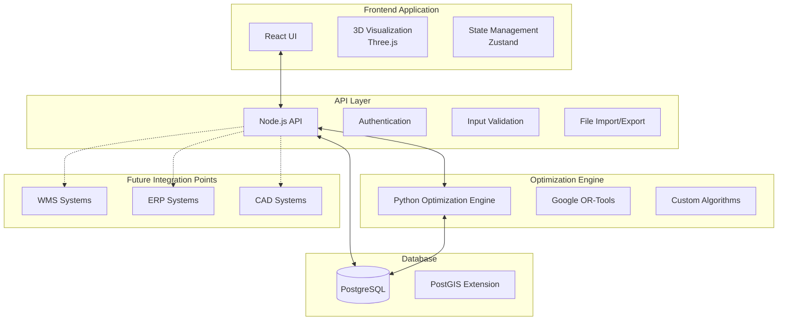
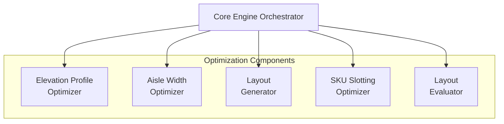
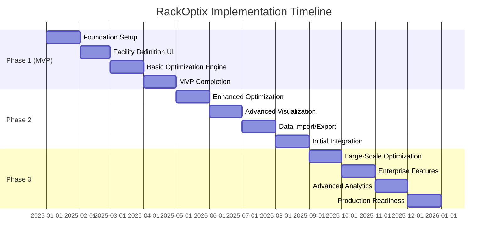

# RackOptix Executive Summary

## Table of Contents
1. [Executive Overview](#executive-overview)
2. [Project Vision and Objectives](#project-vision-and-objectives)
3. [System Architecture](#system-architecture)
4. [Optimization Capabilities](#optimization-capabilities)
5. [User Experience Approach](#user-experience-approach)
6. [Implementation Strategy](#implementation-strategy)
7. [Business Value and ROI](#business-value-and-roi)
8. [Risk Assessment and Mitigation](#risk-assessment-and-mitigation)
9. [Conclusion](#conclusion)

## Executive Overview

RackOptix is a comprehensive warehouse layout optimization system designed to maximize storage density and accessibility in warehouse environments. By leveraging advanced mathematical optimization algorithms and intuitive visualization tools, RackOptix enables warehouse operators to design optimal storage configurations based on their specific facility constraints, product mix, and material handling equipment.

The system delivers significant business value through:
- **15-25% improvement in storage density** over manual designs
- **Reduced travel distances** for picking operations
- **Optimized equipment utilization** through appropriate aisle width configuration
- **Enhanced compliance** with safety regulations and operational requirements
- **Data-driven decision making** for warehouse layout planning

RackOptix is designed for on-premises deployment in warehouse environments with limited internet connectivity, with a phased implementation approach delivering core functionality within 4 months and full enterprise capabilities within 12 months.

## Project Vision and Objectives

### Vision
To revolutionize warehouse layout planning by replacing manual, experience-based approaches with a data-driven optimization system that maximizes storage density while maintaining operational efficiency and safety compliance.

### Key Objectives
1. **Maximize Storage Utilization**: Optimize rack configurations, elevations, and aisle widths to maximize storage capacity within facility constraints
2. **Enhance Operational Efficiency**: Reduce travel distances and congestion through intelligent SKU placement and aisle design
3. **Ensure Compliance**: Validate layouts against fire codes, safety regulations, and equipment specifications
4. **Provide Visualization**: Enable intuitive 2D and 3D visualization of warehouse layouts for stakeholder communication
5. **Support Decision-Making**: Provide quantitative metrics and comparative analysis for layout scenarios

### Target Users
- Warehouse Design Engineers
- Operations Managers
- Supply Chain Consultants
- Facility Planners

## System Architecture

RackOptix employs a modular architecture with four major components designed for on-premises deployment in warehouse environments.

### Key Components

#### Frontend Application
- **Technology**: React with TypeScript, Three.js for 3D visualization, Konva.js for 2D canvas
- **Features**: Interactive facility drawing, rack configuration, 3D visualization, reporting dashboard
- **Design Approach**: Responsive design with offline-first capabilities and progressive loading

#### API Layer
- **Technology**: Node.js with Express, TypeScript
- **Features**: RESTful API endpoints, WebSocket support for real-time updates, file import/export
- **Security**: Authentication, input validation, error handling, logging

#### Optimization Engine
- **Technology**: Python with Google OR-Tools, NumPy, Pandas
- **Features**: Constraint programming, mixed integer linear programming, heuristic algorithms
- **Performance**: Progressive optimization, parallel processing, caching strategies

#### Database
- **Technology**: PostgreSQL with PostGIS extension
- **Features**: Spatial data storage and queries, efficient indexing, data partitioning
- **Design**: Comprehensive schema for facility, product, equipment, and layout data

### Deployment Architecture

RackOptix is designed for on-premises deployment with two options:
1. **Standalone Application**: Electron-based desktop application
2. **Local Server**: Deployable on warehouse server with web access

This approach ensures:
- Data security and privacy (no external data sharing)
- Operation in environments with limited internet connectivity
- Integration with existing on-premises systems
- Compliance with corporate IT policies

## Optimization Capabilities

The core of RackOptix is its advanced optimization engine, which employs multiple algorithms to solve different aspects of the warehouse layout problem.

### Key Optimization Modules

#### Elevation Profile Optimizer
- **Purpose**: Determines optimal beam elevations for rack bays based on SKU dimensions
- **Algorithm**: Constraint Programming (CP) with Google OR-Tools
- **Capabilities**: Supports mixed configurations (e.g., carton flow at bottom, selective above)

#### Aisle Width Optimizer
- **Purpose**: Calculates optimal aisle widths based on equipment, velocity, and turning radius
- **Algorithm**: Mixed Integer Linear Programming (MILP)
- **Capabilities**: Balances space utilization with operational efficiency

#### Layout Generator
- **Purpose**: Creates multiple layout scenarios using different rack types and configurations
- **Algorithm**: Genetic Algorithm + Simulated Annealing
- **Capabilities**: Explores diverse layout options while respecting facility constraints

#### SKU Slotting Optimizer
- **Purpose**: Assigns SKUs to optimal rack locations based on velocity and dimensions
- **Algorithm**: Constraint Programming + Local Search
- **Capabilities**: Optimizes for travel distance, picking efficiency, and storage density

#### Layout Evaluator
- **Purpose**: Evaluates layouts based on multiple metrics
- **Algorithm**: Discrete Event Simulation + Analytical Models
- **Capabilities**: Calculates storage density, travel distances, throughput capacity

### Performance Characteristics

- **Scale**: Designed to handle up to 100,000 SKUs
- **Speed**: Complete optimization runs within 5-10 minutes on standard hardware
- **Responsiveness**: Initial results for interactive optimizations in under 30 seconds
- **Progressive Updates**: Real-time feedback during optimization process

## User Experience Approach

RackOptix prioritizes user experience with an intuitive interface that balances power and usability, enabling warehouse professionals to effectively design and optimize layouts without specialized optimization knowledge.

### Key Interface Components

#### Facility Definition Interface

- Interactive drawing canvas for facility boundaries
- Drag-and-drop placement of obstructions (columns, walls, docks)
- Grid overlay with snap functionality
- Zone definition for specialized areas

#### 3D Visualization

- Interactive 3D view of warehouse layouts
- Zoom, pan, and rotate capabilities
- Realistic rendering of racks, products, and equipment
- Heatmap overlays for metrics visualization

#### Optimization Controls
- Intuitive parameter configuration
- Objective weighting (storage density vs. accessibility)
- Constraint definition and management
- Real-time progress tracking

#### Reporting Dashboard
- Key metrics visualization
- Comparative analysis of layout scenarios
- Exportable reports in multiple formats
- CAD integration for implementation

### User Workflow

1. **Define Facility**: Draw boundaries, place obstructions, define zones
2. **Configure Parameters**: Input product data, equipment specifications, operational requirements
3. **Run Optimization**: Select objectives, set constraints, initiate optimization
4. **Review Results**: Visualize layouts, analyze metrics, compare scenarios
5. **Refine and Export**: Adjust parameters, re-optimize, export final design

## Implementation Strategy

RackOptix will be implemented in three phases over a 12-month period, delivering incremental value while building toward the complete vision.

### Phase 1: Minimum Viable Product (Months 1-4)

**Key Deliverables:**
- Facility boundary drawing interface
- Basic obstruction placement
- Simple rack layout generation
- Basic elevation profile optimization
- 2D visualization of facility layout
- Product/SKU management interface
- Equipment configuration interface

**Resource Requirements:**
- Frontend Developers: 2 FTE
- Backend Developers: 2 FTE
- Optimization Engineer: 1 FTE
- DevOps Engineer: 0.25 FTE
- QA Engineer: 0.5 FTE
- Product Manager: 1 FTE

### Phase 2: Advanced Features and Integrations (Months 5-8)

**Key Deliverables:**
- Advanced layout generation algorithms
- Aisle width optimization
- SKU slotting optimization
- 3D visualization of warehouse layouts
- CSV/Excel import for product data
- CAD import/export capabilities
- Initial API endpoints for integration

**Resource Requirements:**
- Frontend Developers: 2 FTE
- Backend Developers: 2 FTE
- Optimization Engineer: 1 FTE
- DevOps Engineer: 0.5 FTE
- QA Engineer: 1 FTE
- Product Manager: 1 FTE

### Phase 3: Performance Optimizations and Enterprise Features (Months 9-12)

**Key Deliverables:**
- Large-scale optimization for 100,000+ SKUs
- Multi-user support with role-based access
- Advanced analytics and reporting
- Throughput simulation
- Cost vs. density analysis tools
- Production deployment package

**Resource Requirements:**
- Frontend Developers: 2 FTE
- Backend Developers: 2 FTE
- Optimization Engineer: 1 FTE
- DevOps Engineer: 0.5 FTE
- QA Engineer: 1 FTE
- Product Manager: 1 FTE

### Feature Matrix by Phase

| Feature | Phase 1 (MVP) | Phase 2 | Phase 3 |
|---------|---------------|---------|---------|
| Facility Drawing | ✓ | ✓ | ✓ |
| Obstruction Placement | ✓ | ✓ | ✓ |
| Product Management | ✓ | ✓ | ✓ |
| Equipment Configuration | ✓ | ✓ | ✓ |
| Rack Layout Generation | Basic | Advanced | Enterprise |
| Elevation Profile Optimization | Basic | Advanced | Enterprise |
| Aisle Width Optimization | - | ✓ | ✓ |
| SKU Slotting | - | ✓ | ✓ |
| Visualization | 2D | 2D + 3D | Advanced 3D |
| Data Import/Export | Basic | Advanced | Enterprise |
| Integration Capabilities | - | Basic | Advanced |
| Multi-user Support | - | - | ✓ |
| Advanced Analytics | - | - | ✓ |
| Large-scale Optimization | - | - | ✓ |

## Business Value and ROI

RackOptix delivers substantial business value for warehouse operators through improved space utilization, operational efficiency, and data-driven decision making.

### Key Benefits

#### Increased Storage Capacity
- **15-25% improvement in storage density** over manual designs
- Translates to millions in saved expansion costs or increased inventory capacity
- Optimized vertical space utilization through precise elevation profiles

#### Enhanced Operational Efficiency
- **10-20% reduction in travel distances** for picking operations
- Improved throughput capacity through optimized aisle configurations
- Reduced congestion through intelligent layout design

#### Improved Decision Making
- Data-driven approach to layout planning
- Quantitative comparison of layout scenarios
- Ability to quickly evaluate "what-if" scenarios for changing product mix

#### Regulatory Compliance
- Automated validation against fire codes and safety regulations
- Documentation of compliance for auditing purposes
- Reduced risk of non-compliance penalties

### Competitive Advantages

| Feature | RackOptix | Traditional CAD | Manual Planning | Competitors |
|---------|-----------|----------------|----------------|-------------|
| Optimization Algorithms | Advanced | None | None | Basic |
| SKU-specific Optimization | ✓ | - | - | Limited |
| 3D Visualization | ✓ | ✓ | - | Limited |
| Simulation Capabilities | ✓ | - | - | Limited |
| On-premises Deployment | ✓ | ✓ | N/A | Limited |
| Large-scale Optimization | ✓ | - | - | Limited |
| Integration Capabilities | ✓ | Limited | - | Limited |

### ROI Considerations

#### Implementation Costs
- Software licensing
- Hardware requirements (standard server hardware)
- Implementation services
- Training and change management

#### Expected Returns
- **Capital Expenditure Avoidance**: Delay or eliminate facility expansion needs
- **Operational Cost Reduction**: Lower labor costs through improved picking efficiency
- **Inventory Carrying Capacity**: Increased storage within existing footprint
- **Compliance Cost Reduction**: Automated validation and documentation

#### ROI Timeline
- **Short-term** (0-6 months): Immediate benefits from basic optimization
- **Medium-term** (6-18 months): Full ROI realization as advanced features are implemented
- **Long-term** (18+ months): Ongoing benefits from continuous optimization

### Future Expansion Opportunities

- **WMS Integration**: Real-time data synchronization with warehouse management systems
- **ERP Integration**: Inventory planning and forecasting integration
- **IoT Sensors**: Real-time monitoring of warehouse utilization
- **Machine Learning**: Predictive analytics for demand-based layout optimization
- **Cloud Deployment Option**: For multi-facility enterprises

## Risk Assessment and Mitigation

### Technical Feasibility

RackOptix employs proven technologies and algorithms with demonstrated success in similar optimization domains. The technical approach has been validated through:

- **Algorithm Validation**: Testing with real-world warehouse datasets
- **Performance Benchmarking**: Verification of optimization speed and quality
- **Technology Stack Evaluation**: Selection of mature, enterprise-ready components

### Key Risks and Mitigation Strategies

| Risk | Probability | Impact | Mitigation Strategy |
|------|------------|--------|---------------------|
| Optimization algorithm performance issues with large datasets | High | High | Progressive optimization approach, early performance testing, fallback to simpler algorithms |
| 3D visualization performance issues in browser | Medium | Medium | Level-of-detail rendering, performance optimization, fallback to 2D |
| Database scaling challenges with 100,000+ SKUs | Medium | High | Early performance testing, partitioning strategy, indexing optimization |
| Integration complexity with external systems | Medium | Medium | Well-defined API contracts, mock integrations for testing, phased approach |
| User adoption challenges | Medium | High | Intuitive UI design, comprehensive training, phased rollout |

### Resource Requirements and Constraints

#### Development Team
- Frontend Developers (2): React, TypeScript, Three.js, Konva.js
- Backend Developers (2): Node.js, Python, PostgreSQL, PostGIS
- Optimization Engineer (1): Python, OR-Tools, algorithm design
- DevOps Engineer (0.5): CI/CD, containerization, deployment
- QA Engineer (1): Test automation, performance testing

#### Skills Gap Mitigation
- Training programs for specialized technologies (OR-Tools, Three.js)
- External consultants for specialized expertise
- Knowledge sharing and documentation

#### Hardware Requirements
- Development Environment: Standard development workstations
- Testing Environment: Representative server hardware
- Production Environment: On-premises server with adequate CPU/RAM

### Critical Success Factors

1. **Early User Involvement**: Engaging warehouse professionals in the design and testing process
2. **Phased Implementation**: Delivering incremental value while building toward the complete vision
3. **Performance Optimization**: Ensuring responsive user experience even with large datasets
4. **Comprehensive Testing**: Validating optimization results against real-world scenarios
5. **Effective Training**: Enabling users to leverage the full capabilities of the system

## Conclusion

RackOptix represents a significant advancement in warehouse layout optimization, combining sophisticated mathematical algorithms with intuitive visualization tools to deliver substantial business value. The system's modular architecture and phased implementation approach ensure both early value delivery and long-term scalability.

By implementing RackOptix, warehouse operators can:
- Maximize storage capacity within existing facilities
- Improve operational efficiency through optimized layouts
- Ensure compliance with safety regulations and equipment specifications
- Make data-driven decisions about warehouse configuration

The comprehensive design approach addresses both technical requirements and business needs, resulting in a solution that is powerful yet accessible to warehouse professionals without specialized optimization knowledge.

With a clear implementation roadmap and risk mitigation strategy, RackOptix is well-positioned for successful deployment and adoption, delivering measurable ROI within the first year of implementation.