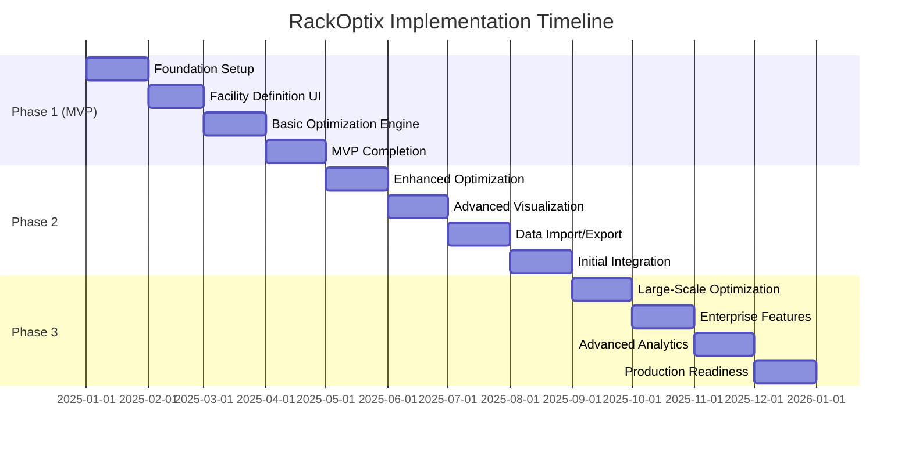

# RackOptix Implementation Roadmap and Phasing Plan

## Executive Summary

This document outlines the comprehensive implementation roadmap for the RackOptix warehouse layout optimization system. The plan prioritizes user experience and interface development in the early phases to enable rapid feedback cycles, while simultaneously building essential optimization engine components. The data model will be implemented early with room for evolution, and integration capabilities and deployment infrastructure will be addressed in later phases.

The implementation is structured into three main phases:
1. **Phase 1 (MVP)**: Core functionality for initial release (Months 1-4)
2. **Phase 2**: Advanced features and integrations (Months 5-8)
3. **Phase 3**: Performance optimizations and enterprise features (Months 9-12)

This roadmap provides a balanced approach that delivers value early while building toward the complete vision of the RackOptix system.

## 1. Project Phases, Milestones, and Deliverables

### 1.1 Phase 1: Minimum Viable Product (Months 1-4)

#### Milestone 1.1: Foundation Setup (Month 1)
- **Deliverables:**
  - Project repository and development environment setup
  - Initial database schema implementation
  - Basic API structure and authentication
  - Frontend application scaffold with routing
  - CI/CD pipeline for development builds

#### Milestone 1.2: Facility Definition UI (Month 2)
- **Deliverables:**
  - Facility boundary drawing interface
  - Obstruction placement functionality
  - Zone definition capabilities
  - 2D visualization of facility layout
  - Data persistence for facility configurations

#### Milestone 1.3: Basic Optimization Engine (Month 3)
- **Deliverables:**
  - Core optimization engine framework
  - Simple rack layout generation algorithm
  - Elevation profile optimizer for basic scenarios
  - Constraint validation system
  - Progress tracking and result visualization

#### Milestone 1.4: MVP Completion (Month 4)
- **Deliverables:**
  - Product/SKU management interface
  - Equipment configuration interface
  - Basic layout evaluation metrics
  - Simple reporting functionality
  - End-to-end testing and bug fixes
  - MVP deployment package

### 1.2 Phase 2: Advanced Features and Integrations (Months 5-8)

#### Milestone 2.1: Enhanced Optimization Capabilities (Month 5)
- **Deliverables:**
  - Advanced layout generation algorithms
  - Aisle width optimization
  - SKU slotting optimization
  - Multi-objective optimization support
  - Performance improvements for medium-sized catalogs

#### Milestone 2.2: Advanced Visualization (Month 6)
- **Deliverables:**
  - 3D visualization of warehouse layouts
  - Interactive rack configuration
  - Heatmap visualizations for metrics
  - Animation capabilities for workflow simulation
  - Enhanced UI for optimization parameters

#### Milestone 2.3: Data Import/Export (Month 7)
- **Deliverables:**
  - CSV/Excel import for product data
  - CAD import for existing layouts
  - DXF/DWG export for CAD integration
  - PDF report generation
  - Batch processing for large datasets

#### Milestone 2.4: Initial Integration Capabilities (Month 8)
- **Deliverables:**
  - API endpoints for external system integration
  - Webhook support for notifications
  - File-based data exchange mechanisms
  - Integration documentation
  - Sample integration clients

### 1.3 Phase 3: Performance Optimizations and Enterprise Features (Months 9-12)

#### Milestone 3.1: Large-Scale Optimization (Month 9)
- **Deliverables:**
  - Optimization engine scaling for 100,000+ SKUs
  - Parallel processing capabilities
  - Incremental optimization for large changes
  - Advanced caching strategies
  - Performance benchmarking tools

#### Milestone 3.2: Enterprise Features (Month 10)
- **Deliverables:**
  - Multi-user support with role-based access control
  - Collaboration features
  - Audit logging and compliance reporting
  - Enhanced security features
  - Backup and recovery mechanisms

#### Milestone 3.3: Advanced Analytics (Month 11)
- **Deliverables:**
  - Cost vs. density analysis tools
  - Throughput simulation
  - What-if scenario modeling
  - Custom reporting engine
  - Dashboard for KPI tracking

#### Milestone 3.4: Production Readiness (Month 12)
- **Deliverables:**
  - Production deployment package
  - System documentation
  - User training materials
  - Performance tuning
  - Final quality assurance and security audit

## 2. Feature Prioritization and MVP Definition

### 2.1 MVP Core Features

The Minimum Viable Product (MVP) will focus on delivering essential functionality that provides immediate value to users while establishing the foundation for future enhancements.

#### 2.1.1 Facility Definition
- Facility boundary drawing with grid snap
- Basic obstruction placement (columns, walls, docks)
- Simple zone definition
- 2D visualization of facility layout

#### 2.1.2 Product and Equipment Management
- Basic product/SKU data management
- Simple product categorization
- Equipment specification management
- Storage method configuration

#### 2.1.3 Basic Optimization
- Simple rack layout generation
- Basic elevation profile optimization
- Fundamental constraint validation
- Layout evaluation with key metrics

#### 2.1.4 User Interface
- Intuitive drawing interface for facility definition
- Form-based data entry for products and equipment
- Simple visualization of optimization results
- Basic reporting functionality

### 2.2 Phase 2 Features

#### 2.2.1 Enhanced Optimization
- Advanced layout generation algorithms
- Aisle width optimization
- SKU slotting optimization
- Multi-objective optimization

#### 2.2.2 Advanced Visualization
- 3D visualization of warehouse layouts
- Interactive rack configuration
- Heatmap visualizations
- Workflow simulation

#### 2.2.3 Data Management
- Bulk import/export capabilities
- CAD integration
- Enhanced reporting
- Batch processing

#### 2.2.4 Initial Integration
- External API endpoints
- Webhook support
- File-based data exchange
- Integration documentation

### 2.3 Phase 3 Features

#### 2.3.1 Enterprise Capabilities
- Multi-user support with RBAC
- Collaboration features
- Audit logging
- Enhanced security

#### 2.3.2 Advanced Analytics
- Cost vs. density analysis
- Throughput simulation
- What-if scenario modeling
- Custom reporting

#### 2.3.3 Performance Optimizations
- Large-scale optimization support
- Parallel processing
- Incremental optimization
- Advanced caching

#### 2.3.4 Deployment and Operations
- On-premises deployment package
- Monitoring and observability
- Backup and recovery
- System documentation

### 2.4 Feature Prioritization Matrix

| Feature | Business Value | Implementation Complexity | Phase | Priority |
|---------|----------------|---------------------------|-------|----------|
| Facility Drawing Interface | High | Medium | 1 | P0 |
| 2D Visualization | High | Medium | 1 | P0 |
| Basic Rack Layout Generation | High | High | 1 | P0 |
| Product/SKU Management | Medium | Low | 1 | P0 |
| Equipment Configuration | Medium | Low | 1 | P0 |
| Elevation Profile Optimization | Medium | High | 1 | P0 |
| Basic Reporting | Medium | Low | 1 | P0 |
| 3D Visualization | Medium | High | 2 | P1 |
| Aisle Width Optimization | High | Medium | 2 | P1 |
| SKU Slotting Optimization | High | High | 2 | P1 |
| Data Import/Export | Medium | Medium | 2 | P1 |
| CAD Integration | Medium | Medium | 2 | P1 |
| External API | Low | Medium | 2 | P2 |
| Multi-user Support | Low | High | 3 | P2 |
| Advanced Analytics | Medium | High | 3 | P2 |
| Large-scale Optimization | High | High | 3 | P1 |
| Throughput Simulation | Medium | High | 3 | P2 |
| On-premises Deployment | High | Medium | 3 | P1 |

*Priority: P0 = MVP, P1 = High Priority Post-MVP, P2 = Medium Priority, P3 = Nice to Have*

## 3. Resource Requirements and Team Structure

### 3.1 Core Team Composition

#### 3.1.1 Development Team
- **Frontend Developers (2)**
  - Skills: React, TypeScript, Three.js, Konva.js
  - Responsibilities: UI development, visualization, state management

- **Backend Developers (2)**
  - Skills: Node.js, Python, PostgreSQL, PostGIS
  - Responsibilities: API development, database management, integration

- **Optimization Engineer (1)**
  - Skills: Python, OR-Tools, algorithm design, mathematical optimization
  - Responsibilities: Optimization engine development, algorithm implementation

- **DevOps Engineer (0.5)**
  - Skills: CI/CD, containerization, deployment automation
  - Responsibilities: Build pipeline, deployment, infrastructure

- **QA Engineer (1)**
  - Skills: Test automation, performance testing, quality assurance
  - Responsibilities: Test planning, test automation, quality control

#### 3.1.2 Supporting Roles
- **Product Manager (1)**
  - Responsibilities: Requirements, prioritization, stakeholder management

- **UX Designer (0.5)**
  - Responsibilities: User experience design, UI mockups, usability testing

- **Technical Writer (0.5)**
  - Responsibilities: Documentation, user guides, API documentation

### 3.2 Resource Allocation by Phase

#### 3.2.1 Phase 1 (MVP)
- Frontend Developers: 2 FTE
- Backend Developers: 2 FTE
- Optimization Engineer: 1 FTE
- DevOps Engineer: 0.25 FTE
- QA Engineer: 0.5 FTE
- Product Manager: 1 FTE
- UX Designer: 0.5 FTE
- Technical Writer: 0.25 FTE

#### 3.2.2 Phase 2
- Frontend Developers: 2 FTE
- Backend Developers: 2 FTE
- Optimization Engineer: 1 FTE
- DevOps Engineer: 0.5 FTE
- QA Engineer: 1 FTE
- Product Manager: 1 FTE
- UX Designer: 0.25 FTE
- Technical Writer: 0.5 FTE

#### 3.2.3 Phase 3
- Frontend Developers: 2 FTE
- Backend Developers: 2 FTE
- Optimization Engineer: 1 FTE
- DevOps Engineer: 0.5 FTE
- QA Engineer: 1 FTE
- Product Manager: 1 FTE
- UX Designer: 0.25 FTE
- Technical Writer: 0.5 FTE

### 3.3 Skills Matrix and Training Needs

| Skill Area | Current Capability | Required Capability | Gap Mitigation |
|------------|-------------------|---------------------|----------------|
| React/TypeScript | Medium | High | Training, pair programming |
| Three.js | Low | High | External consultant, training |
| Node.js/Express | Medium | High | Training, documentation |
| Python Optimization | Medium | High | Specialized hiring, training |
| OR-Tools | Low | High | External consultant, training |
| PostgreSQL/PostGIS | Medium | High | Training, documentation |
| DevOps/CI/CD | Medium | Medium | Documentation, tools |
| Test Automation | Medium | High | Training, tools |

## 4. Implementation Approach by Component

### 4.1 Database Implementation Sequence

#### 4.1.1 Phase 1: Core Schema
1. **Week 1-2:** Set up PostgreSQL with PostGIS extension
2. **Week 2-3:** Implement user and project management tables
3. **Week 3-4:** Implement facility and building structure tables
4. **Week 5-6:** Implement product and equipment tables
5. **Week 7-8:** Implement basic layout and rack tables
6. **Week 9-10:** Implement optimization job tables
7. **Week 11-12:** Implement indexing strategy for core tables
8. **Week 13-16:** Refine schema based on application development feedback

#### 4.1.2 Phase 2: Enhanced Schema
1. **Month 5:** Implement advanced rack configuration tables
2. **Month 6:** Enhance spatial indexing for visualization
3. **Month 7:** Implement import/export tracking tables
4. **Month 8:** Add integration-related tables and logging

#### 4.1.3 Phase 3: Enterprise Schema
1. **Month 9:** Implement partitioning for large tables
2. **Month 10:** Add multi-user and RBAC tables
3. **Month 11:** Implement analytics and reporting tables
4. **Month 12:** Finalize schema with performance optimizations

### 4.2 Backend API Development Strategy

#### 4.2.1 Phase 1: Core API
1. **Week 1-2:** Set up Node.js with Express framework
2. **Week 2-3:** Implement authentication and basic middleware
3. **Week 3-4:** Develop facility management endpoints
4. **Week 5-6:** Implement product and equipment endpoints
5. **Week 7-8:** Develop basic optimization job endpoints
6. **Week 9-10:** Implement layout management endpoints
7. **Week 11-12:** Develop file upload/download capabilities
8. **Week 13-16:** Refine API based on frontend development feedback

#### 4.2.2 Phase 2: Enhanced API
1. **Month 5:** Implement advanced optimization endpoints
2. **Month 6:** Develop visualization data endpoints
3. **Month 7:** Implement import/export endpoints
4. **Month 8:** Develop initial integration endpoints

#### 4.2.3 Phase 3: Enterprise API
1. **Month 9:** Implement large-scale data handling endpoints
2. **Month 10:** Develop multi-user and RBAC endpoints
3. **Month 11:** Implement analytics and reporting endpoints
4. **Month 12:** Finalize API with performance optimizations

### 4.3 Optimization Engine Development Approach

#### 4.3.1 Phase 1: Core Engine
1. **Week 1-2:** Set up Python environment with OR-Tools
2. **Week 3-4:** Implement core engine orchestrator
3. **Week 5-6:** Develop constraint management system
4. **Week 7-8:** Implement basic elevation profile optimizer
5. **Week 9-10:** Develop simple layout generation algorithm
6. **Week 11-12:** Implement progress tracking and result formatting
7. **Week 13-16:** Integrate with API and refine based on testing

#### 4.3.2 Phase 2: Enhanced Engine
1. **Month 5:** Implement advanced layout generation algorithms
2. **Month 6:** Develop aisle width optimizer
3. **Month 7:** Implement SKU slotting optimizer
4. **Month 8:** Develop layout evaluator with simulation capabilities

#### 4.3.3 Phase 3: Enterprise Engine
1. **Month 9:** Implement parallel processing capabilities
2. **Month 10:** Develop incremental optimization for large changes
3. **Month 11:** Implement advanced caching strategies
4. **Month 12:** Finalize engine with performance optimizations

### 4.4 Frontend Implementation Sequence

#### 4.4.1 Phase 1: Core UI
1. **Week 1-2:** Set up React application with TypeScript
2. **Week 2-3:** Implement routing and state management
3. **Week 3-4:** Develop facility drawing interface with Konva.js
4. **Week 5-6:** Implement obstruction placement functionality
5. **Week 7-8:** Develop product and equipment management forms
6. **Week 9-10:** Implement 2D visualization of facility layout
7. **Week 11-12:** Develop basic optimization controls and results display
8. **Week 13-16:** Refine UI based on user testing feedback

#### 4.4.2 Phase 2: Enhanced UI
1. **Month 5:** Implement advanced optimization parameter controls
2. **Month 6:** Develop 3D visualization with Three.js
3. **Month 7:** Implement import/export interfaces
4. **Month 8:** Develop enhanced reporting and visualization

#### 4.4.3 Phase 3: Enterprise UI
1. **Month 9:** Implement large-scale data visualization optimizations
2. **Month 10:** Develop multi-user and collaboration interfaces
3. **Month 11:** Implement advanced analytics dashboards
4. **Month 12:** Finalize UI with performance optimizations

### 4.5 Integration and Testing Strategy

#### 4.5.1 Phase 1: Core Testing
1. **Week 1-2:** Set up testing framework and CI pipeline
2. **Week 3-4:** Implement unit tests for core components
3. **Week 5-6:** Develop API integration tests
4. **Week 7-8:** Implement frontend component tests
5. **Week 9-10:** Develop end-to-end tests for critical flows
6. **Week 11-12:** Implement performance tests for basic operations
7. **Week 13-16:** Conduct user acceptance testing for MVP

#### 4.5.2 Phase 2: Enhanced Testing
1. **Month 5:** Implement tests for advanced optimization algorithms
2. **Month 6:** Develop visualization testing strategy
3. **Month 7:** Implement import/export testing
4. **Month 8:** Develop integration testing framework

#### 4.5.3 Phase 3: Enterprise Testing
1. **Month 9:** Implement large-scale performance testing
2. **Month 10:** Develop multi-user and security testing
3. **Month 11:** Implement analytics and reporting tests
4. **Month 12:** Conduct final system testing and security audit

## 5. Risk Management Plan

### 5.1 Technical Risks

| Risk | Probability | Impact | Mitigation Strategy |
|------|------------|--------|---------------------|
| Optimization algorithm performance issues with large datasets | High | High | Progressive optimization approach, early performance testing, fallback to simpler algorithms |
| 3D visualization performance issues in browser | Medium | Medium | Level-of-detail rendering, performance optimization, fallback to 2D |
| Database scaling challenges with 100,000+ SKUs | Medium | High | Early performance testing, partitioning strategy, indexing optimization |
| Integration complexity with external systems | Medium | Medium | Well-defined API contracts, mock integrations for testing, phased approach |
| Browser compatibility issues | Low | Medium | Cross-browser testing, progressive enhancement, polyfills |

### 5.2 Schedule Risks

| Risk | Probability | Impact | Mitigation Strategy |
|------|------------|--------|---------------------|
| Optimization algorithm development delays | High | High | Early prototyping, parallel development tracks, phased implementation |
| UI/UX complexity underestimation | Medium | Medium | Early wireframing, user testing, iterative development |
| Integration delays with external systems | Medium | Medium | Clear API contracts, mock integrations, phased approach |
| Performance optimization taking longer than expected | Medium | High | Early performance testing, continuous profiling, prioritization |
| Scope creep | High | High | Clear MVP definition, change control process, regular backlog grooming |

### 5.3 Resource Risks

| Risk | Probability | Impact | Mitigation Strategy |
|------|------------|--------|---------------------|
| Specialized skill shortages (OR-Tools, Three.js) | High | High | Early training, external consultants, knowledge sharing |
| Team member unavailability | Medium | Medium | Cross-training, documentation, knowledge redundancy |
| Environment/infrastructure limitations | Low | Medium | Early environment setup, clear requirements, DevOps automation |
| Third-party dependency issues | Medium | Medium | Dependency evaluation, alternative options, version locking |
| Budget constraints for specialized tools | Low | Low | Open-source alternatives, phased licensing, ROI justification |

### 5.4 Contingency Plans for Critical Path Items

#### 5.4.1 Optimization Engine Performance
- **Plan B:** Implement simplified algorithms with guaranteed performance
- **Fallback:** Provide manual layout tools with optimization suggestions

#### 5.4.2 3D Visualization
- **Plan B:** Simplified 3D with reduced detail
- **Fallback:** Enhanced 2D visualization with pseudo-3D elements

#### 5.4.3 Large-Scale Data Handling
- **Plan B:** Implement data partitioning and lazy loading
- **Fallback:** Set practical limits with pagination

#### 5.4.4 Integration Capabilities
- **Plan B:** Simplified file-based integration
- **Fallback:** Manual import/export processes

## 6. Quality Assurance Strategy

### 6.1 Testing Approach by Component

#### 6.1.1 Database
- Schema validation tests
- Data integrity tests
- Performance benchmarks
- Migration tests

#### 6.1.2 Backend API
- Unit tests for business logic
- Integration tests for endpoints
- Contract tests for API interfaces
- Load and stress tests

#### 6.1.3 Optimization Engine
- Algorithm correctness tests
- Performance benchmarks
- Edge case testing
- Comparative analysis with known solutions

#### 6.1.4 Frontend
- Component unit tests
- Integration tests
- Visual regression tests
- Usability tests
- Cross-browser compatibility tests

### 6.2 Validation Methodology for Optimization Results

#### 6.2.1 Correctness Validation
- Constraint satisfaction verification
- Mathematical proof for simple cases
- Comparison with manual solutions
- Consistency checks

#### 6.2.2 Performance Validation
- Execution time measurement
- Memory usage profiling
- Scalability testing with increasing problem sizes
- Comparative benchmarking

#### 6.2.3 Quality Validation
- Objective function evaluation
- Comparison with industry benchmarks
- Expert review of solutions
- A/B testing of different algorithms

### 6.3 User Acceptance Testing Plan

#### 6.3.1 Phase 1: MVP Testing
- Core functionality validation
- Usability testing with representative users
- Performance testing with realistic data
- Bug tracking and resolution

#### 6.3.2 Phase 2: Enhanced Features Testing
- Advanced functionality validation
- Integration testing
- Performance testing with larger datasets
- Regression testing

#### 6.3.3 Phase 3: Enterprise Features Testing
- Large-scale performance testing
- Security and compliance testing
- Multi-user scenario testing
- End-to-end workflow validation

### 6.4 Performance Benchmarking Approach

#### 6.4.1 Benchmark Scenarios
- Small facility (10,000 sq ft, 1,000 SKUs)
- Medium facility (50,000 sq ft, 10,000 SKUs)
- Large facility (200,000 sq ft, 100,000 SKUs)

#### 6.4.2 Key Metrics
- Optimization completion time
- Time to first result
- Memory usage
- CPU utilization
- Storage requirements
- UI responsiveness

#### 6.4.3 Benchmarking Tools
- Custom performance harness
- Profiling tools (Python cProfile, Node.js profiler)
- Browser performance tools
- Database query analyzers

## 7. Deployment and Operations Strategy

### 7.1 Deployment Pipeline and Environments

#### 7.1.1 Environment Structure
- Development environment (per developer)
- Integration environment (continuous integration)
- Testing environment (QA)
- Staging environment (pre-production)
- Production environment

#### 7.1.2 Deployment Pipeline
1. Code commit triggers CI build
2. Automated tests run in CI environment
3. Successful builds deploy to testing environment
4. QA approval promotes to staging
5. Final approval deploys to production

#### 7.1.3 Deployment Artifacts
- Frontend application bundle
- Backend API server package
- Optimization engine package
- Database migration scripts
- Configuration files
- Documentation

### 7.2 Monitoring and Observability Approach

#### 7.2.1 Application Monitoring
- Error tracking and alerting
- Performance metrics collection
- User activity monitoring
- Resource utilization tracking

#### 7.2.2 Optimization Engine Monitoring
- Algorithm performance metrics
- Resource utilization
- Optimization job tracking
- Result quality metrics

#### 7.2.3 Database Monitoring
- Query performance
- Connection pool utilization
- Storage utilization
- Index effectiveness

#### 7.2.4 Infrastructure Monitoring
- Server health metrics
- Network performance
- Disk I/O and storage
- Memory and CPU utilization

### 7.3 Maintenance and Support Plan

#### 7.3.1 Routine Maintenance
- Database maintenance (weekly)
- Log rotation and cleanup (daily)
- Backup verification (weekly)
- Performance optimization (monthly)

#### 7.3.2 Support Levels
- Level 1: Basic user support
- Level 2: Technical support and troubleshooting
- Level 3: Developer support for complex issues
- Level 4: Core team support for critical issues

#### 7.3.3 Issue Management
- Issue tracking system
- Severity classification
- Response time SLAs
- Escalation procedures

### 7.4 Update and Patch Management

#### 7.4.1 Update Types
- Critical security patches (immediate)
- Bug fixes (bi-weekly)
- Minor feature updates (monthly)
- Major releases (quarterly)

#### 7.4.2 Update Process
1. Development and testing in isolated environment
2. Regression testing
3. Release notes preparation
4. Deployment to staging
5. User acceptance testing
6. Production deployment
7. Post-deployment verification

#### 7.4.3 Rollback Procedures
- Database rollback scripts
- Application version rollback
- Configuration rollback
- Emergency procedures

## 8. Timeline and Gantt Chart

## 9. Conclusion

This implementation roadmap provides a comprehensive plan for developing the RackOptix system over a 12-month period. The phased approach prioritizes user experience and interface development in the early stages while building essential optimization engine components, allowing for early user feedback and iterative improvement.

The plan balances the need for rapid delivery of core functionality with the long-term vision for a sophisticated warehouse layout optimization system. By focusing on a well-defined MVP in Phase 1, the project can deliver value quickly while establishing the foundation for more advanced features in subsequent phases.

The roadmap includes detailed strategies for risk management, quality assurance, and deployment operations, ensuring a robust and reliable system. Regular milestones and clear deliverables provide structure for tracking progress and managing expectations.

This document serves as the master plan for the development and delivery of the RackOptix system, providing clear guidance for the development team while allowing for flexibility to adapt to changing requirements and technical challenges.